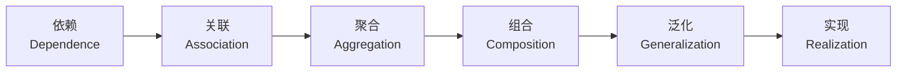
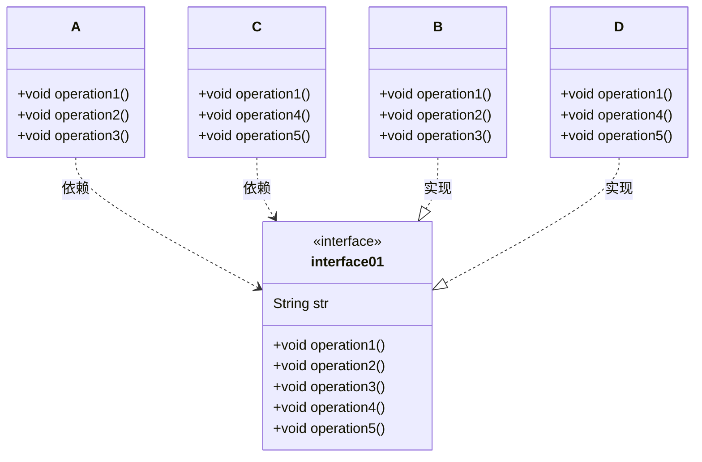
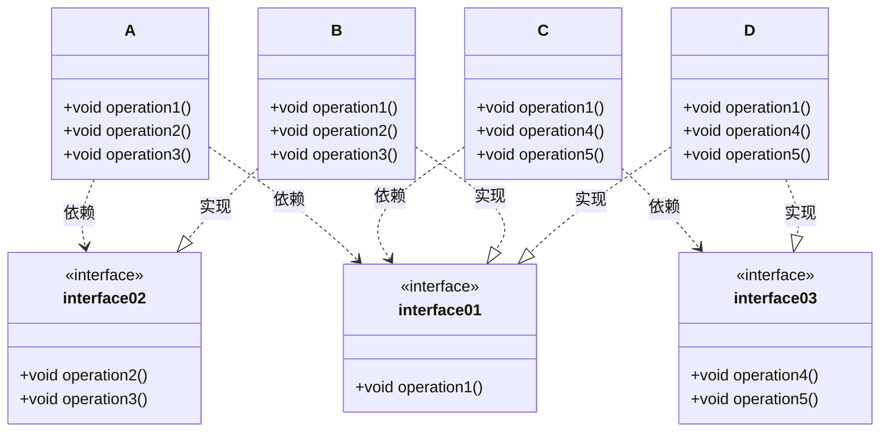
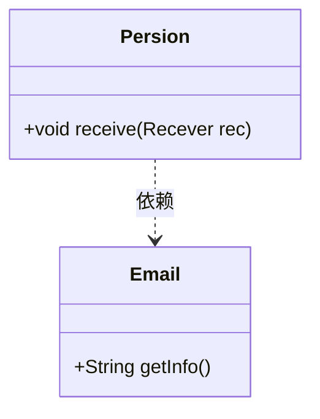
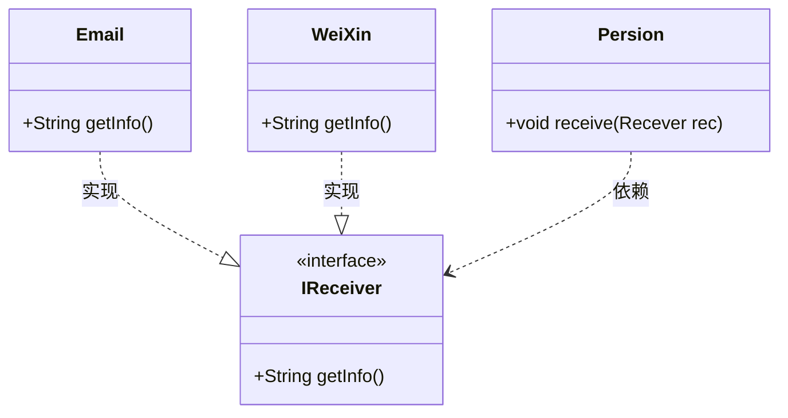
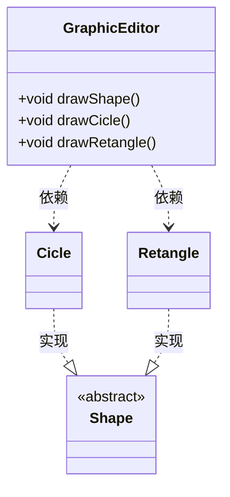
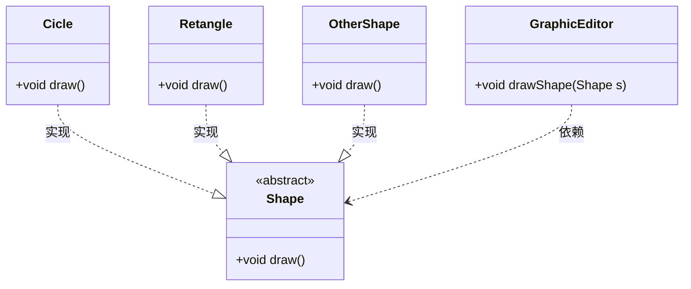

## 类间关系

---

**耦合度从弱到强**



#### 1、依赖（Dependence）

含义：体现了类之间的弱作用关系，是一种临时性的使用关系，通常用虚线+箭头表示。

举例：依赖关系是类之间最弱的关系，比如，类A的一些方法参数中使用了类B的实例；类A的一些方法逻辑中调用了类B的方法或变量等等。

#### 2、关联（Association）

含义：体现了类之间的强作用关系，通常用实线或实线+箭头表示，这里的关联关系指的是一般关联关系，后面的聚合和组合也属于关联关系。

举例：关联关系是类之间的引用关系，生活中的常见，比如有：手机和充电线，老师和学生，生产者和消费者等。可以通过成员变量来实现关联关系，比如类A中使用了类B的对象引用，A和B之间就是一种关联关系。

类型：一般关联关系又可以分为单向关联、双向关联、自关联，画图表示。

#### 3、聚合（Aggregation）

含义：体现了类之间的强作用关系，也属于关联关系的一种，是整体和局部之间的关系，是 has-a 的关系，通常用实线+虚心菱形箭头表示。

举例：聚合关系强调了整体和局部的关系，比如学校和教师，工厂和工人等，注意的是局部可以独立于整体而存在，比如工厂没了但工人还是可以存在的！通过成员属性来实现聚合关系。

#### 4、组合（Composition）

含义：体现了类之间的强作用关系，也属于关联关系的一种，也是整体和局部之间的关系，是 cxmtains-a 的关系，通常用实线+实心菱形箭头表示。

举例：组合关系是一种耦合度更高的聚合关系，整体对象可以控制部分对象的生命周期，部分对象不能脱离整体对象而存在，比如电脑和CPU，如果CPU没了，电脑就失去了基本的运算能力等同于电脑报废。

#### 5、泛化（Generalization）

含义：体现了类之间的继承关系，是一种耦合度最高的关系，是 is-a 的关系，通常用实线+空心三角箭头表示。

举例：泛化关系强调了一般与特殊的关系，通过Java的类继承机制实现类之间的泛化关系，比如：手机工厂，与华为手机工厂，小米手机工厂之间的关系。

#### 6、实现（Realization）

含义：体现了接口和类之间的关系，通常用虚线+空心三角箭头表示。

举例：实现关系，通过Java的实现机制实现的，比如：手机工厂接口，与华为手机工厂实现类，小米手机工厂实现类之间的关系。


## 六(七)大设计原则

---

#### 一、单一职责原则

**注意事项和细节**
1. 降低类的复杂度，一个类只负责一个职责
2. 提高类的可读性，可维护性
3. 降低变更引起的风险
4. 通常情况下，我们应当遵守单一职责原则 ，只有逻辑足够简单，才能在代码级违反单一职责原则；只有类中方法足够少，可以在方法级别保持单一职责原则

#### 二、接口隔离原则

**客户端不应该依赖它不需要的接口， 即一个类对另一个类的依赖应该建立在最小的接口上**



**问题：** 类 A 通过接口依赖类 B， 类 C 通过接口依赖类 D， 如果接口对于类 A 和类 C 来说不是最小接口， 那么**类 B 和类 D 必须去实现他们不需要的方法**

**解决：** 将接口拆分为独立的几个接口(这里我们拆分成 3 个接口)



#### 三、依赖倒转原则

依赖倒转原则(Dependence Inversion Principle)是指:

1. 高层模块不应该依赖低层模块， 二者都应该依赖其抽象
2. 抽象不应该依赖细节， 细节应该依赖抽象
3. 依赖倒转(倒置)的中心思想是面向接口编程
4. 依赖倒转原则是基于这样的设计理念： 相对于细节的多变性， 抽象的东西要稳定的多。 以抽象为基础搭建的架构比以细节为基础的架构要稳定的多。 在 java 中， 抽象指的是接口或抽象类， 细节就是具体的实现类
5. 使用接口或抽象类的目的是制定好规范， 而不涉及任何具体的操作， 把展现细节的任务交给他的实现类去完成

问题(不知道图画的对不对)：如果获取的对象是微信，就要新增类，Persion也要新增相应接收方法



解决思路: 引入一个抽象的接口 IReceiver



依赖关系传递的三种方式

1. 接口传递
```java
ChangHong changHong = new ChangHong();  //实现ITV接口
OpenAndClose openAndClose = new OpenAndClose();  //实现IOpenAndClose接口
openAndClose.open(changHong);  //IOpenAndClose方法参数为ITV
```
2. 构造方法传递
```java
OpenAndClose openAndClose = new OpenAndClose(changHong);  //实现IOpenAndClose接口 且 构造参数为ITV
openAndClose.open();  //调用ITV的play方法
```
3. setter 方式传递
```java
OpenAndClose openAndClose = new OpenAndClose();  //实现IOpenAndClose接口
openAndClose.setTv(changHong);  //set方法参数为ITV
openAndClose.open();  //调用ITV的play方法
```

注意事项:

1) 低层模块尽量都要有抽象类或接口， 或者两者都有， 程序稳定性更好.  
2) 变量的声明类型尽量是抽象类或接口, 这样我们的变量引用和实际对象间， 就存在一个缓冲层， 利于程序扩展和优化  
3) 继承时遵循里氏替换原则

#### 四、里式替换原则

**OO 中的继承性的思考和说明:**

1) 继承包含这样一层含义： 父类中凡是已经实现好的方法， 实际上是在设定规范和契约子类如果对这些方法任意修改, 就会对继承体系造成破坏  
2) 继承在给程序设计带来便利的同时， 也带来了弊端。会给程序带来侵入性， 程序的可移植性降低，增加对象间的耦合性(修改父类, 子类可能出现故障)
3) 问题提出： 在编程中， 如何正确的使用继承? => 里氏替换原则

**基本介绍:**

1) 1988 年， 由麻省理工学院的以为姓里的女士提出
2) **理想状态**: 所有引用基类的地方必须能透明地使用其子类的对象
3) **使用继承时**: 子类中尽量不要重写父类的方法
4) 继承实际上让两个类耦合性增强了，适当的情况下: 可以通过**聚合， 组合， 依赖**来解决问题

#### 五、开闭原则ocp

基本介绍:

1) 开闭原则（Open Closed Principle） 是编程中最基础、 最重要的设计原则
2) 一个软件实体如类， 模块和函数应该对扩展开放(对提供方)， 对修改关闭(对使用方)。 用抽象构建框架， 用实现扩展细节
3) 当软件需要变化时， 尽量通过扩展软件实体的行为来实现变化， 而不是通过修改已有的代码来实现变化。
4) 编程中遵循其它原则， 以及使用设计模式的目的就是遵循开闭原则



优缺点：好理解易操作；违反了开闭原则；新增加一个三角形类，要修改很多地方（如：新加Trlangle类 GraphicEditor类增加方法 drawShape方法增加分支）



#### 六、迪米特法则(最少知道原则)

基本原则:
1) 一个对象应该对其他对象保持最少的了解
2) 类与类关系越密切， 耦合度越大
3) 迪米特法则(Demeter Principle)又叫最少知道原则， 即一个类对自己依赖的类知道的越少越好。 也就是说， 对于被依赖的类不管多么复杂， 都尽量将逻辑封装在类的内部。 对外除了提供的 public 方法， 不对外泄露任何信息
4) 迪米特法则还有个更简单的定义： **只与直接的朋友通信**
5) **直接的朋友**： 每个对象都会与其他对象有耦合关系， 只要两个对象之间有耦合关系， 我们就说这两个对象之间是朋友关系。 耦合的方式很多， 依赖， 关联， 组合， 聚合等。 其中， 我们称出现成员变量， 方法参数， 方法返回值中的类为直接的朋友， 而出现在局部变量中的类不是直接的朋友。 也就是说， 陌生的类最好不要以局部变量的形式出现在类的内部

注意事项

1) 迪米特法则的核心是降低类之间的耦合
2) 但是注意： 由于每个类都减少了不必要的依赖， 因此迪米特法则只是要求降低类间(对象间)耦合关系， 并不是要求完全没有依赖关系

#### 七？合成复用原则

基本介绍：原则是尽量使用合成/聚合的方式， 而不是使用继承 


## 设计模式入门
---

#### 设计原则

1. 找出应用中可能需要变化之处，把它们独立出来，不要和那些不需要变化的代码混在一起。
2. 针对接口编程，而不是针对实现编程。
3. 多用组合，少用继承
4. 为了交互对象之间的松耦合设计而努力
5. 类应该对扩展开放，对修改关闭。（开闭原则）

#### 元认知

[](https://imgtu.com/i/jyGv5j)

#### 要点

- 知道OO基础，并不足以让你设计出良好的OO系统。
- 良好的OO设计必须具备可复用、可扩充、可维护三个特性。
- 模式可以让我们建造出具有良好OO设计质量的系统。
- 模式被认为是历经验证的OO设计经验。
- 模式不是代码，而是针对设计问题的通用解决方案。你可把它们应用到特定的应用中。
- 模式不是被发明，而是被发现。
- 大多数的模式和原则，都着眼于软件变化的主题。
- 大多数的模式都允许系统局部改变独立于其他部分。
- 我们常把系统中会变化的部分抽出来封装。
- 模式让开发人员之间有共享的语言，能够最大化沟通的价值。


## mermaid 语法

---

#### Github官网

**Mermaid 是一个基于 JavaScript 的图表和图表工具，通过解析 Markdown 的文本定义，以动态创建和修改图表。**

可使之创建流程图、时序图、UML类图、状态图、实体关系图、用户体验旅程图、甘特图、饼图、需求图、Git分支图、软件架构（C4）图等

[官网语法](https://mermaid-js.github.io/mermaid)

