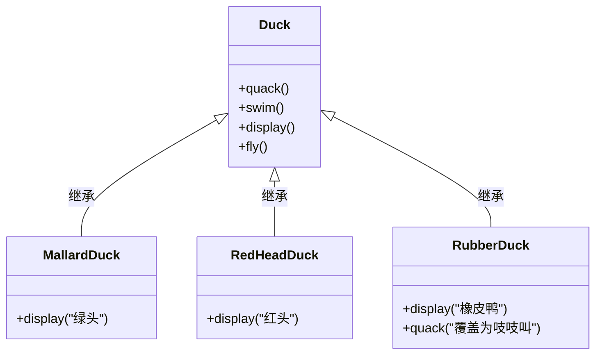
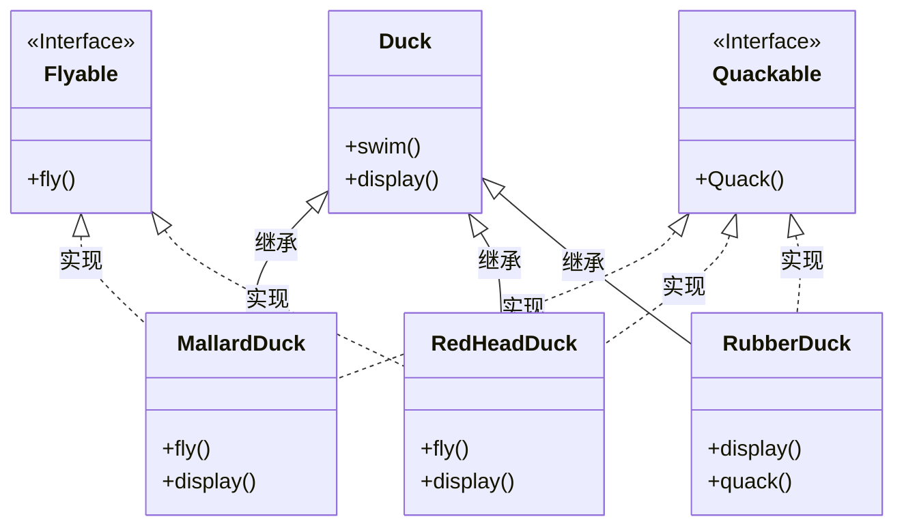
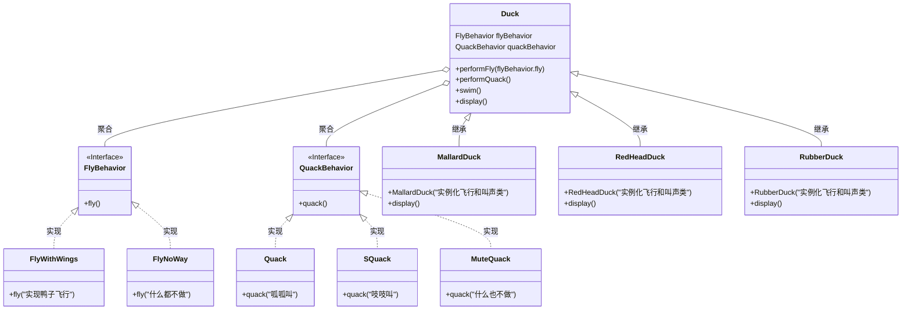
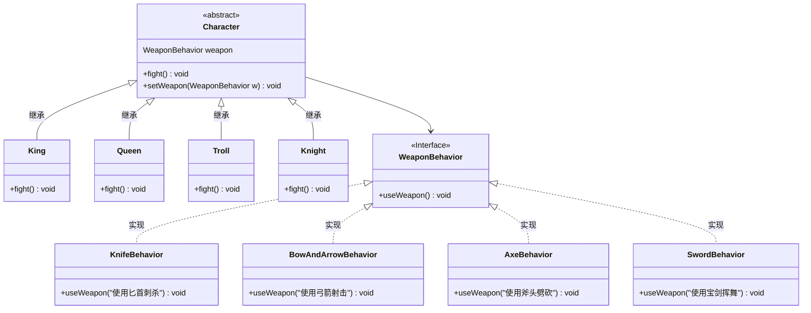

## 策略模式（Strategy Pattern）

**策略模式**定义了算法族，分别封装起来，让它们之间可以互相替换，此模式让算法的变化独立于使用算法的客户。

#### 鸭子飞和叫

**为了给鸭子增加飞行能力**

> 问题：在超类增加方法导致橡皮鸭也会飞了
> 解决方案：在子类中覆盖掉父类方法，又会导致其他问题（一旦创建新的鸭子类，就必须检查飞行和叫的方法）

> 使用接口呢，会导致
> 1. 代码不能复用
> 2. 飞行动作有区别，就要每个类的方法都有不同的实现

> 针对接口编程 真正含义为针对超类编程。即Animal animal = new Dog()的形式
> 优点：
> 1. 飞行和叫的动作可以被其他对象复用
> 2. 可以新增行为，不会影响到行为类，也不会影响到鸭子类
>
> 缺点：构造器实例化对象，是对具体实现编程，有待改进

**改进：** 创建 FlyBehavior、QuackBehavior 的 get、set 方法，使运行时可以动态的设定其行为，即在创建鸭子对象时传入行为对象来设置其行为。（有点类似于函数编程通过参数传入一段逻辑的感觉？？？）

#### 小游戏：动作冒险游戏

有游戏角色和使用武器行为的类，每个角色一次只能使用一种武器，但是可以在游戏过程中换武器。

