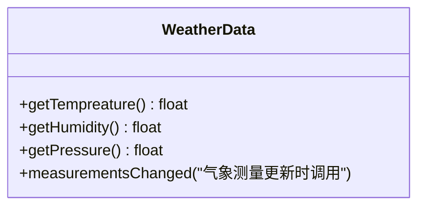
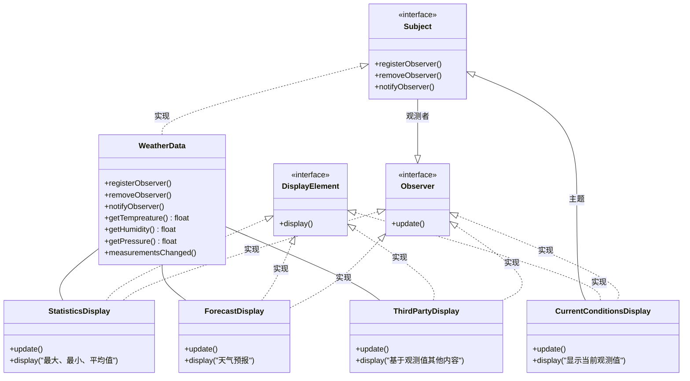

## 观察者模式（Observer）

<span style='color:red'>**观察者模式** 定义了对象之间的一对多依赖，这样一来，当一个对象改变状态时，它的所有依赖者都会收到通知并自动更新。</span>

简单来说：观察者模式 = 出版者<span style='color:#CCCCCC'>（主题 Subject）</span> + 订阅者<span style='color:#CCCCCC'>（观察者 Observer）</span> 

#### 气象监测应用

##### 1. 问题描述

> 此系统中的三个部分是气象站（获取实际气象数据的物理装置）、WeatherData对象(追踪来自气象站的数据，并更新布告板)和布告板（显示目前天气状况给用户看）



##### 2. 错误示范

> 错误示范：实现 measurementsChanged 方法
> 1. 这里针对具体实现编程，而非针对接口
> 2. 对于每个新的布告板，我们都得修改代码
> 3. 无法在运行时动态增加或删除布告板
> 4. 没有封装改变的部分

```java
public class WeatherData{
    public void measurementsChanged() {
        // 通过getter方法获取值
        float temp = getTempreature();
        float humidity = getHumidity();
        float pressure = getPressure();

        // 更新3个布告板
        currentConditionsDisplay.update(temp, humidity, pressure);
        statisticsDisplay.update(temp, humidity, pressure);
        forecastDisplay.update(temp, humidity, pressure);

        // 其他方法
    }
}
```

##### 3. 松耦合

- 当两个对象之间松耦合，它们依然可以交互，但是不太清楚彼此的细节。
- 观察者模式提供了一种对象设计，让主题和观察者之间松耦合。
- 松耦合的设计之所以能让我们建立有弹性的OO系统，能够应对变化，是因为对象之间的互相依赖降到了最低。

##### 4. 类图设计



#### 实现观察者模式（主题推送信息）
<br/>

<code-group>
  <code-block title="主题（Subject）" active>
  ```java
  import java.util.ArrayList;
  import java.util.List;
  
  interface Subject{
      void registerObserver(Observer observer);
      void removeObserver(Observer observer);
      void notifyObservers();
  }
  
  public class WeatherData implements Subject {
      private float tempreature;
      private float humidity;
      private float pressure;
      private List<Observer> listObject;
  
      public WeatherData() {
          // 创建主题对象时，实例化存储观察者的集合
          listObject = new ArrayList<>();
      }
  
      public float getTempreature() {
          return tempreature;
      }
  
      public float getHumidity() {
          return humidity;
      }
  
      public float getPressure() {
          return pressure;
      }
  
      @Override
      public void registerObserver(Observer observer) {
          // 观察者注册，将其加入通知队列中
          listObject.add(observer);
      }
  
      @Override
      public void removeObserver(Observer observer) {
          // 观察者取消，将其从通知队列中删除
          listObject.remove(observer);
      }
  
      @Override
      public void notifyObservers() {
          System.out.println("观察者数量：" + listObject.size());
          // 遍历观察者集合，发送最新观测值
          for (Observer observer : listObject) {
              observer.update(getTempreature(), getHumidity(), getPressure());
          }
      }
  
      public void measurementsChanged() {
          // 当从气象站获取更新观测值时，通知观察者
          notifyObservers();
      }
  
      public void setMeasurements(float tempreature, float humidity, float pressure) {
          this.tempreature = tempreature;
          this.humidity = humidity;
          this.pressure = pressure;
          measurementsChanged();
      }
  }
  ```
  </code-block>
  
  <code-block title="观察者（Observer）">
  ```java
  public interface Observer {
      void update(float tempreature, float humidity, float pressure);
  }
  public interface DisplayElement {
      void display();
  }
  public class CurrentConditionsDisplay implements DisplayElement, Observer{
      private float tempreature;
      private float humidity;
      private float pressure;
      private Subject subject;
  
      public CurrentConditionsDisplay(Subject s) {
          this.subject = s;
          subject.registerObserver(this);
      }
  
      @Override
      public String toString() {
          return "CurrentConditionsDisplay{" +
                  "tempreature=" + tempreature +
                  ", humidity=" + humidity +
                  ", pressure=" + pressure +
                  '}';
      }
  
      @Override
      public void update(float tempreature, float humidity, float pressure) {
          this.tempreature = tempreature;
          this.humidity = humidity;
          this.pressure = pressure;
          display();
      }
  
      @Override
      public void display() {
          System.out.println(toString());
      }
  }
  // 其他观察者类似
  ```
  </code-block>
  
  <code-block title="启动类">
  ```java
  public class Main {
      public static void main(String[] args) {
          WeatherData weatherData = new WeatherData();
  
          Observer currentConditionsDisplay = new CurrentConditionsDisplay(weatherData);
          Observer statisticsDisplay = new StatisticsDisplay(weatherData);
          Observer thirdPartyDisplay = new ThirdPartyDisplay(weatherData);
          Observer forecastDisplay = new ForecastDisplay(weatherData);
          weatherData.registerObserver(forecastDisplay);
          // weatherData.removeObserver(currentConditionsDisplay);
  
          weatherData.setMeasurements(22, 22, 22);
          weatherData.setMeasurements(25, 25, 25);
          weatherData.setMeasurements(30, 30, 30);
      }
  }
  ```
  </code-block>
</code-group>


#### 使用内置观察者模式实现主题推送数据

<code-group>
  <code-block title="主题（Subject）" active>
  ```java
  // 1. 导入java内置包
  import java.util.Observable;
  
  // 2.继承主题类
  public class Weather extends Observable {
  
      // 3. 不需要追踪观察者，父类已经实现
      // 4. 不需要构造器初始化观察者集合
      public Weather() {}
  
      public void setMeasurements(Object arg) {
          // 5. 调用 notifyObservers() 之前，调用 setChanged() 设置状态（这一步必须做，因为 changed 默认为 false ）
          setChanged();
          // 注意：传入数据参数，观察模式为主题推送；若没有传送数据对象，则为观察者拉取？
          notifyObservers(arg);
      }
  }
  ```
  </code-block>
  
  <code-block title="观察者（Observer）">
  ```java
  import java.util.List;
  import java.util.Observable;
  import java.util.Observer;
  
  public class ThirdPartyDisplay implements DisplayElement, Observer{
      private float tempreature;
      private float humidity;
      private float pressure;
      private Observable observable;
  
      public ThirdPartyDisplay(Observable weather) {
          this.observable = weather;
          this.observable.addObserver(this);
      }
  
      @Override
      public String toString() {
          return "ThirdPartyDisplay{" +
                  "tempreature=" + tempreature +
                  ", humidity=" + humidity +
                  ", pressure=" + pressure +
                  '}';
      }
  
      @Override
      public void display() {
          System.out.println(toString());
      }
  
      @Override
      public void update(Observable o, Object arg) {
          List list = (List) arg;
          this.tempreature = (float) list.get(0);
          this.humidity = (float) list.get(1);
          this.pressure = (float) list.get(2);
          display();
      }
  }
  ```
  </code-block>
  
  <code-block title="启动类">
  ```java
  import java.util.Arrays;
  import java.util.Observer;
  
  public class Main {
      public static void main(String[] args) {
          // 使用内置观察者模式实现 推送数据
          Weather weather = new Weather();
          Observer thirdPartyDisplay = new ThirdPartyDisplay(weather);
          Observer thirdPartyDisplay2 = new ThirdPartyDisplay(weather);
          weather.setMeasurements(Arrays.asList(25f, 25f, 25f));
      }
  }
  ```
  </code-block>
</code-group>

#### 使用内置观察者模式实现观察者拉取数据
<br/>

<code-group>
  <code-block title="主题（Subject）" active>
  ```java
  // 1. 导入java内置包
  import java.util.Observable;
  
  // 2.继承主题类
  public class Weather extends Observable {
  
      private float tempreature;
      private float humidity;
      private float pressure;
  
      public float getTempreature() {
          return tempreature;
      }
  
      public float getHumidity() {
          return humidity;
      }
  
      public float getPressure() {
          return pressure;
      }
  
      // 3. 不需要追踪观察者，父类已经实现
      // 4. 不需要构造器初始化观察者集合
      public Weather() {}
  
      public void setMeasurements(float v, float v1, float v2) {
          this.tempreature = v;
          this.humidity = v1;
          this.pressure = v2;
          measurementsChanged();
      }
      public void measurementsChanged() {
          // 5. 调用 notifyObservers() 之前，调用 setChanged() 设置状态（这一步必须做，因为 changed 默认为 false ）
          setChanged();
          // 注意：没有传送数据对象，则为观察者拉取
          notifyObservers();
      }
  
  }
  ```
  </code-block>
  
  <code-block title="观察者（Observer）">
  ```java
  import java.util.Observable;
  import java.util.Observer;
  
  public class ThirdPartyDisplay implements DisplayElement, Observer{
      private float tempreature;
      private float humidity;
      private float pressure;
      private Observable observable;
  
      public ThirdPartyDisplay(Observable weather) {
          this.observable = weather;
          this.observable.addObserver(this);
      }
  
      @Override
      public String toString() {
          return "ThirdPartyDisplay{" +
                  "tempreature=" + tempreature +
                  ", humidity=" + humidity +
                  ", pressure=" + pressure +
                  '}';
      }
  
      @Override
      public void display() {
          System.out.println(toString());
      }
  
      @Override
      public void update(Observable o, Object arg) {
          if (o instanceof Weather) {
              Weather weather = (Weather) o;
              this.tempreature = weather.getTempreature();
              this.humidity = weather.getHumidity();
              this.pressure = weather.getPressure();
              display();
          }
      }
  }
  ```
  </code-block>
  
  <code-block title="启动类">
  ```java
  
  import java.util.Observer;
  
  public class Main {
      public static void main(String[] args) {
          // 使用内置观察者模式实现观察者拉取数据
          Weather weather = new Weather();
          Observer thirdPartyDisplay1 = new ThirdPartyDisplay(weather);
          Observer thirdPartyDisplay2 = new ThirdPartyDisplay(weather);
          weather.setMeasurements(25f, 25f, 25f);
      }
  }
  ```
  </code-block>
</code-group>

#### 要点

- 观察者模式定义了对象之间一对多的关系。
- 主题（也就是可观察者）用一个共同的接口来更新观察者
- 观察者和可观察者之间用松耦合方式结合（loosecoupling),可观察者不知道观察者的细节，只知道观察者实现了观察者接口。
- 使用此模式时，你可从被观察者处推(push)或拉(pull)数据（然而，推的方式被认为更“正确”）。
- 有多个观察者时，不可以依赖特定的通知次序。
- Java有多种观察者模式的实现，包括了通用的java.util.Observable
- 要注意 java.util.Observable 实现上所带来的一些问题。
- 如果有必要的话，可以实现自己的Observable，这并不难，不要害怕。
- Swing大量使用观察者模式，许多GUI框架也是如此。
- 此模式也被应用在许多地方，例如：JavaBeans、RMI。

#### 观察者模式对设计原则的应用

1. 找出程序中会变化的方面，然后将其和固定不变的方面相分离。
> 在观察者模式中，会改变的是主题的状态，以及观察者的数目和类型。用这个模式，你可以改变依赖于主题状态的对象，却不必改变主题。这就叫提前规划！
2. 针对接口编程，不针对实现编程。
> 主题与观察者都使用接口：观察者利用主题的接口向主题注册，而主题利用观察者接口通知观察者。这样可以让两者之间运作正常，又同时具有松耦合的优点。
3. 多用组合，少用继承。
> 观察者模式利用“组合”，将许多观察者组合进主题中。对象之间的这种关系不是通过继承产生的，而是在运行时利用组合的方式而产生的。
