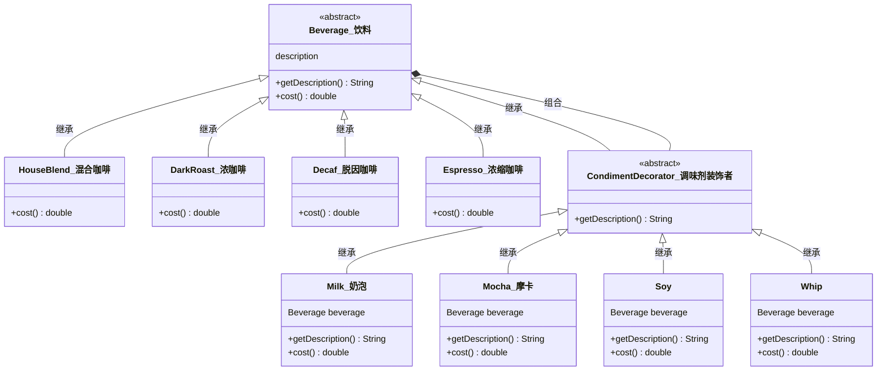

## 装饰者模式（Decorator Pattern）

<span style='color:red'><b>装饰者模式</b> 动态地将责任附加到对象上。若要扩展功能，装饰者提供了比继承更有弹性的替代方案。</span>

#### 咖啡订单系统

##### 第一次尝试

Beverage（饮料）类作为抽象类，每个子类都实现 Beverage 类中的 cost方法。但由于购买咖啡时，可以再其中加入蒸奶、豆浆等调料，所以订单系统需要考虑加入不同调料的价格，导致类呈爆炸性增长。

##### 设计


##### 要点
- 装饰者和被装饰对象有相同的父类。
- 你可以用一个或多个装饰者包装一个对象。
- 既然装饰者和被装饰对象有相同的父类，所以在任何需要原始对象（被包装的）的场合，可以用装饰过的对象代替它。
- 装饰者可以在所委托被装饰者的行为之前与（或）之后，加上自己的行为，以达到特定的目的。
- 对象可以在任何时候被装饰，所以可以在运行时动态地、不限量地用你喜欢的装饰者来装饰对象。

##### 类图



#### 代码实现

<code-group>
  <code-block title="组件" active>
  ```java
  public abstract class Beverage {
      String description = "未知的饮料";
  
      public String getDescription() {
          return description;
      }
  
      public abstract double cost();
  }
  -------------------------------------------------------
  public class HouseBlend extends Beverage {
      public HouseBlend() {
          description = "HouseBlend";
      }
  
      @Override
      public double cost() {
          return 1;
      }
  }
  -------------------------------------------------------
  public class DarkRoast extends Beverage {
  
      public DarkRoast() {
          description = "DarkRoast";
      }
  
      @Override
      public double cost() {
          return 2;
      }
  }
  -------------------------------------------------------
  public class Espresso extends Beverage {
      public Espresso() {
          description = "Espresso";
      }
  
      @Override
      public double cost() {
          return 3;
      }
  }
  -------------------------------------------------------
  public class Decaf extends Beverage {
      public Decaf() {
          description = "Decaf";
      }
  
      @Override
      public double cost() {
          return 4;
      }
  }
  ```
  </code-block>

  <code-block title="装饰者">
  ```java
  public abstract class CondimentDecorator extends Beverage {
      @Override
      public String getDescription() {
          return super.getDescription();
      }
  }
  -------------------------------------------------------
  public class Milk extends CondimentDecorator {
  
      Beverage beverage;
  
      public Milk(Beverage beverage) {
          this.beverage = beverage;
      }
  
      @Override
      public double cost() {
          return beverage.cost() + 0.1;
      }
  
      @Override
      public String getDescription() {
          return beverage.getDescription() + "，Milk";
      }
  }
  -------------------------------------------------------
  public class Mocha extends CondimentDecorator {
  
      Beverage beverage;
  
      public Mocha(Beverage beverage) {
          this.beverage = beverage;
      }
  
      @Override
      public double cost() {
          return beverage.cost() + 0.2;
      }
  
      @Override
      public String getDescription() {
          return beverage.getDescription() + "，Mocha";
      }
  }
  -------------------------------------------------------
  public class Soy extends CondimentDecorator {
  
      Beverage beverage;
  
      public Soy(Beverage beverage) {
          this.beverage = beverage;
      }
  
      @Override
      public double cost() {
          return beverage.cost() + 0.3;
      }
  
      @Override
      public String getDescription() {
          return beverage.getDescription() + "，Soy";
      }
  }
  -------------------------------------------------------
  public class Whip extends CondimentDecorator {
  
      Beverage beverage;
  
      public Whip(Beverage beverage) {
          this.beverage = beverage;
      }
  
      @Override
      public double cost() {
          return beverage.cost() + 0.4;
      }
  
      @Override
      public String getDescription() {
          return beverage.getDescription() + "，Whip";
      }
  }
  ```
  </code-block>
  
  <code-block title="测试类">
    ```java
    public class Main {
        public static void main(String[] args) {
            Beverage darkRoast = new DarkRoast();
            darkRoast = new Milk(darkRoast);
            darkRoast = new Mocha(darkRoast);
            darkRoast = new Soy(darkRoast);
    
            System.out.println("商品：" + darkRoast.getDescription() + "\n价格：" + darkRoast.cost());
    
            Beverage espresso = new Espresso();
            espresso = new Milk(espresso);
            espresso = new Whip(espresso);
    
            System.out.println("商品：" + espresso.getDescription() + "\n价格：" + espresso.cost());
        }
    }
    ```
    </code-block>
</code-group>
