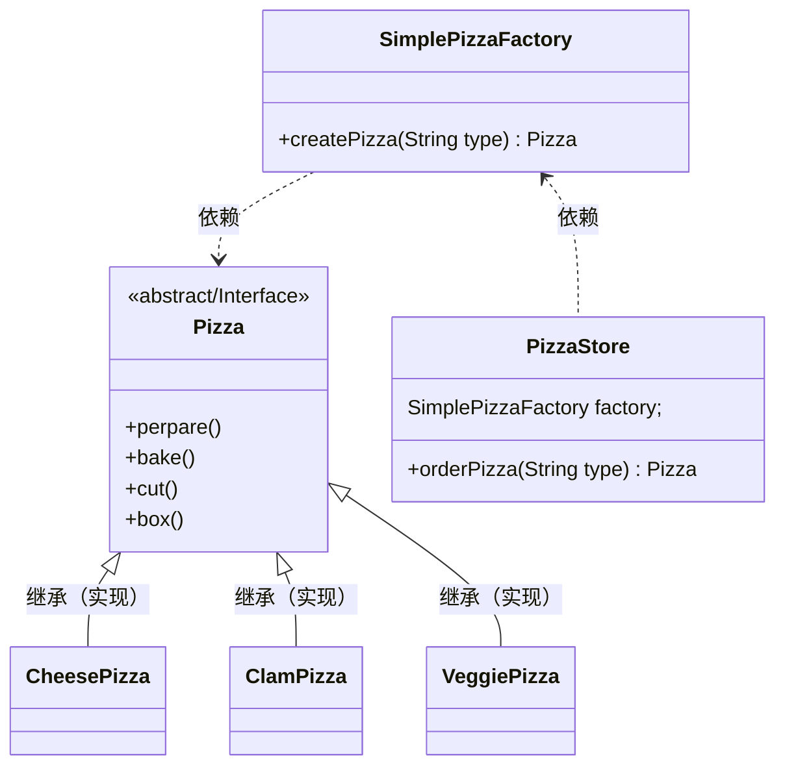
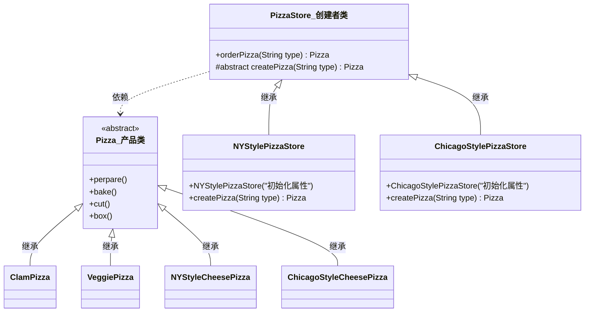
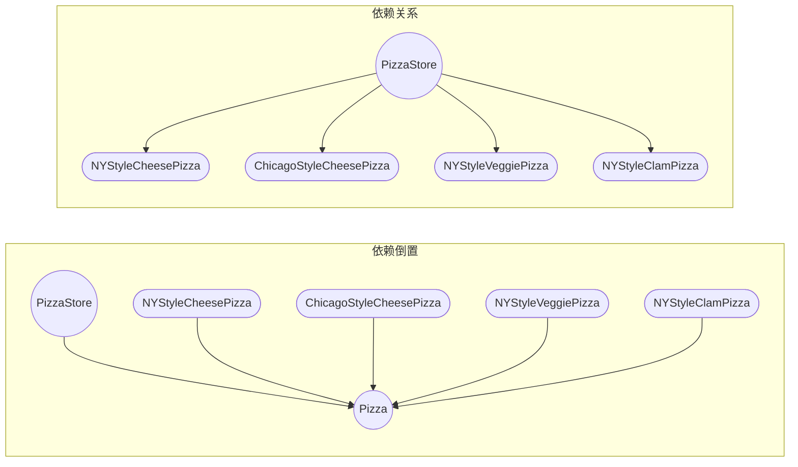
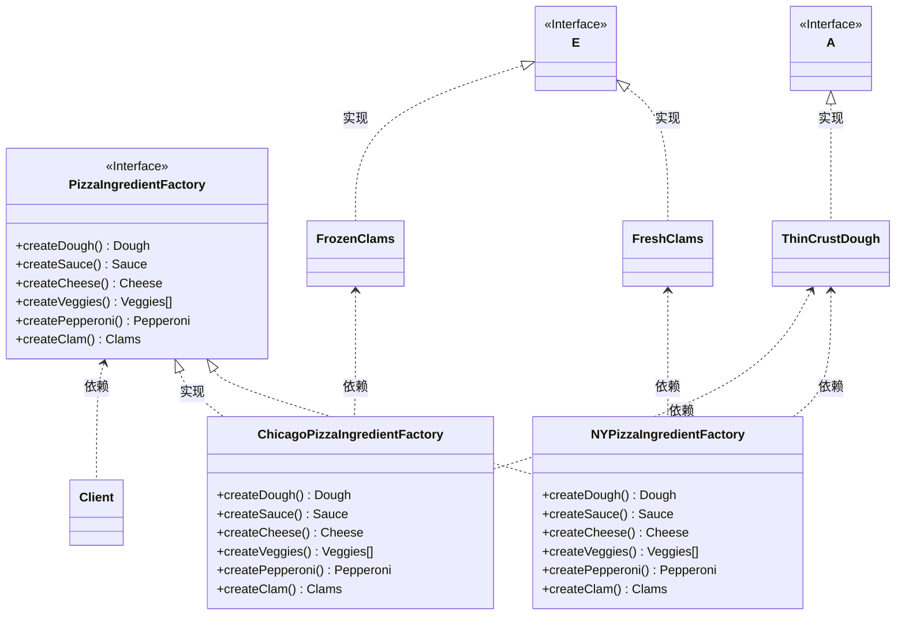

### 三、工厂模式（Factory Pattern）

#### 问题提出
当我们使用 "new" 来实例化对象时，也是在对具体实现编程。
比如我们根据条件的不同来实例化鸭子，需要编写以下代码

```java
Pizza orderPizza(String type) {
  Pizza pizza;

  if (type.equals("cheese")) {
    pizza = new CheesePizza();
  } else if (type.equals("clam")) {
    pizza = new ClamPizza();
  } else if (type.equals("veggie")) {
    pizza = new VeggiePizza();
  }

  pizza.perpare();
  pizza.bake();
  pizza.cut();
  pizza.box();
  return pizza;
}
```

一旦发生修改或扩展，我们就必须去维护这段代码，容易出现问题（违反开闭原则）

#### 简单工厂

简单工厂其实不是一个设计模式，反而比较像是一种编程习惯。

##### 抽取变化的地方

把创建不同对象这个 “变” 的地方抽取出来，不变的地方（其他方法）不做变动。

```java
public class SimplePizzaFactory {
  public Pizza createPizza(String type) {
    Pizza pizza;

    if (type.equals("cheese")) {
      pizza = new CheesePizza();
    } else if (type.equals("clam")) {
      pizza = new ClamPizza();
    } else if (type.equals("veggie")) {
      pizza = new VeggiePizza();
    }

    return pizza;
  }
}
```

附：
> 静态工厂：使用静态方法来定义简单工厂，可以不使用创建对象的方法来实例化对象。缺点是不能通过继承来修改创建方法内的行为。


##### 类图



#### 工厂方法模式

<span style='color:red'><b>工厂方法模式</b> 定义了一个创建对象的接口，但由子类决定要实例化的类是哪一个。工厂方法让类把实例化推迟到子类。</span>

##### 开加盟店

###### 类图



###### 代码实现
<br/> 

<code-group>
  <code-block title="产品类" active>
  ```java
  import java.util.ArrayList;
  
  public abstract class Pizza {
      protected String name;            // 披萨名字
      protected String dough;           // 面团类型
      protected String sauce;           // 酱料类型
      protected ArrayList topping= new ArrayList();     // 一套佐料
  
      public String getName() {
          return name;
      }
  
      public void perpare(){
          System.out.println("准备原料");
      }
      public void bake(){
          System.out.println("炙烤披萨");
      }
      public void cut(){
          System.out.println("披萨切片");
      }
      public void box(){
          System.out.println("披萨装盒");
      }
  }
  
  
  class ClamPizza extends Pizza {
      public ClamPizza() {
          name = "ClamPizza";
          System.out.println("初始化" + name);
      }
  }
  class VeggiePizza extends Pizza {
      public VeggiePizza() {
          name = "VeggiePizza";
          System.out.println("初始化" + name);
      }
  }
  class NYStyleCheesePizza extends Pizza {
      public NYStyleCheesePizza() {
          name = "NYStyleCheesePizza";
          System.out.println("初始化" + name);
      }
  }
  class ChicagoStyleCheesePizza extends Pizza {
      public ChicagoStyleCheesePizza() {
          name = "ChicagoStyleCheesePizza";
          System.out.println("初始化" + name);
      }
  
      @Override
      public void cut() {
          System.out.println("披萨切为方块");
      }
  }
  ```
  </code-block>

  <code-block title="创建者类">
  ```java
  public abstract class PizzaStore {
      Pizza pizza = null;
  
      public Pizza orderPizza(String type) {
          return createPizza(type);
      }
  
      public void makePizza() {
          if (null != this.pizza) {
              pizza.perpare();
              pizza.bake();
              pizza.cut();
              pizza.box();
          }
      }
  
      protected abstract Pizza createPizza(String type);
  }
  
  class NYStylePizzaStore extends PizzaStore {
  
      @Override
      protected Pizza createPizza(String type) {
          if ("clam".equalsIgnoreCase(type)) {
              pizza = new ClamPizza();
          } else if ("veggie".equalsIgnoreCase(type)) {
              pizza = new VeggiePizza();
          } else if ("cheese".equalsIgnoreCase(type)) {
              pizza = new NYStyleCheesePizza();
          }
          makePizza();
          return pizza;
      }
  }
  
  class ChicagoStylePizzaStore extends PizzaStore {
  
      @Override
      protected Pizza createPizza(String type) {
          if ("clam".equalsIgnoreCase(type)) {
              pizza = new ClamPizza();
          } else if ("veggie".equalsIgnoreCase(type)) {
              pizza = new VeggiePizza();
          } else if ("cheese".equalsIgnoreCase(type)) {
              pizza = new ChicagoStyleCheesePizza();
          }
          makePizza();
          return pizza;
      }
  }
  ```
  </code-block>
  
  <code-block title="测试启动类">
  ```java
  public class Main {
      public static void main(String[] args) {
          PizzaStore nyStylePizzaStore = new NYStylePizzaStore();
          PizzaStore chicagoStylePizzaStore = new ChicagoStylePizzaStore();
  
          Pizza nyCheese = nyStylePizzaStore.orderPizza("CHEESE");
          System.out.println(nyCheese.getName());
  
          Pizza chCheese = chicagoStylePizzaStore.orderPizza("CHEESE");
          System.out.println(chCheese.getName());
      }
  }
  ```
  </code-block>
</code-group>

##### 依赖倒置原则

###### 描述

<b>不能让高层组件依赖低层组件。而且，不管高层组件还是低层组件，都应该依赖于抽象。</b>

在应用工厂方法之后，你将注意到，高层组件（也就是PizzaStore）和低层组件（也就是这些比萨）都依赖了Pizz抽象。想要遵循依赖倒置原则，工厂方法并非是唯一的技巧，但却是最有威力的技巧之一。

所谓倒置体现在：



###### 如何遵循此原则

1. 变量不可以持有具体类的引用。
2. 不要让类派生自具体类。
3. 不要覆盖基类中已实现的方法


#### 抽象工厂模式

<span style='color:red'><b>抽象工厂模式</b> 提供一个接口，用于创建相关或依赖对象的家族，而不需要明确指定具体类。</span>

##### 原料工厂

###### 问题提出

如何确保原料的一致？由于地域差别，每家店的披萨所使用的原材料并不完全一致。我们需要建造一个工厂生产原料，并处理各个区域的差异。

###### 类图

抽象工厂允许客户使用抽象的接口来创建一组相关的产品，而不需要知道（或关心）实际产出的具体产品是什么。这样一来，客户就从具体的产品中被解耦。让我们看看类图来了解其中的关系：



###### 代码实现
<br/>

<code-group>
  <code-block title="配料家族类" active>
  ```java
  public interface Ingredient {}
  
  class Dough implements Ingredient {
      String name = "Dough";
      public Dough() {
          System.out.println("配料: " + name);
      }
  }
  class Sauce implements Ingredient {
      String name = "Sauce";
      public Sauce() {
      }
  }
  class Cheese implements Ingredient {
      String name = "Cheese";
      public Cheese() {
          System.out.println("配料: " + name);
      }
  }
  class Veggies implements Ingredient {
      String name = "Veggies";
  }
  class Carrot extends Veggies {
      public Carrot() {
          name = "胡萝卜";
          System.out.println("配料: " + name);
      }
  }
  class Lettuce extends Veggies {
      public Lettuce() {
          name = "生菜";
          System.out.println("配料: " + name);
      }
  }
  class Pepperoni implements Ingredient {
      String name = "Pepperoni";
      public Pepperoni() {
          System.out.println("配料: " + name);
      }
  }
  
  interface Clams extends Ingredient {}
  
  class FreshClams implements Clams {
      String name = "新鲜蛤蜊";
      public FreshClams() {
          System.out.println("配料: " + name);
      }
  }
  class FrozenClams implements Clams {
      String name = "冰冻蛤蜊";
      public FrozenClams() {
          System.out.println("配料: " + name);
      }
  }
  ```
  </code-block>

  <code-block title="配料抽象工厂类">
  ```java
  public interface PizzaIngredientFactory {
      Dough createDough();
      Sauce createSauce();
      Cheese createCheese();
      Veggies[] createVeggies();
      Pepperoni createPepperoni();
      Clams createClam();
  }
  
  
  class ChicagoPizzaIngredientFactory implements PizzaIngredientFactory {
  
      @Override
      public Dough createDough() {
          return new Dough();
      }
  
      @Override
      public Sauce createSauce() {
          return new Sauce();
      }
  
      @Override
      public Cheese createCheese() {
          return new Cheese();
      }
  
      @Override
      public Veggies[] createVeggies() {
          return new Veggies[]{new Carrot(), new Lettuce()};
      }
  
      @Override
      public Pepperoni createPepperoni() {
          return new Pepperoni();
      }
  
      @Override
      public Clams createClam() {
          return new FreshClams();
      }
  }
  
  class NYPizzaIngredientFactory implements PizzaIngredientFactory {
  
      @Override
      public Dough createDough() {
          return new Dough();
      }
  
      @Override
      public Sauce createSauce() {
          return new Sauce();
      }
  
      @Override
      public Cheese createCheese() {
          return new Cheese();
      }
  
      @Override
      public Veggies[] createVeggies() {
          return new Veggies[]{new Lettuce()};
      }
  
      @Override
      public Pepperoni createPepperoni() {
          return new Pepperoni();
      }
  
      @Override
      public Clams createClam() {
          return new FrozenClams();
      }
  }
  ```
  </code-block>
  
  <code-block title="披萨类（产品）">
  ```java
  public abstract class Pizza {
      protected String name;            // 披萨名字
      protected Dough dough;           // 面团类型
      protected Sauce sauce;           // 酱料类型
      protected List<Ingredient> topping= new ArrayList();     // 一套佐料
      protected Clams clams;
  
      public String getName() {
          return name;
      }
  
      public void perpare(){
          System.out.println("准备原料");
      }
      public void bake(){
          System.out.println("炙烤披萨");
      }
      public void cut(){
          System.out.println("披萨切片");
      }
      public void box(){
          System.out.println("披萨装盒");
      }
  }
  
  
  class ClamPizza extends Pizza {
      PizzaIngredientFactory pizzaIngredientFactory;   // 新增原料工厂
  
      public ClamPizza(PizzaIngredientFactory pizzaIngredientFactory) {
          name = "ClamPizza";
          this.pizzaIngredientFactory = pizzaIngredientFactory;
      }
  
      @Override
      public void perpare() {
          super.perpare();
          dough = pizzaIngredientFactory.createDough();
          sauce = pizzaIngredientFactory.createSauce();
          topping = Arrays.asList(pizzaIngredientFactory.createVeggies());
          clams = pizzaIngredientFactory.createClam();
      }
  }
  class VeggiePizza extends Pizza {
      public VeggiePizza() {
          name = "VeggiePizza";
          System.out.println("初始化" + name);
      }
  }
  class NYStyleCheesePizza extends Pizza {
      public NYStyleCheesePizza() {
          name = "NYStyleCheesePizza";
          System.out.println("初始化" + name);
      }
  }
  class ChicagoStyleCheesePizza extends Pizza {
      public ChicagoStyleCheesePizza() {
          name = "ChicagoStyleCheesePizza";
          System.out.println("初始化" + name);
      }
  
      @Override
      public void cut() {
          System.out.println("披萨切为方块");
      }
  }
  ```
  </code-block>
    
  <code-block title="披萨店（创建者）">
  ```java
  public abstract class PizzaStore {
      Pizza pizza = null;
      PizzaIngredientFactory pizzaIngredientFactory;   // 新增原料工厂
  
      public Pizza orderPizza(String type) {
          return createPizza(type);
      }
  
      public void makePizza() {
          if (null != this.pizza) {
              pizza.perpare();
              pizza.bake();
              pizza.cut();
              pizza.box();
          }
      }
  
      protected abstract Pizza createPizza(String type);
  }
  
  class NYStylePizzaStore extends PizzaStore {
      public NYStylePizzaStore(PizzaIngredientFactory pizzaIngredientFactory) {
          super.pizzaIngredientFactory = pizzaIngredientFactory;
      }
  
      @Override
      protected Pizza createPizza(String type) {
          if ("clam".equalsIgnoreCase(type)) {
              pizza = new ClamPizza(pizzaIngredientFactory);
          } else if ("veggie".equalsIgnoreCase(type)) {
              pizza = new VeggiePizza();
          } else if ("cheese".equalsIgnoreCase(type)) {
              pizza = new NYStyleCheesePizza();
          }
          makePizza();
          return pizza;
      }
  }
  
  class ChicagoStylePizzaStore extends PizzaStore {
      public ChicagoStylePizzaStore(PizzaIngredientFactory pizzaIngredientFactory) {
          super.pizzaIngredientFactory = pizzaIngredientFactory;
      }
  
      @Override
      protected Pizza createPizza(String type) {
          if ("clam".equalsIgnoreCase(type)) {
              pizza = new ClamPizza(pizzaIngredientFactory);
          } else if ("veggie".equalsIgnoreCase(type)) {
              pizza = new VeggiePizza();
          } else if ("cheese".equalsIgnoreCase(type)) {
              pizza = new ChicagoStyleCheesePizza();
          }
          makePizza();
          return pizza;
      }
  }
  ```
  </code-block>
  
  <code-block title="测试启动类">
  ```java
  public class Main {
      public static void main(String[] args) {
          PizzaStore nyStylePizzaStore = new NYStylePizzaStore(new NYPizzaIngredientFactory());
          PizzaStore chicagoStylePizzaStore = new ChicagoStylePizzaStore(new ChicagoPizzaIngredientFactory());
  
          Pizza nyCheese = nyStylePizzaStore.orderPizza("Clam");
          System.out.println(nyCheese.getName());
  
          Pizza chCheese = chicagoStylePizzaStore.orderPizza("Clam");
          System.out.println(chCheese.getName());
      }
  }
  ```
  </code-block>
</code-group>

#### 要点

> 抽象工厂的任务是定义创建一组产品的接口，这个接口里的每个方法都负责创建一个具体产品，同时我们通过实现抽象工厂子类来具体实现这些方法（工厂方法）。即，抽象工厂的方法通常是以工厂方法的方式实现的。

- 所有的工厂都是用来封装对象的创建
- 简单工厂，虽然不是真正的设计模式，但仍不失为一个简单的方法，可以将客户程序从具体类解稠。
- 工厂方法使用继承：把对象的创建委托给子类，子类实现工厂方法来创建对象。
- 抽象工厂使用对象组合：对象的创建被实现在工厂接口所暴露出来的方法中。
- 所有工厂模式都通过减少应用程序和具体类之间的依赖促进松耦合。
- 工厂方法允许类将实例化延迟到子类进行。
- 抽象工厂创建相关的对象家族，而不需要依赖它们的具体类。
- 依赖倒置原则，指导我们避免依赖具体类型，而要尽量依赖抽象。
- 工厂是很有威力的技巧，帮助我们针对抽象编程，而不要针对具体类编程。
