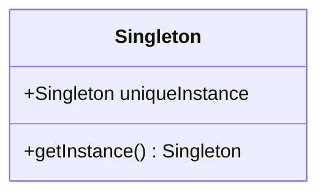

## 单例模式（Singleton）

<span style='color:red'><b>单例模式</b> 确保一个类只有一个实例，并提供一个全局访问点。</span>

#### 问题提出

问题：有些对象我们只需要一个。比如线程池（threadpool）、缓存（cache）、对话框、处理偏好设置和注册表（registry）的对象、日志对象、驱动程序对象等。

Java 静态变量可以保证全局只有一个实例，但是会有缺点：必须一开始就创建好对象，

#### 经典单例模式

##### 类图



##### 代码

<b>问题：在多线程的情况下会出现问题</b>

```java
public class ChocolateBoiler {
    private boolean empty;   // 锅炉是否是空的
    private boolean boiled;  // 是否煮沸过
    private static ChocolateBoiler chocolateBoiler;

    private ChocolateBoiler() {
        empty = true;
        boiled = false;
    }

    public static ChocolateBoiler getInstance() {
        if (null == chocolateBoiler) {
            chocolateBoiler =  new ChocolateBoiler();
        }
        return chocolateBoiler;
    }

    public void  fill() {
        if (isEmpty()) {
            empty = false;
            boiled = false;
            // 在锅炉里填充巧克力和牛奶的混合物
        }
    }

    private boolean isEmpty() {
        return empty;
    }
}
```

#### 解决多线程问题

##### 1. 加 synchronized 锁

给 getInstance() 方法加 synchronized 锁，缺点是会降低性能。

##### 2. 饿汉式单例

在JVM加载类时立刻实例化对象，后面调用 getInstance() 方法时直接返回实例就可以。

```java
public class Singleton() {
  private static Singleton uniqueSingleton = new Singleton();

  private Singleton() {}

  public static Singleton getInstance() {
    return uniqueSingleton;
  }
}
```

##### 3. 懒汉式单例（双重检查加锁）

利用双重检查加锁（double-checked locking），首先检查是否实例已经创建了，如果尚未创建，“才”进行同步。这样一来，只有第一次会同步，这正是我们想要的。

> volatile关键字是java提供的一种稍弱的同步机制。用来将变量的更新操作同步到其他线程，保证可见性，保证线程等到的变量值是最新的  
> 注：JDK1.4 及更早版本的 volatile 会导致双重检查锁失效

```java
public class Singleton() {
  private volatile static Singleton uniqueSingleton;

  private Singleton() {}

  public static Singleton getInstance() {
    if (uniqueSingleton == null) {
      synchronized (Singleton.class) {
        if (uniqueSingleton == null) {
          uniqueSingleton = new Singleton();
        }
      }
    }
    return uniqueSingleton;
  }
}
```

#### 要点

- 单例模式确保程序中一个类最多只有一个实例。
- 单例模式也提供访问这个实例的全局点。
- 在Java中实现单例模式需要私有的构造器、一个静态方法和一个静态变量。
- 确定在性能和资源上的限制，然后小心地选择适当的方案来实现单例，以解决多线程的问题（我们必须认定所有的程序都是多线程的）。
- 如果不是采用JDK1.5以上，双重检查加锁实现会失效。
- 小心，你如果使用多个类加载器，可能导致单例失效而产生多个实例。
  > 由于每个类加载器都定义了一个命名空间，如果有多个类加载器，会导致同一个类被加载多次，造成多个单例模式并存的现象。解决办法是：执行指定类加载器，并指定同一个类加载器。
- 如果使用JVM1.2或之前的版本，你必须建立单例注册表，以免垃圾收集器将单例回收。
  > 谣言：垃圾收集器会吃掉单例。Java1.2之前，垃圾收集器有个bug，单例没有全局引用（只有单例类引用自身）的时候会被当做垃圾清除。1.2 以后已修复。
