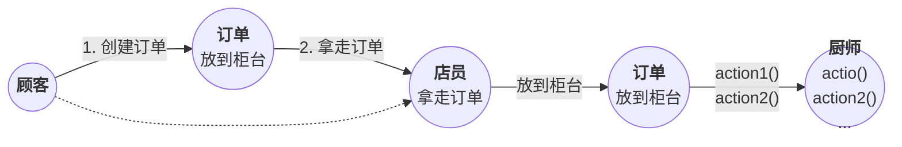
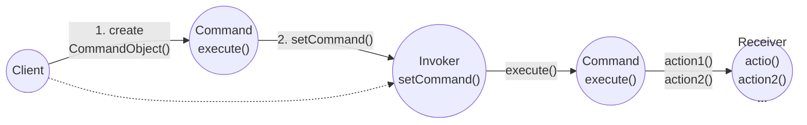
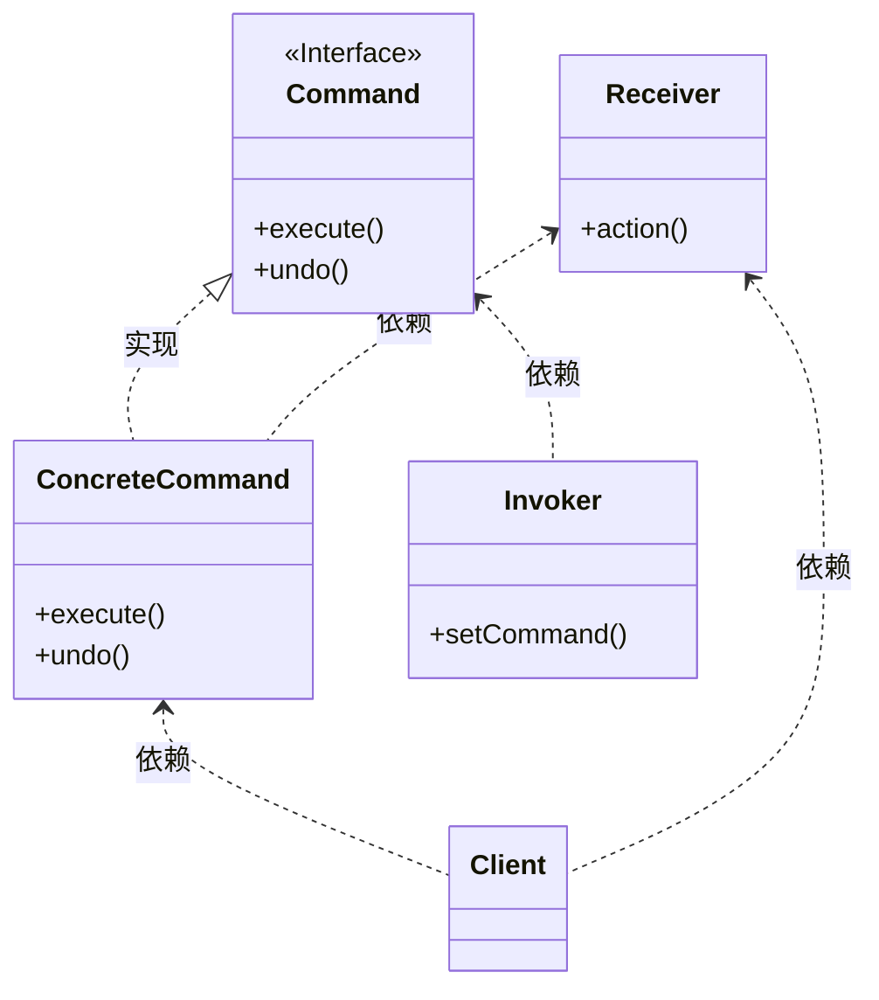
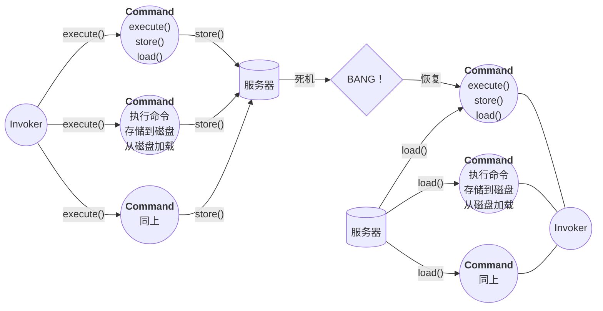

## 命令模式（Command Pattern）

<span style='color:red'><b>命令模式</b> 将“请求”封装成对象，以便使用不同的请求、队列或者日志来参数化其他对象。命令模式也支持可撤销的操作。</span>

#### 问题提出

创建一组控制遥控器的API，让遥控器每个插槽都能控制一个或一组装置。注意：要求能够控制目前的装置和任何未来可能出现的装置。

#### 思考如何实现



1. 客户创建一个命令对象
2. 客户利用 setCommand() 将命令对象存储在调用者中
3. 客户要求调用者执行命令
  > 注意：一旦命令被加载到调用者，该命令可以被使用或丢弃，或者可以被保留下来并使用许多次。



#### 类图
 

 
#### 代码实现
<br/>

<code-group>
  <code-block title="各厂商装置类" active>
  ```java
  // 电灯类
  class Light {
      String name;
      public Light(String name) {
          this.name = name;
      }
  
      public void on() {
          System.out.println(name + "被打开");
      }
      public void off() {
          System.out.println(name + "被关闭");
      }
  }
  
  /**
   * 音响类
   */
  class Stereo {
      public void on() {
          System.out.println("打开音响");
      }
  
      public void setCD() {
          System.out.println("播放CD");
      }
  
      public void setVolume(int val) {
          System.out.println("设置音量" + val);
      }
  
      public void off() {
          System.out.println("关闭音响");
      }
  }
  ```
  </code-block>

  <code-block title="命令类">
  ```java
  public interface Command {
      public void execute();
  }
  
  class NoCommand implements Command {
  
      @Override
      public void execute() {
          // System.out.println("什么也不做");
      }
  }
  
  // 打开电灯
  class LightOnCommand implements Command {
      Light light;
  
      public LightOnCommand(Light light) {
          this.light = light;
      }
  
      @Override
      public void execute() {
          light.on();
      }
  }
  
  // 关闭电灯
  class LightOffCommand implements Command {
      Light light;
  
      public LightOffCommand(Light light) {
          this.light = light;
      }
  
      @Override
      public void execute() {
          light.off();
      }
  }
  
  /**
   * 打开音响命令
   */
  class StereoOnWithCDCommand implements Command {
      Stereo stereo;
  
      public StereoOnWithCDCommand(Stereo stereo) {
          this.stereo = stereo;
      }
  
      @Override
      public void execute() {
          stereo.on();
          stereo.setCD();
          stereo.setVolume(11);
      }
  }
  
  /**
   * 关闭音响命令
   */
  class StereoOffCommand implements Command {
      Stereo stereo;
  
      public StereoOffCommand(Stereo stereo) {
          this.stereo = stereo;
      }
  
      @Override
      public void execute() {
          stereo.off();
      }
  }
  ```
  </code-block>

  <code-block title="执行命令（遥控器类）">
  ```java
  /**
   * 遥控器类
   */
  public class SimpleRemoteController {
      // 插槽持有命令，控制着一个装置
      // 用来记录 7 个接口的命令
      Command[] onCommands;
      Command[] offCommands;
  
      public SimpleRemoteController() {
          // 实例化并初始化两个开关数组
          this.onCommands = new Command[7];
          this.offCommands = new Command[7];
  
          NoCommand noCommand = new NoCommand();
          for (int i = 0; i < 7; i++) {
              onCommands[i] = noCommand;
              offCommands[i] = noCommand;
          }
      }
  
      /**
       * @param slot   插槽位置
       * @param onCommand   开命令
       * @param offCommand  关命令
       * 用来设置插槽控制命令，可以通过多次调用改变行为
       */
      public void setCommand(int slot, Command onCommand, Command offCommand) {
          onCommands[slot] = onCommand;
          offCommands[slot] = offCommand;
      }
  
      /**
       * 按下开启按钮，命令衔接插槽，调用 execute() 方法
       */
      public void onButtonWasPressed(int slot) {
          onCommands[slot].execute();
      }
  
      public void offButtonWasPressed(int slot) {
          offCommands[slot].execute();
      }
  
      @Override
      public String toString() {
          StringBuffer stringBuffer = new StringBuffer();
  
          for (int i = 0; i < 7; i++) {
              stringBuffer.append("装置：")
                      .append(i)
                      .append("\t开启类：")
                      .append(onCommands[i].getClass().getName())
                      .append("\t关闭类：")
                      .append(offCommands.getClass().getName())
                      .append("\n");
          }
  
          return stringBuffer.toString();
      }
  }
  ```
  </code-block>

  <code-block title="测试类">
  ```java
  /**
   * 命令模式的客户
   */
  public class Main {
      public static void main(String[] args) {
          Light light1 = new Light("厨房灯");
          Light light2 = new Light("卧室灯");
          Stereo stereo = new Stereo();
          LightOnCommand light1OnCommand = new LightOnCommand(light1);
          LightOnCommand light2OnCommand = new LightOnCommand(light2);
          LightOffCommand light1OffCommand = new LightOffCommand(light1);
          LightOffCommand light2OffCommand = new LightOffCommand(light2);
          StereoOnWithCDCommand stereoOnWithCDCommand = new StereoOnWithCDCommand(stereo);
          StereoOffCommand stereoOffCommand = new StereoOffCommand(stereo);
  
          SimpleRemoteController simpleRemoteController = new SimpleRemoteController();
          simpleRemoteController.setCommand(1, light1OnCommand, light1OffCommand);
          simpleRemoteController.setCommand(2, light2OnCommand, light2OffCommand);
          simpleRemoteController.setCommand(3, stereoOnWithCDCommand, stereoOffCommand);
  
          System.out.println(simpleRemoteController.toString());
  
          simpleRemoteController.onButtonWasPressed(1);
          simpleRemoteController.onButtonWasPressed(2);
          simpleRemoteController.onButtonWasPressed(3);
          simpleRemoteController.offButtonWasPressed(3);
      }
  }
  ```
  </code-block>
</code-group>

#### 其他

##### 实现命令撤销（待完善）
##### 使用宏命令及宏撤销（待完善）
##### 命令模式更多用途：队列请求（待完善）
##### 命令模式更多用途：日志请求（待完善）



#### 要点

- 命令模式将发出请求的对象和执行请求的对象解耦。
- 在被解耦的两者之间是通过命令对象进行沟通的。命令对象封装了接收者和一个或一组动作。
- 调用者通过调用命令对象的execute()发出请求，这会使得接收者的动作被调用。
- 调用者可以接受命令当做参数，甚至在运行时动态地进行。
- 命令可以支特撒销，做法是实现一个undo()方法来回到execute()被执行前的状态。
- 宏命令是命令的一种简单的延伸，允许调用多个命令。宏方法也可以支持撤销。
- 实际操作时，很常见使用“聪明”命令对象，也就是直接实现了请求，而不是将工作委托给接收者。
- 命令也可以用来实现日志和事务系统。