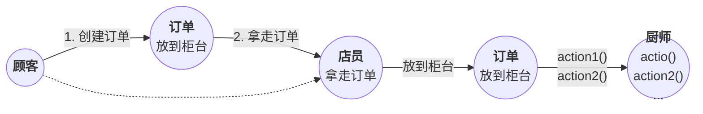
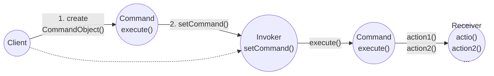

## 命令模式（Command Pattern）

<b>命令模式</b> 将“请求”封装成对象，以便使用不同的请求、队列或者日志来参数化其他对象。命令模式也支持可撤销的操作。

#### 问题提出

创建一组控制遥控器的API，让遥控器每个插槽都能控制一个或一组装置。注意：要求能够控制目前的装置和任何未来可能出现的装置。

#### 思考如何实现

1. 客户创建一个命令对象
2. 客户利用 setCommand() 将命令对象存储在调用者中
3. 客户要求调用者执行命令
  > 注意：一旦命令被加载到调用者，该命令可以被使用或丢弃，或者可以被保留下来并使用许多次。

