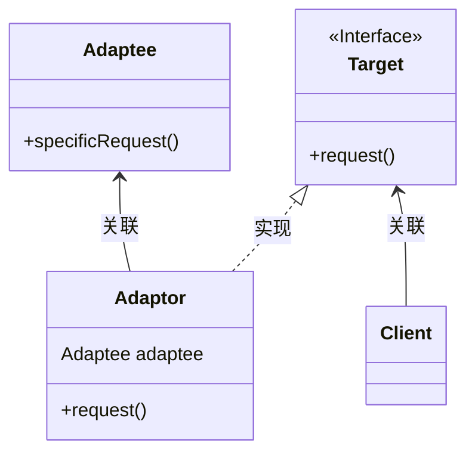
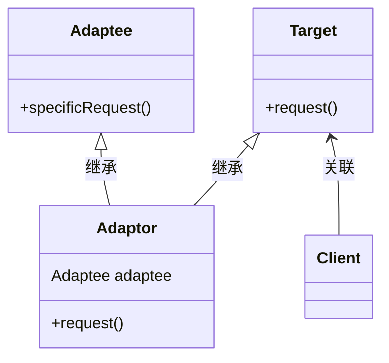
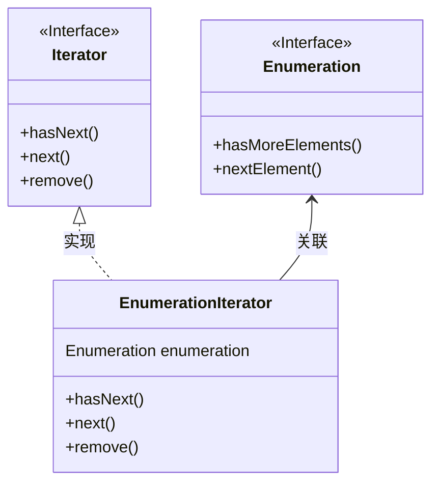

## 适配器模式（adaptor pattern）

<span style='color:red'><b>适配器模式</b> 将一个类的接口，转换成客户期望的另一个接口。适配器让原本接口不兼容的类可以合作无间。</span>

#### 问题提出：火鸡转换器

假如我们在路上遇见一个NPC，必须给他一只鸭子才能完成任务。但是我们只有一只火鸡，这时，我们就需要适配器模式来适配他的需求。😕🤣

#### 类图（对象适配器）
<br/>

采用组合的方式



#### 代码实现

<code-group>
  <code-block title="鸭子类" active>
  ```java
  / 鸭子接口
  public interface Duck {
      public void quack();
      public void fly();
  }
  
  class MallardDuck implements Duck{
  
      @Override
      public void quack() {
          System.out.println("绿头鸭叫");
      }
  
      @Override
      public void fly() {
          System.out.println("绿头鸭飞");
      }
  }
  ```
  </code-block>

  <code-block title="火鸡类">
  ```java
  /**
   * 火鸡接口
   */
  public interface Turkey {
      public void gobble();   // 火鸡咯咯叫
      public void fly();      // 火鸡飞
  }
  
  /**
   * 火鸡实现
   */
  class WildTurkey implements Turkey {
  
      @Override
      public void gobble() {
          System.out.println("火鸡咯咯叫");
      }
  
      @Override
      public void fly() {
          System.out.println("火鸡飞行");
      }
  }
  ```
  </code-block>
  
  <code-block title="适配器">
  ```java
  public class TurkeyAdaptor implements Duck {
      Turkey turkey;
  
      public TurkeyAdaptor(Turkey turkey) {
          this.turkey = turkey;
      }
  
      @Override
      public void quack() {
          turkey.gobble();
      }
  
      @Override
      public void fly() {
          turkey.fly();
      }
  }
  ```
  </code-block>
  
  <code-block title="测试类">
  ```java
  public class Main {
      public static void main(String[] args) {
          MallardDuck duck = new MallardDuck();   // 创建一只鸭子
          WildTurkey turkey = new WildTurkey();   // 创建一只火鸡
  
          Main main = new Main();
          main.testDuck(duck);
  //        main.testDuck(turkey);
          TurkeyAdaptor turkeyAdaptor = new TurkeyAdaptor(turkey);
          main.testDuck(turkeyAdaptor);
      }
  
      /**
       * 鸭子测试类
       * @param duck
       */
      public void testDuck(Duck duck) {
          duck.quack();
          duck.fly();
      }
  }
  ```
  </code-block>
</code-group>

#### 多继承时类适配器（Java无法实现）

采用继承的形式<br/>



#### 真实世界（Java）的适配器

##### 问题提出

1. 旧世界的枚举器
    > 如果你已经使用过Java，可能记得早期的集合(collection)类型（例如：Vector、Stack、Hashtable)都实现了一个名为elements（）的方法。该方法会返回一个Enumeration（举）。这个Enumeration接口可以逐一走过此集合内的每个元素，而无需知道它们在集合内是如何被管理的。

2. 新世界的迭代器
    > 当Sun推出更新后的集合类时，开始使用了Iterator（迭代器）接口，这个接口和枚举接口很像，都可以让你遍历此集合类型内的每个元素，但不同的是，迭代器还提供了删除元素的能力。

3. 遗留代码暴露了枚举器接口，但是新代码只希望用迭代器。想解决这个问题，需要构造一个适配器。

##### 将枚举适配到迭代器

由于 Enumeration 为“只读”接口，无法实现 remove() 的效果，只能先在 remove 中抛出异常。



## 外观模式

<span style='color:red'><b>外观模式</b> 提供了一个统一的接口，用来访问子系统中的一群接口。外观定义了一个高层接口，让子系统更容易使用。</span>


