## 适配器模式（Adaptor Pattern）

<span style='color:red'><b>适配器模式</b> 将一个类的接口，转换成客户期望的另一个接口。适配器让原本接口不兼容的类可以合作无间。</span>

#### 问题提出：火鸡转换器

假如我们在路上遇见一个NPC，必须给他一只鸭子才能完成任务。但是我们只有一只火鸡，这时，我们就需要适配器模式来适配他的需求。😕🤣

#### 类图（对象适配器）
<br/>

采用组合的方式

```mermaid
classDiagram
  class Target{
    <<Interface>>
    +request()
  }
  class Adaptee{
    +specificRequest()
  }
  class Adaptor{
    Adaptee adaptee
    +request()
  }
  
  class Client{
  }

  Target <|.. Adaptor : 实现
  Adaptee <-- Adaptor : 关联
  Target <-- Client : 关联
```



#### 代码实现

<code-group>
  <code-block title="鸭子类" active>
  ```java
  / 鸭子接口
  public interface Duck {
      public void quack();
      public void fly();
  }
  
  class MallardDuck implements Duck{
  
      @Override
      public void quack() {
          System.out.println("绿头鸭叫");
      }
  
      @Override
      public void fly() {
          System.out.println("绿头鸭飞");
      }
  }
  ```
  </code-block>

  <code-block title="火鸡类">
  ```java
  /**
   * 火鸡接口
   */
  public interface Turkey {
      public void gobble();   // 火鸡咯咯叫
      public void fly();      // 火鸡飞
  }
  
  /**
   * 火鸡实现
   */
  class WildTurkey implements Turkey {
  
      @Override
      public void gobble() {
          System.out.println("火鸡咯咯叫");
      }
  
      @Override
      public void fly() {
          System.out.println("火鸡飞行");
      }
  }
  ```
  </code-block>
  
  <code-block title="适配器">
  ```java
  public class TurkeyAdaptor implements Duck {
      Turkey turkey;
  
      public TurkeyAdaptor(Turkey turkey) {
          this.turkey = turkey;
      }
  
      @Override
      public void quack() {
          turkey.gobble();
      }
  
      @Override
      public void fly() {
          turkey.fly();
      }
  }
  ```
  </code-block>
  
  <code-block title="测试类">
  ```java
  public class Main {
      public static void main(String[] args) {
          MallardDuck duck = new MallardDuck();   // 创建一只鸭子
          WildTurkey turkey = new WildTurkey();   // 创建一只火鸡
  
          Main main = new Main();
          main.testDuck(duck);
  //        main.testDuck(turkey);
          TurkeyAdaptor turkeyAdaptor = new TurkeyAdaptor(turkey);
          main.testDuck(turkeyAdaptor);
      }
  
      /**
       * 鸭子测试类
       * @param duck
       */
      public void testDuck(Duck duck) {
          duck.quack();
          duck.fly();
      }
  }
  ```
  </code-block>
</code-group>

#### 多继承时类适配器（Java无法实现）

```mermaid
classDiagram
  class Target{
    +request()
  }
  class Adaptee{
    +specificRequest()
  }
  class Adaptor{
    Adaptee adaptee
    +request()
  }
  
  class Client{
  }

  Target <|-- Adaptor : 继承
  Adaptee <|-- Adaptor : 继承
  Target <-- Client : 关联
```

采用继承的形式<br/>



#### 真实世界（Java）的适配器

##### 问题提出

1. 旧世界的枚举器
    > 如果你已经使用过Java，可能记得早期的集合(collection)类型（例如：Vector、Stack、Hashtable)都实现了一个名为elements（）的方法。该方法会返回一个Enumeration（举）。这个Enumeration接口可以逐一走过此集合内的每个元素，而无需知道它们在集合内是如何被管理的。

2. 新世界的迭代器
    > 当Sun推出更新后的集合类时，开始使用了Iterator（迭代器）接口，这个接口和枚举接口很像，都可以让你遍历此集合类型内的每个元素，但不同的是，迭代器还提供了删除元素的能力。

3. 遗留代码暴露了枚举器接口，但是新代码只希望用迭代器。想解决这个问题，需要构造一个适配器。

##### 将枚举适配到迭代器

由于 Enumeration 为“只读”接口，无法实现 remove() 的效果，只能先在 remove 中抛出异常。（可以使用装饰者模式实现？）


## 外观模式（Facade Pattern）

<span style='color:red'><b>外观模式</b> 提供了一个统一的接口，用来访问子系统中的一群接口。外观定义了一个高层接口，让子系统更容易使用。</span>

#### 类图

```mermaid  
classDiagram  
    class HomeTheaterFacade{
      Amplifier amo
      Tuner tuner
      DvdPlayer dvd
      CdPlayer cd
      Projector projector
      TheaterLights lights
      Screen screen
      PopcornPopper popper
      + watchMovie()
      + endMovie()
      + listenToCd()
      + endCd()
      + listenToRadio()
      + endRadio()
    }
    class Amplifier{
      Tuner tuner
      DvdPlayer dvdPlayer
      CdPlayer cdPlayer
      on()
      off()
      setCd()
      setDvd()
      setStereoSound()
      setSturroudSoud()
      setTuner()
      setVolume()
      toString()
    }
    class DvdPlayer{
      Amplifier amplifier
      on()
      off()
      eject()
      pause()
      play()
      setStereoSound()
      setSturroudSoud()
      stop()
    }
    class CdPlayer{
      Amplifier amplifier
      on()
      off()
      eject()
      pause()
      play()
      stop()
      toString()
    }
    class Projector{
      DvdPlayer dvdPlayer
      on()
      off()
      tvMode()
      wideScreenMode()
      toString()
    }

    class Tuner{
      Amplifier amplifier
      on()
      off()
      setAm()
      setFm()
      setFrequency()
      toString()
    }
    class Screen{
      up()
      down()
      toString()
    }
    class PopcornPopper{
      on()
      off()
      pop()
      toString()
    }
    class TheaterLights{
      on()
      off()
      dim()
      toString()
    }

    HomeTheaterFacade o-- Amplifier : 聚合
    HomeTheaterFacade o-- Tuner : 聚合
    HomeTheaterFacade o-- DvdPlayer : 聚合
    HomeTheaterFacade o-- CdPlayer : 聚合
    HomeTheaterFacade o-- Projector : 聚合
    HomeTheaterFacade o-- TheaterLights : 聚合
    HomeTheaterFacade o-- Screen : 聚合
    HomeTheaterFacade o-- PopcornPopper : 聚合
	
	Amplifier ..> Tuner:依赖
	Amplifier ..> DvdPlayer:依赖
	Amplifier ..> CdPlayer:依赖
	Tuner ..> Amplifier:依赖
	DvdPlayer ..> Amplifier:依赖
	CdPlayer ..> Amplifier:依赖
	Projector ..> DvdPlayer:依赖
```



#### 最少知道原则

最少知识原则：只和你的密友谈话。

> 最少知识（Least Knowledge）原则告诉我们要减少对象之间的交互，只留下几个“密友”。  
> 这个原则希望我们在设计中，不要让太多的类耦合在一起，免得修改系统中一部分，会影响到其他部分。如果许多类之间相互依赖，那么这个系统就会变成一个易碎的系统，它需要花许多成本维护，也会因为太复杂而不容易被其他人了解。

该原则提供一些方针：就任何对象而言，在该对线的方法内，我们只应该调用属于以下范围的方法：
1. 该对象本身
2. 被当作方法的参数而传递进来的对象
3. 此方法所创建或实例化的任何对象
4 对象的任何组件（HAS-A关系）

#### 要点

- 当需要使用一个现有的类而其接口并不符合你的需要时，就使用适配器。
- 当需要简化并统一一个很大的接口或者一群复杂的接口时，使用外观。
- 适配器改变接口以符合客户的期望。
- 外观将客户从一个复杂的子系统中解耦。
- 实现一个适配器可能需要一番功夫，也可能不费功夫，视目标接口的大小与复杂度而定。
- 实现一个外观，需要将子系统组合进外观中，然后将工作委托给子系统执行。
- 适配器模式有两种形式：对象适配器和类适配器。类适配器需要用到多重继承。
- 你可以为一个子系统实现一个以上的外观。
- 适配器将一个对象包装起来以改变其接口，装饰者将一个对象包装起来以增加新的行为和责任，而外观将一群对象“包装”起来以简化其接口。
