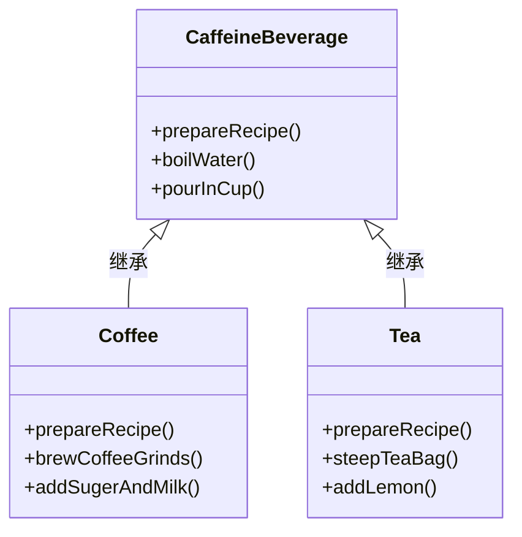
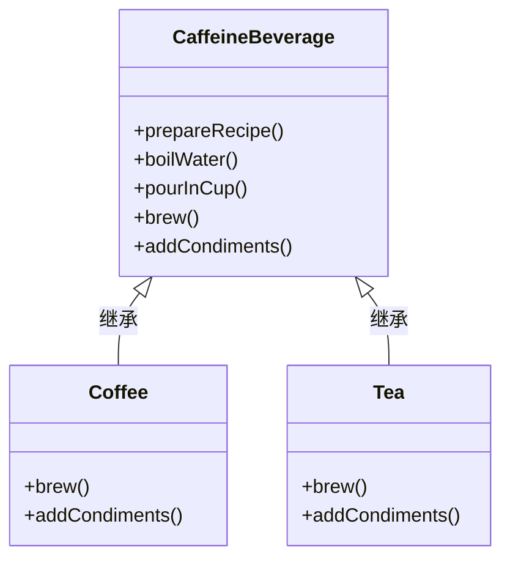

## 模板方法模式（Template Method Pattern）

<span style='color:red'><b>模板方法模式</b> 在一个方法中定义一个算法的骨架，而将一些步骤延迟到子类中。模板方法使得子类可以在不改变算法结构的情况下，重新定义算法中的某些步骤。</span>

> 这个模式是用来创建一个算法的模板。什么是模板？如你所见的，模板就是一个方法。更具体地说，这个方法将算法定义成一组步骤，其中的任何步骤都可以是抽象的，由子类负责实现。这可以确保算法的结构保持不变，同时由子类提供部分实现。

#### 快速写出咖啡和茶的类
<br/>

<code-group>
  <code-block title="咖啡" active>
  ```java
  class Coffee {
      void prepareRecipe() {
          boilWater();
          brewCoffeeGrinds();
          pourInCup();
          addSugerAndMilk();
      }
  
      public void boilWater() {
          System.out.println("把水煮沸");
      }
      public void brewCoffeeGrinds() {
          System.out.println("用沸水冲泡咖啡");
      }
      public void pourInCup() {
          System.out.println("吧咖啡倒进杯子");
      }
      public void addSugerAndMilk() {
          System.out.println("加糖和牛奶");
      }
  }
  ```
  </code-block>

  <code-block title="茶">
  ```java
  public class Tea {
      void prepareRecipe() {
          boilWater();
          steepTeaBag();
          pourInCup();
          addLemon();
      }
  
      public void boilWater() {
          System.out.println("把水煮沸");
      }
      public void steepTeaBag() {
          System.out.println("用沸水浸泡茶叶");
      }
      public void pourInCup() {
          System.out.println("把茶倒进杯子");
      }
      public void addLemon() {
          System.out.println("加柠檬");
      }
  }
  ```
  </code-block>
</code-group>

#### 第一版设计

> 1. prepareRecipe() 方法在每个类中都不一样，所以定义为抽象方法；每个子类都覆盖 prepareRecipe()，实现自己的冲泡法
> 2. boilWater() 和 pourInCup() 为相同的方法，所以定义在超类中；特有方法放到子类中



#### 类图

> 1. CaffeineBeverage 是高层组件，他能控制冲泡法的算法，只有在需要子类实现某个方法时，才调用子类
> 2. 饮料的客户代码只依赖 CaffeineBeverage 抽象，而不依赖具体的 Tea 或者 Coffee 这可以减少整个系统的依赖
> 3. 子类只简单用来提供一些实现细节
> 4. Tea 和 Coffee 如果没有先被调用，绝对不会调用抽象类



#### 代码实现（挂钩）
<br/>

<code-group>
  <code-block title="父类（模板方法类）" active>
  ```java
  /**
   * 抽象类，用来作为基类，其子类必须实现其操作
   */
  abstract class CaffeineBeverageWithHook {
      /**
       * 模板方法被声明为 final，以免算法顺序被改变（不能被子类覆盖）
       * 此方法定义了一连串步骤，每个步骤为一个方法
       */
      final void prepareRecipe() {
          boilWater();
          brew();
          pourInCup();
          // 加上条件语句，条件成立（customerWantsCondiments() 为 true，即顾客想要调料 ）时，才调用 addCondiments() 方法
          if (customerWantsCondiments()) {
              addCondiments();
          }
      }
  
      /**
       * 原语操作，子类必须实现他们
       */
      abstract void brew();
      abstract void addCondiments();
  
      void boilWater() {
          System.out.println("把水煮沸");
      }
      void pourInCup() {
          System.out.println("倒进杯子中");
      }
  
      /**
       * 这就是一个钩子，子类有可能覆盖此方法
       * @return
       */
      boolean customerWantsCondiments () {
          return true;
      }
  
  }
  ```
  </code-block>

  <code-block title="茶和咖啡（子类）">
  ```java
  class CoffeeWithHook extends CaffeineBeverageWithHook {
  
      @Override
      public void brew() {
          System.out.println("用沸水冲泡咖啡");
      }
  
      @Override
      public void addCondiments() {
          System.out.println("加糖和牛奶");
      }
  
      /**
       * 使用钩子：覆盖钩子，提供自己的功能
       * @return
       */
      @Override
      public boolean customerWantsCondiments() {
          String answer = getUserInput();
          return "y".equalsIgnoreCase(answer);
      }
  
      private String getUserInput () {
          String answer = null;
  
          System.out.println("咖啡里要加糖和牛奶吗？（y/n）");
  
          BufferedReader bufferedReader = new BufferedReader(new InputStreamReader(System.in));
          try {
              answer = bufferedReader.readLine();
          } catch (IOException e) {
              e.printStackTrace();
          } finally {
              if (null != bufferedReader) {
                  try {
                      bufferedReader.close();
                  } catch (IOException e) {
                      e.printStackTrace();
                  }
              }
          }
  
          if (null == answer) answer = "n";
          return answer;
      }
  }
  
  public class TeaWithHook extends CaffeineBeverageWithHook {
  
      @Override
      public void brew() {
          System.out.println("用沸水浸泡茶叶");
      }
  
      @Override
      public void addCondiments() {
          System.out.println("加柠檬");
      }
  }
  ```
  </code-block>
  
  <code-block title="测试主类">
  ```java
  public class Main {
      public static void main(String[] args) {
          TeaWithHook teaWithHook = new TeaWithHook();
          CoffeeWithHook coffeeWithHook = new CoffeeWithHook();
  
          System.out.println("制作茶...");
          teaWithHook.prepareRecipe();
  
          System.out.println("制作咖啡...");
          coffeeWithHook.prepareRecipe();
      }
  }
  ```
  </code-block>
</code-group>

#### 好莱坞原则

别调用（CALL）我们，我们会调用（CALL）你

> 好菜坞原则可以给我们一种防止“依赖腐败”的方法。当高层组件依赖低层组件，而低层组件又依赖高层组件，而高层组件又依赖边侧组件，而边侧组件又依赖低层组件时，依赖腐败就发生了。在这种情况下，没有人可以轻易地搞懂系统是如何设计的。

[](https://imgtu.com/i/jxNHmD)

#### Java Api 中的模板方法模式

1. 模板方法排序（java.util.Arrays 的 sort 方法） 

> 比较类实现 Comparable 接口并实现 compareTo 方法，就可以使用 Arrays.sort() 进行排序

2. Swing 的 JFrame（其中 paint() 方法是一个钩子）
3. Applet（具体的applet大量使用钩子来提供行为。因为这些行为是作为钩子实现的，所以Applet类就不用去实现它们。）
    - init 钩子用来进行 applet 的初始化动作，会在 applet 一开始的时候调用一次
    - repaint() 是一个具体方法，可让上层组件知道这个 applet 要重绘
    - start 钩子可以在 applet 正要显示在网页上时，让 applet 做一些事情
    - 若跳到别的网页 stop() 钩子会被调用
    - applet 即将被销毁，destroy 钩子会被调用


#### 要点

- “模板方法”定义了算法的步骤，把这些步骤的实现延迟到子类。
- 模板方法模式为我们提供了一种代码复用的重要技巧。
- 模板方法的抽象类可以定义具体方法、抽象方法和钩子。
- 抽象方法由子类实现。
- 钩子是一种方法，它在抽象类中不做事，或着只做默认的事情，子类可以选择要不要去覆盖它。
- 为了防止子类改变模板方法中的算法，可以将模板方法声明为 final。
- 好莱坞原则告诉我们，将决策权放在高层模块中，以便决定如何以及何时调用低层模块。
- 你将在真实世界代码中看到模板方法模式的许多变体，不要期望一眼就可以认出它们。
- 策略模式和模板方法模式都封装算法，一个用组合，一个用继承。
- 工厂方法是模板方法的一种特殊饭本。