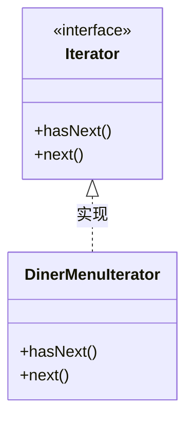
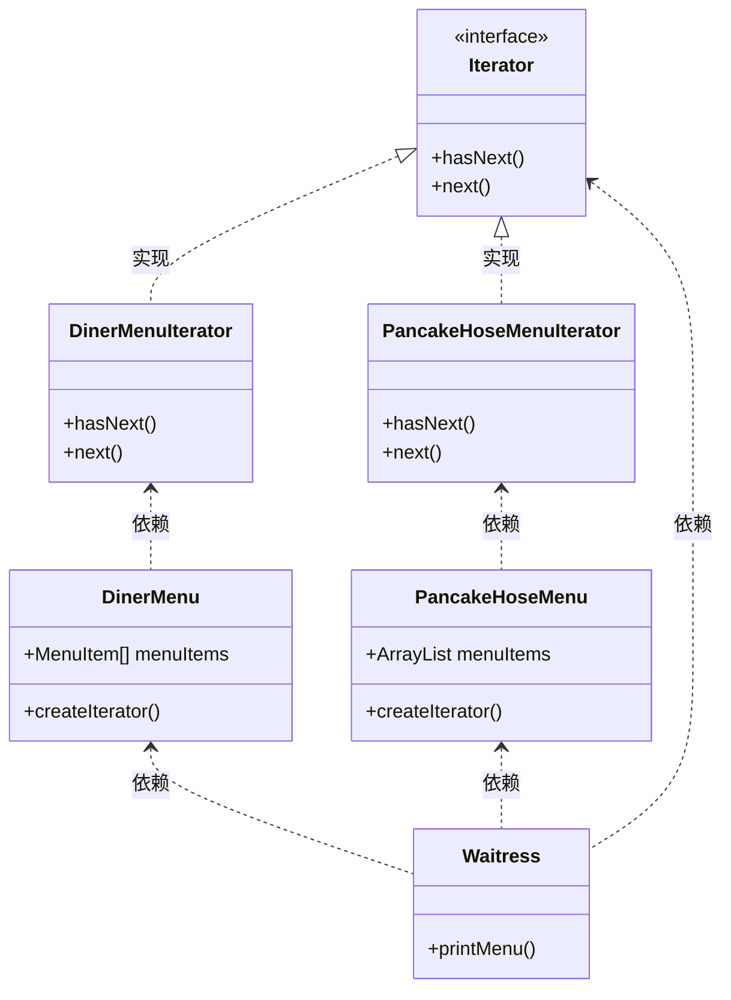
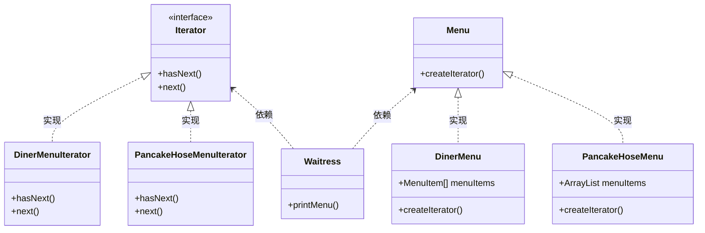
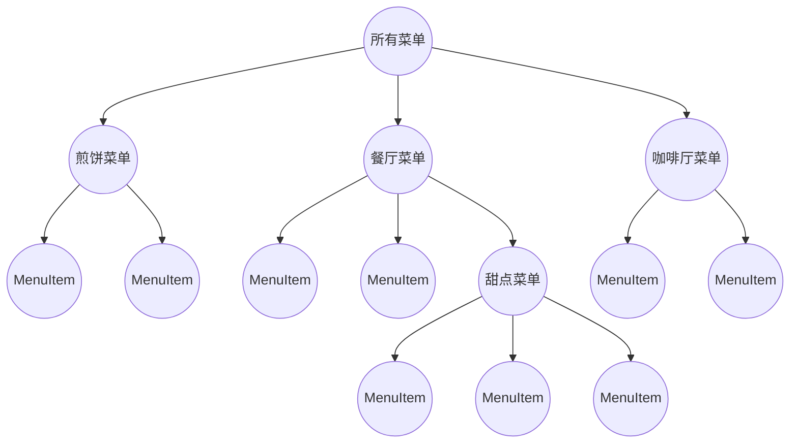
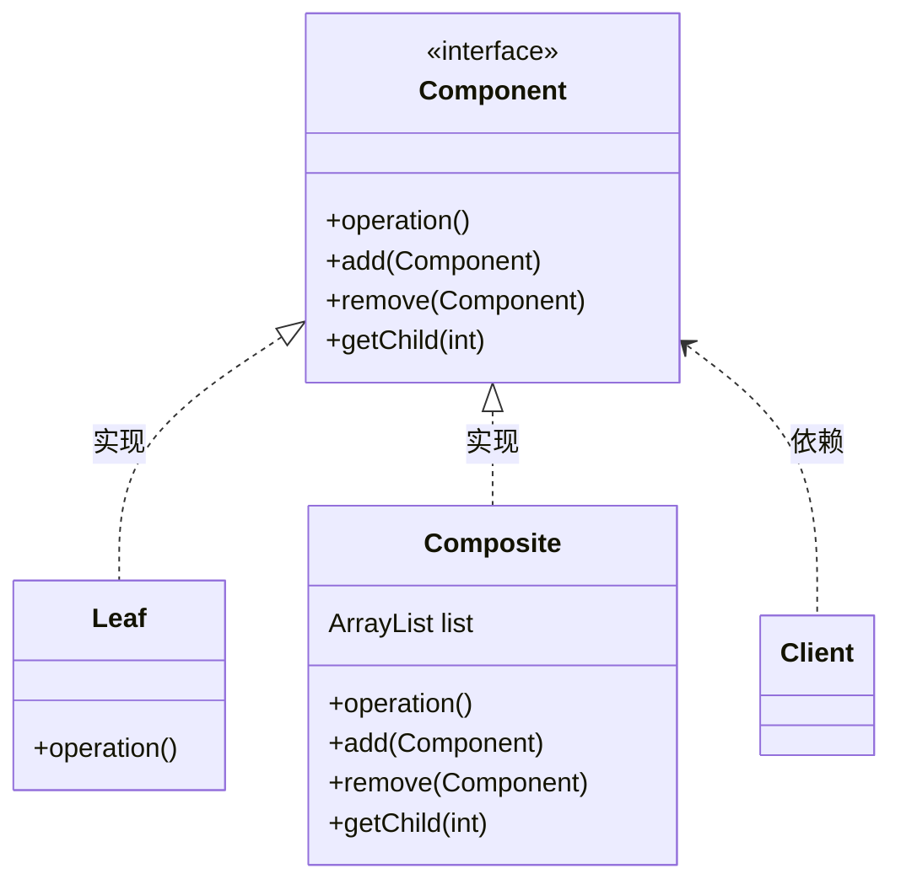
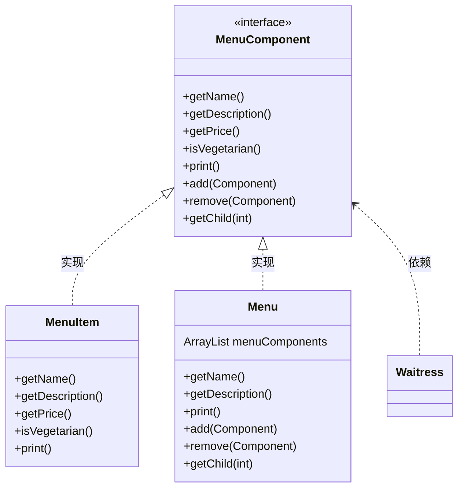

## 迭代器模式（Iterator Pattern）

#### 定义

<span style='color:red'><b>迭代器模式</b> 提供一种方法顺序访向一个聚合对象中的各个元素，而又不暴露其内部的表示。</span>

#### 问题提出

现在有一个煎饼屋和餐厅需要合并，早上菜单由煎饼屋提供，午饭菜单由餐厅提供。但是两家菜单的实现方式不一样，一个是通过 ArrayList 实现，另一个通过数组实现。因此，遍历菜单的方式不一样，代码不能通用。

```java
// 集合方式遍历
for (int i = 0; i < breakfastItems.size(); i++) {
    MenuItem menuItem = (MenuItem)breakfastItems.get(i);
    System.out.println(menuItem.toString());
}

// 数组方式遍历
for (int i = 0; i < lunchItems.length; i++) {
    MenuItem menuItem = lunchItems[i];
    System.out.println(menuItem.toString());
}
```

#### 迭代器



#### 类图



#### 代码实现
<br/>

<code-group>
  <code-block title="菜单项" active>
  ```java
  public class MenuItem {
      String name;
      String description;
      boolean vegetaian;
      double price;
  
      public MenuItem(String name, String description, boolean vegetaian, double price) {
          this.name = name;
          this.description = description;
          this.vegetaian = vegetaian;
          this.price = price;
      }
  
      public String getName() {
          return name;
      }
  
      public String getDescription() {
          return description;
      }
  
      public boolean isVegetaian() {
          return vegetaian;
      }
  
      public double getPrice() {
          return price;
      }
  
      @Override
      public String toString() {
          return "MenuItem{" +
                  "name='" + name + '\'' +
                  ", description='" + description + '\'' +
                  ", vegetaian=" + vegetaian +
                  ", price=" + price +
                  '}';
      }
  }
  ```
  </code-block>
  
  <code-block title="餐厅菜单">
  ```java
  public class DinerMenu {
      static final int MAX_ITEM = 6;
      int numOfItems = 0;
      MenuItem[] menuItems;
  
      public DinerMenu() {
          menuItems = new MenuItem[MAX_ITEM];
          addItem("11", "11", true, 1.1);
          addItem("22", "22", true, 2.2);
          addItem("33", "33", true, 3.3);
          addItem("44", "44", true, 4.4);
          addItem("55", "55", true, 5.5);
      }
  
      public void addItem(String name, String description, boolean vegetaian, double price) {
          MenuItem menuItem = new MenuItem(name, description, vegetaian, price);
  
          if (numOfItems >= MAX_ITEM) {
              System.out.println("超过最大保存菜单数");
          } else {
              menuItems[numOfItems++] = new MenuItem(name, description, vegetaian, price);
          }
      }
  
      /*public MenuItem[] getMenuItems() {
          return menuItems;
      }*/
  
      public Iterator createIterator() {
          return new DinerMenuIterator(menuItems);
      }
  }
  ```
  </code-block>

  <code-block title="餐厅菜单迭代器">
  ```java
  // 迭代器接口
  interface Iterator {
      boolean hasNext();
      Object next();
  }
  public class DinerMenuIterator implements Iterator{
      MenuItem[] items;
      int position; // 记录当前位置
  
      public DinerMenuIterator(MenuItem[] items) {
          this.items = items;
      }
  
      @Override
      public boolean hasNext() {
          if (position >= items.length || null == items[position]) {
              return false;
          } else {
              return true;
          }
      }
  
      @Override
      public Object next() {
          return items[position++];
      }
  }
  ```
  </code-block>
  
  <code-block title="煎饼菜单">
  ```java
  public class PancakeHoseMenu {
      ArrayList menuItems;
  
      public PancakeHoseMenu() {
          menuItems = new ArrayList<>();
          addItem("111", "111", true, 1.11);
          addItem("222", "222", true, 2.22);
          addItem("333", "333", true, 3.33);
          addItem("444", "444", true, 4.44);
          addItem("555", "555", true, 5.55);
      }
  
      public void addItem(String name, String description, boolean vegetaian, double price) {
          MenuItem menuItem = new MenuItem(name, description, vegetaian, price);
          menuItems.add(menuItem);
      }
  
      /*public ArrayList getMenuItem() {
          return menuItems;
      }*/
      public Iterator createIterator() {
          return new PancakeHoseMenuIterator(menuItems);
      }
  }
  ```
  </code-block>

  <code-block title="煎饼菜单迭代器">
  ```java
  public class PancakeHoseMenuIterator implements Iterator {
      ArrayList menuItems;
      int position; // 记录当前位置
  
      public PancakeHoseMenuIterator(ArrayList menuItems) {
          this.menuItems = menuItems;
      }
  
      @Override
      public boolean hasNext() {
          if (position >= menuItems.size()) {
              return false;
          } else {
              return true;
          }
      }
  
      @Override
      public Object next() {
          return menuItems.get(position++);
      }
  }
  ```
  </code-block>
  
  <code-block title="服务员报菜单">
  ```java
  public class Waitress {
      PancakeHoseMenu pancakeHoseMenu;
      DinerMenu dinerMenu;
  
      public Waitress(PancakeHoseMenu pancakeHoseMenu, DinerMenu dinerMenu) {
          this.pancakeHoseMenu = pancakeHoseMenu;
          this.dinerMenu = dinerMenu;
      }
  
      private void printMenu(Iterator iterator) {
          while (iterator.hasNext()) {
              MenuItem menuItem = (MenuItem)iterator.next();
              System.out.println(menuItem.toString());
          }
      }
  
      public void printMenu() {
          Iterator pancakeHoseMenuIterator = pancakeHoseMenu.createIterator();
          Iterator dinerMenuIterator = dinerMenu.createIterator();
          System.out.println("----- pancakeHoseMenuIterator ----");
          printMenu(pancakeHoseMenuIterator);
          System.out.println("----- dinerMenuIterator ----");
          printMenu(dinerMenuIterator);
      }
  }
  ```
  </code-block>

  <code-block title="测试主类">
  ```java
  public class Main {
      public static void main(String[] args) {
          PancakeHoseMenu pancakeHoseMenu = new PancakeHoseMenu();
          DinerMenu dinerMenu = new DinerMenu();
  
          Waitress waitress = new Waitress(pancakeHoseMenu, dinerMenu);
          waitress.printMenu();
      }
  }
  ```
  </code-block>
</code-group>

#### 改进

利用接口（而不是具体类）引用菜单兑现，通过“针对接口编程，而不针对实现编程”，减少服务员和具体类之间的依赖。
<br/>



#### 单一职责原则

一个类应该只有一个引起变化的原因

> 我们知道要避免类内的改变，因为修改代码很容易造成许多潜在的错误。如果有一个类具有两个改变的原因，那么这会使得将来该类的变化机率上升，而当它真的改变时，你的设计中同时有两个方面将会受到影响。


## 组合模式（Composite Pattern）

#### 定义

<span style='color:red'><b>组合模式</b> 允许你将对象组合成树形结构来表现“整体/部分”层次结构。组合能让客户以一致的方式处理个别对象以及对象组合。</span>

#### 问题提出

当我们使用了迭代器模式，我们可以很轻易的加入一份菜单。但是，如果我们想要加上一份餐后甜点的菜单（菜单中的菜单），迭代器模式就有些无能为力了。

因此，需要重新设计：
1. 我们需要树形结构，来容纳菜单、子菜单和菜单项。
2. 我们必须能够轻易遍历菜单项，至少需要和迭代器一样方便。
3. 也需要更有弹性的遍历菜单项，比如：可能只需要遍历甜点菜单，或者可以遍历全部菜单。



#### 类图



**设计菜单**



#### 代码实现
<br/>

<code-group>
  <code-block title="菜单组件父类" active>
  ```java
  public abstract class MenuComponent {
    public String getName(){
        throw new UnsupportedOperationException();
    }
    public String getDescription(){
        throw new UnsupportedOperationException();
    }
    public double getPrice(){
        throw new UnsupportedOperationException();
    }
    public boolean isVegetarian(){
        throw new UnsupportedOperationException();
    }
    public void print()  {
        throw new UnsupportedOperationException();
    }
    public void add(MenuComponent menuComponent){
        throw new UnsupportedOperationException();
    }
    public void remove(MenuComponent menuComponent){
        throw new UnsupportedOperationException();
    }
    public MenuComponent getChild(int num) {
        throw new UnsupportedOperationException();
    }
  }
  ```
  </code-block>
  
  <code-block title="菜单项">
  ```java
  public class MenuItem extends MenuComponent {
    String name;
    String description;
    boolean vegetaian;
    double price;

    public MenuItem(String name, String description, boolean vegetaian, double price) {
        this.name = name;
        this.description = description;
        this.vegetaian = vegetaian;
        this.price = price;
    }

    @Override
    public String getName() {
        return name;
    }

    @Override
    public String getDescription() {
        return description;
    }

    @Override
    public boolean isVegetarian() {
        return vegetaian;
    }

    @Override
    public double getPrice() {
        return price;
    }

    @Override
    public void print() {
        String isV = isVegetarian() ? "(v)" : "";
        System.out.println(" " + getName() + isV);
        System.out.println(" " + getDescription());
        System.out.println(" " + getPrice());
    }
  }
  ```
  </code-block>

  <code-block title="菜单实现类">
  ```java
  public class Menu extends MenuComponent {
    ArrayList menuComponents = new ArrayList<>();
    String name;
    String description;

    public Menu(String name, String description) {
        this.name = name;
        this.description = description;
    }

    @Override
    public String getName() {
        return name;
    }

    @Override
    public String getDescription() {
        return description;
    }

    @Override
    public void print() {
        System.out.println("菜单名称：" + getName());
        System.out.println("菜单描述：" + getDescription());
        System.out.println("--------------------------------");

        Iterator iterator = menuComponents.iterator();
        while (iterator.hasNext()) {
            MenuComponent menuComponent = (MenuComponent)iterator.next();
            menuComponent.print();
        }
    }

    @Override
    public void add(MenuComponent menuComponent) {
        menuComponents.add(menuComponent);
    }

    @Override
    public void remove(MenuComponent menuComponent) {
        menuComponents.remove(menuComponent);
    }

    @Override
    public MenuComponent getChild(int num) {
        return (MenuComponent)menuComponents.get(num);
    }
  }
  ```
  </code-block>
  
  <code-block title="服务员类">
  ```java
  public class Waitress {
    MenuComponent allMenus;

    public Waitress(MenuComponent allMenus) {
        this.allMenus = allMenus;
    }

    public void printMenu() {
        allMenus.print();
    }
  }
  ```
  </code-block>

  <code-block title="测试主类">
  ```java
  public class Main {
    public static void main(String[] args) {
        MenuComponent pancakeHouseMenu = new Menu("煎饼", "早餐");
        MenuComponent dinerMenu = new Menu("餐厅", "午餐");
        MenuComponent cafeMenu = new Menu("咖啡", "晚餐");
        MenuComponent dessertMenu = new Menu("甜点", "");
        dessertMenu.add(new MenuItem("蛋糕", "蛋糕", true, 0));
        dinerMenu.add(dessertMenu);
        dinerMenu.add(new MenuItem("炒胡萝卜", "炒胡萝卜", true, 22));
        dinerMenu.add(new MenuItem("炒鸡蛋", "炒鸡蛋", false, 23));

        MenuComponent menuRoot = new Menu("所有菜单", "根节点");
        menuRoot.add(pancakeHouseMenu);
        menuRoot.add(dinerMenu);
        menuRoot.add(cafeMenu);

        Waitress waitress = new Waitress(menuRoot);
        waitress.printMenu();
    }
  }
  ```
  </code-block>
</code-group>

#### 组合迭代器（待完善）

#### 要点

- 迭代器允许访问聚合的元素，而不需要暴露它的内部结构。
- 迭代器将遍历聚合的工作封装进一个对象中。
- 当使用迭代器的时候，我们依赖聚合提供遍历。
- 迭代器提供了一个通用的接口，让我们遍历聚合的项，当我们编码使用聚合的项时，就可以使用多态机制。
- 我们应该努力让一个类只分配一个责任。
- 组合模式提供一个结构，可同时包容个别对象和组合对象。
- 组合模式允许客户对个别对象以及组合对象一视同仁。
- 组合结构内的任意对象称为组件，组件可以是组合，也可以是叶节点。
- 在实现组合模式时，有许多设计上的折中。你要根据需要平衡透明性和安全性