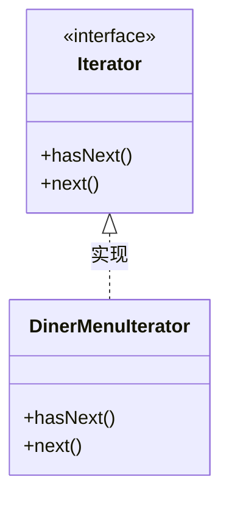
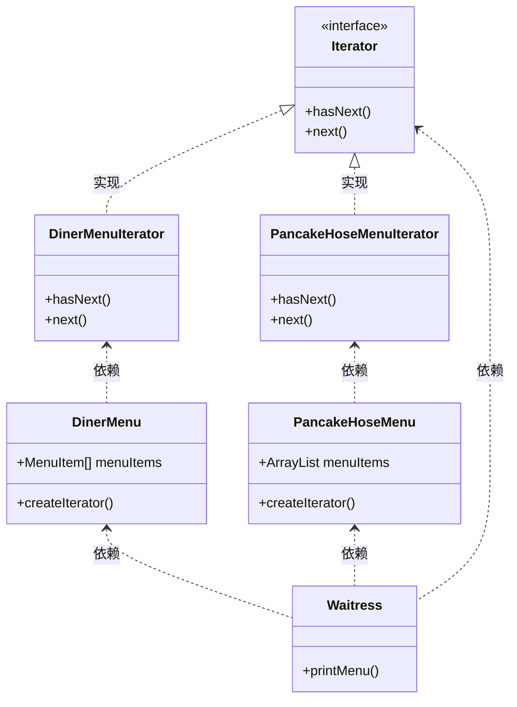

## 迭代器模式（Iterator Pattern）

#### 问题提出

现在有一个煎饼屋和餐厅需要合并，早上菜单由煎饼屋提供，午饭菜单由餐厅提供。但是两家菜单的实现方式不一样，一个是通过 ArrayList 实现，另一个通过数组实现。因此，遍历菜单的方式不一样，代码不能通用。

```java
// 集合方式遍历
for (int i = 0; i < breakfastItems.size(); i++) {
    MenuItem menuItem = (MenuItem)breakfastItems.get(i);
    System.out.println(menuItem.toString());
}

// 数组方式遍历
for (int i = 0; i < lunchItems.length; i++) {
    MenuItem menuItem = lunchItems[i];
    System.out.println(menuItem.toString());
}
```

#### 迭代器



#### 类图



#### 代码实现
<br/>

<code-group>
  
  <code-block title="菜单项" active>
  ```java
  public class MenuItem {
      String name;
      String description;
      boolean vegetaian;
      double price;
  
      public MenuItem(String name, String description, boolean vegetaian, double price) {
          this.name = name;
          this.description = description;
          this.vegetaian = vegetaian;
          this.price = price;
      }
  
      public String getName() {
          return name;
      }
  
      public String getDescription() {
          return description;
      }
  
      public boolean isVegetaian() {
          return vegetaian;
      }
  
      public double getPrice() {
          return price;
      }
  
      @Override
      public String toString() {
          return "MenuItem{" +
                  "name='" + name + '\'' +
                  ", description='" + description + '\'' +
                  ", vegetaian=" + vegetaian +
                  ", price=" + price +
                  '}';
      }
  }
  ```
  </code-block>
  
  <code-block title="餐厅菜单">
  ```java
  public class DinerMenu {
      static final int MAX_ITEM = 6;
      int numOfItems = 0;
      MenuItem[] menuItems;
  
      public DinerMenu() {
          menuItems = new MenuItem[MAX_ITEM];
          addItem("11", "11", true, 1.1);
          addItem("22", "22", true, 2.2);
          addItem("33", "33", true, 3.3);
          addItem("44", "44", true, 4.4);
          addItem("55", "55", true, 5.5);
      }
  
      public void addItem(String name, String description, boolean vegetaian, double price) {
          MenuItem menuItem = new MenuItem(name, description, vegetaian, price);
  
          if (numOfItems >= MAX_ITEM) {
              System.out.println("超过最大保存菜单数");
          } else {
              menuItems[numOfItems++] = new MenuItem(name, description, vegetaian, price);
          }
      }
  
      /*public MenuItem[] getMenuItems() {
          return menuItems;
      }*/
  
      public Iterator createIterator() {
          return new DinerMenuIterator(menuItems);
      }
  }
  ```
  </code-block>

  <code-block title="餐厅菜单迭代器">
  ```java
  // 迭代器接口
  interface Iterator {
      boolean hasNext();
      Object next();
  }
  public class DinerMenuIterator implements Iterator{
      MenuItem[] items;
      int position; // 记录当前位置
  
      public DinerMenuIterator(MenuItem[] items) {
          this.items = items;
      }
  
      @Override
      public boolean hasNext() {
          if (position >= items.length || null == items[position]) {
              return false;
          } else {
              return true;
          }
      }
  
      @Override
      public Object next() {
          return items[position++];
      }
  }
  ```
  </code-block>
  
  <code-block title="煎饼菜单">
  ```java
  public class PancakeHoseMenu {
      ArrayList menuItems;
  
      public PancakeHoseMenu() {
          menuItems = new ArrayList<>();
          addItem("111", "111", true, 1.11);
          addItem("222", "222", true, 2.22);
          addItem("333", "333", true, 3.33);
          addItem("444", "444", true, 4.44);
          addItem("555", "555", true, 5.55);
      }
  
      public void addItem(String name, String description, boolean vegetaian, double price) {
          MenuItem menuItem = new MenuItem(name, description, vegetaian, price);
          menuItems.add(menuItem);
      }
  
      /*public ArrayList getMenuItem() {
          return menuItems;
      }*/
      public Iterator createIterator() {
          return new PancakeHoseMenuIterator(menuItems);
      }
  }
  ```
  </code-block>

  <code-block title="煎饼菜单迭代器">
  ```java
  public class PancakeHoseMenuIterator implements Iterator {
      ArrayList menuItems;
      int position; // 记录当前位置
  
      public PancakeHoseMenuIterator(ArrayList menuItems) {
          this.menuItems = menuItems;
      }
  
      @Override
      public boolean hasNext() {
          if (position >= menuItems.size()) {
              return false;
          } else {
              return true;
          }
      }
  
      @Override
      public Object next() {
          return menuItems.get(position++);
      }
  }
  ```
  </code-block>
  
  <code-block title="服务员报菜单">
  ```java
  public class Waitress {
      PancakeHoseMenu pancakeHoseMenu;
      DinerMenu dinerMenu;
  
      public Waitress(PancakeHoseMenu pancakeHoseMenu, DinerMenu dinerMenu) {
          this.pancakeHoseMenu = pancakeHoseMenu;
          this.dinerMenu = dinerMenu;
      }
  
      private void printMenu(Iterator iterator) {
          while (iterator.hasNext()) {
              MenuItem menuItem = (MenuItem)iterator.next();
              System.out.println(menuItem.toString());
          }
      }
  
      public void printMenu() {
          Iterator pancakeHoseMenuIterator = pancakeHoseMenu.createIterator();
          Iterator dinerMenuIterator = dinerMenu.createIterator();
          System.out.println("----- pancakeHoseMenuIterator ----");
          printMenu(pancakeHoseMenuIterator);
          System.out.println("----- dinerMenuIterator ----");
          printMenu(dinerMenuIterator);
      }
  }
  ```
  </code-block>

  <code-block title="测试主类">
  ```java
  public class Main {
      public static void main(String[] args) {
          PancakeHoseMenu pancakeHoseMenu = new PancakeHoseMenu();
          DinerMenu dinerMenu = new DinerMenu();
  
          Waitress waitress = new Waitress(pancakeHoseMenu, dinerMenu);
          waitress.printMenu();
      }
  }
  ```
  </code-block>
</code-group>