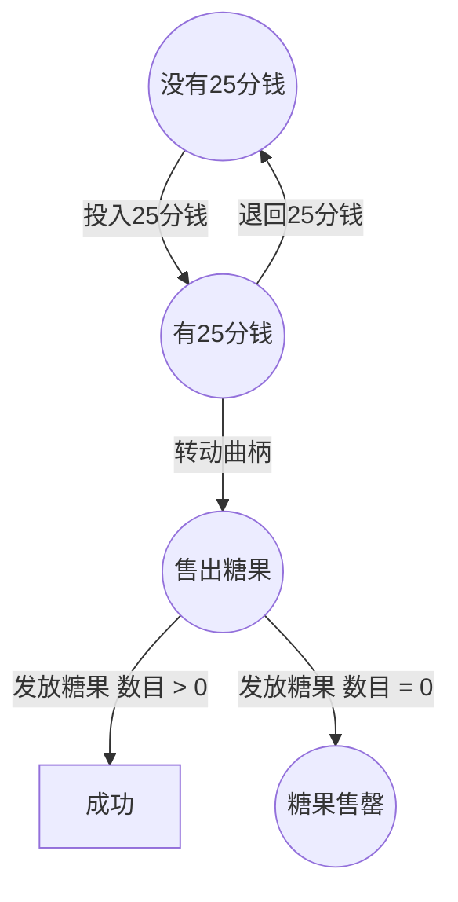
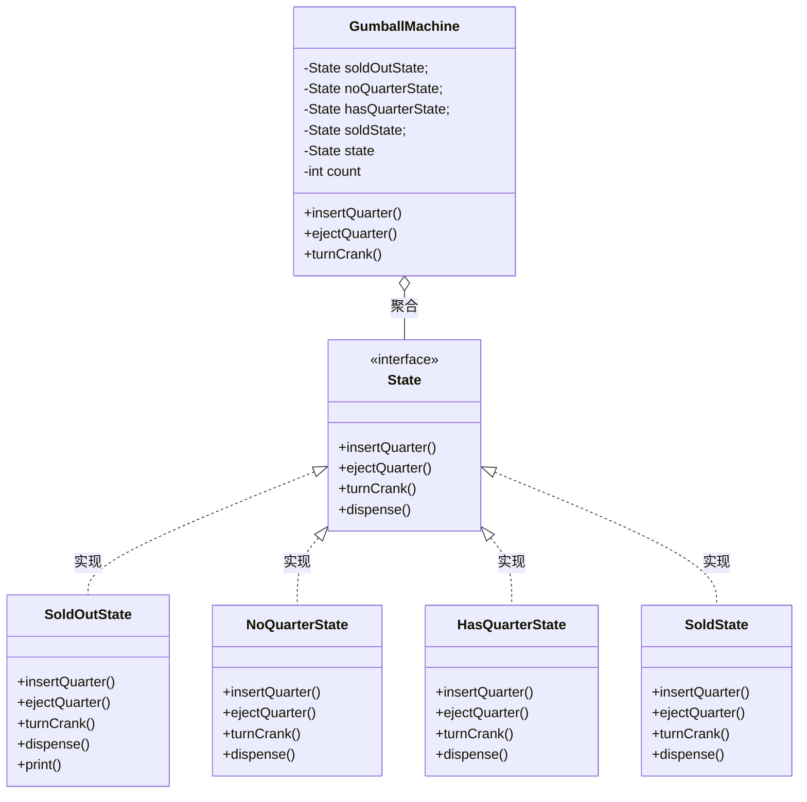
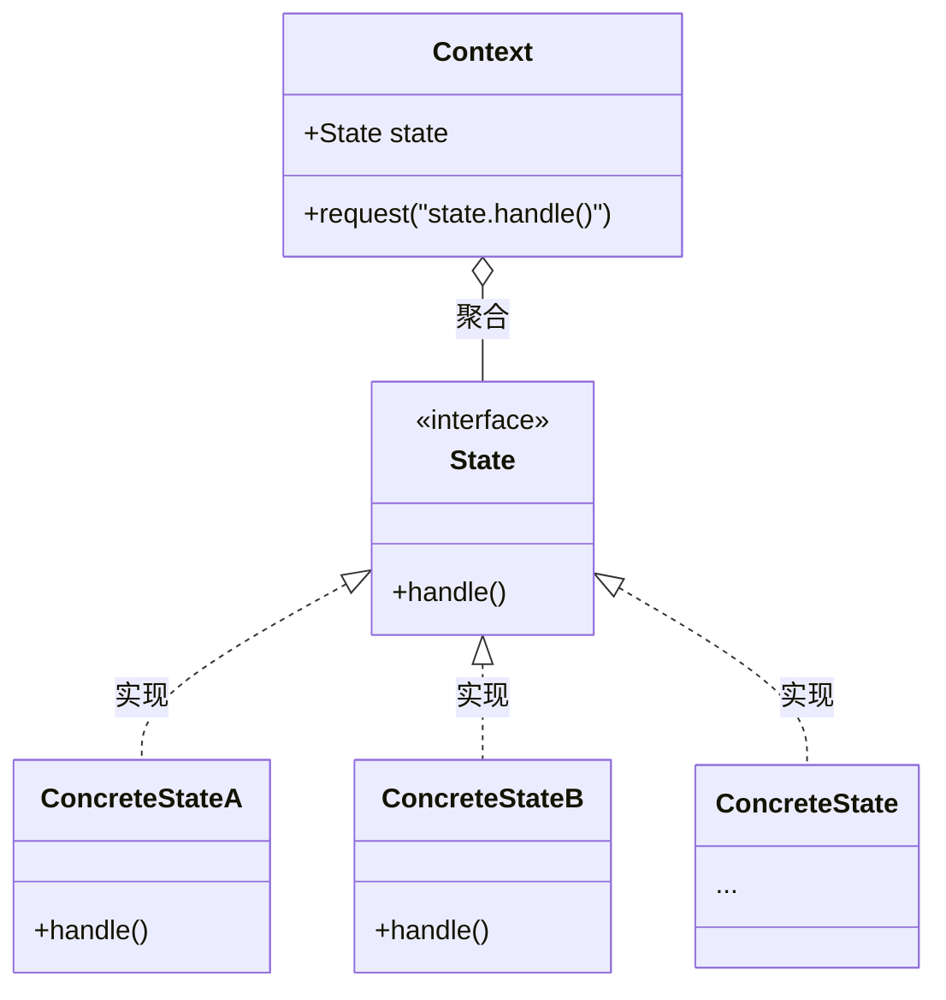

## 状态模式（State Pattern）

#### 定义

<span style='color:red'><b>状态模式</b> 允许对象在内部状态改变时改变它的行为，对象看起来好像修改了它的类。</span>

> 基本常识：策略模式和状态模式是双胞胎，在出生时才分开。策略模式是围绕可以互换的算法来创建业务的。然而，状态模式走的是更崇高的路，它通过改变对象内部的状态来帮助对象控制自己的行为。

#### 提出问题

##### 万能糖果机



##### 代码实现

以下为代码的初步实现存在，但存在诸多问题

1. 这份代码没有遵循开闭原则
2. 这个设计其实不符合面向对象
3. 状态转换被隐藏在语句中，所以并不明显
4. 没有把会改变的那部分包装起来
5. 未来加入的代码可能会导致 bug

<br/>

<code-group>
  <code-block title="自动糖果机" active>
  ```java
  public class GumballMachine {
    final static int SOLD_OUT = 0;      // 糖果售罄
    final static int NO_QUARTER = 1;    // 没有25分钱
    final static int HAS_QUARTER = 2;   // 有25分钱
    final static int SOLD = 3;          // 售出糖果
    
    // 实例变量，持有当前的状态。初始化为“糖果售罄”状态。
    int state = SOLD_OUT;
    int count = 0;  // 糖果数量
    
    public GumballMachine(int count) {
        this.count = count;
        if (count > 0) state = NO_QUARTER;
    }

    // 投入钱
    public void insertQuarter() {
        switch (state) {
            case HAS_QUARTER:       // 如果有25分钱，提示已经投过钱
                System.out.println("您已经投过钱");
                break;
            case NO_QUARTER:
                state = HAS_QUARTER;
                System.out.println("您投入了25分钱");
                break;
            case SOLD_OUT:
                System.out.println("您不能投入钱，糖果已经售罄");
                break;
            case SOLD:
                System.out.println("请稍等，我们已经给出了糖果");
                break;
        }
    }

    // 退回钱
    public void ejectQuarter() {
        switch (state) {
            case HAS_QUARTER:
                state = NO_QUARTER;
                System.out.println("退回钱");
                break;
            case NO_QUARTER:
                System.out.println("您未投入钱，不能退回");
                break;
            case SOLD_OUT:
                System.out.println("未收到钱，不能退回");  // 糖果售罄，不能投入钱，自然不能退回
                break;
            case SOLD:
                System.out.println("转动曲柄，已经拿到糖果，不能退钱");
                break;
        }
    }

    // 转动曲柄
    public void turnCrank() {
        switch (state) {
            case HAS_QUARTER:
                System.out.println("转动成功，正在发放糖果");
                state = SOLD;
                dispense();
                break;
            case NO_QUARTER:
                System.out.println("需要先投入钱");
                break;
            case SOLD_OUT:
                System.out.println("sorry，糖果已售罄");
                break;
            case SOLD:
                System.out.println("已经拿到糖果，不能拿两次糖果");
                break;
        }
    }

    // 发放糖果
    public void dispense() {
        switch (state) {
            case SOLD:
                System.out.println("一个糖果从槽里滚出来");
                count--;
                if (count == 0) {
                    state = SOLD_OUT;
                    System.out.println("糖果售罄");
                } else {
                    state = NO_QUARTER;
                }
                break;
            // 以下情况不应该发生
            case HAS_QUARTER:
                System.out.println("ERROR【HAS_QUARTER】");
                break;
            case NO_QUARTER:
                System.out.println("ERROR【NO_QUARTER】");
                break;
            case SOLD_OUT:
                System.out.println("ERROR【SOLD_OUT】");
                break;
        }
    }

    @Override
    public String toString() {
        return "GumballMachine{" +
                "state=" + state +
                ", count=" + count +
                '}';
    }
  }
  ```
  </code-block>

  <code-block title="测试主类">
  ```java
  public class Main {
    public static void main(String[] args) {
        GumballMachine gumballMachine = new GumballMachine(5);

        System.out.println(gumballMachine);

        gumballMachine.insertQuarter();  // 投入硬币
        gumballMachine.turnCrank();     // 转动曲柄

        System.out.println(gumballMachine);

        gumballMachine.insertQuarter(); // 投入硬币
        gumballMachine.ejectQuarter();  // 退回硬币
        gumballMachine.turnCrank();     // 转动曲柄

        System.out.println(gumballMachine);

        gumballMachine.insertQuarter(); // 投入硬币
        gumballMachine.turnCrank();     // 转动曲柄
        gumballMachine.insertQuarter(); // 投入硬币
        gumballMachine.turnCrank();     // 转动曲柄
        gumballMachine.ejectQuarter();  // 退回硬币

        System.out.println(gumballMachine);

        gumballMachine.insertQuarter(); // 投入硬币
        gumballMachine.insertQuarter(); // 投入硬币
        gumballMachine.turnCrank();     // 转动曲柄
        gumballMachine.insertQuarter(); // 投入硬币
        gumballMachine.turnCrank();     // 转动曲柄
        gumballMachine.insertQuarter(); // 投入硬币
        gumballMachine.turnCrank();     // 转动曲柄

        System.out.println(gumballMachine);
    }
  }
  ```
  </code-block>
</code-group>

##### 新的设计

因为以上代码的缺陷，我们需要重新设计代码，使其便于维护与扩展

1. 首先，我们定义一个State接口。在这个接口内，糖果机的每个动作都有一个对应的方法。
2. 然后为机器中的每个状态实现状态类。这些类将负责在对应的状态下进行机器的行为。
3. 最后，我们要摆脱旧的条件代码，取而代之的方式是，将动作委托到状态类。

##### 类图
<br/>



**状态模式类图**
<br/>



##### 优化后代码

<code-group>
  <code-block title="自动糖果机" active>
  ```java
  public class GumballMachine {
    private State soldOutState;     // 糖果售罄
    private State noQuarterState;       // 没有25分钱
    private State hasQuarterState;      // 有25分钱
    private State soldState;        // 售出糖果
    private State WinnerState;

    // 实例变量，持有当前的状态。初始化为“糖果售罄”状态。
    private State state = soldOutState;
    private int count = 0;  // 糖果数量

    public GumballMachine(int numerGumballs) {
        soldOutState = new SoldOutState(this);
        noQuarterState = new NoQuarterState(this);
        hasQuarterState = new HasQuarterState(this);
        soldState = new SoldState(this);
        WinnerState = new WinnerState(this);
        this.count = numerGumballs;
        if (numerGumballs > 0) state = noQuarterState;
    }

    public void insertQuarter() {
        state.insertQuarter();
    }

    public void ejectQuarter() {
        state.ejectQuarter();
    }

    public void turnCrank() {
        state.turnCrank();
        state.dispense();
    }

    // 发放糖果
    void releaseBall() {
        System.out.println("一个糖果从槽里滚出来");
        if (count != 0) count--;
    }

    public State getSoldOutState() {
        return soldOutState;
    }

    public State getNoQuarterState() {
        return noQuarterState;
    }

    public State getHasQuarterState() {
        return hasQuarterState;
    }

    public State getSoldState() {
        return soldState;
    }

    public State getState() {
        return state;
    }

    public State getWinnerState() {
        return WinnerState;
    }

    public void setState(State state) {
        this.state = state;
    }

    public int getCount() {
        return count;
    }

    @Override
    public String toString() {
        return "GumballMachine{" +
                "state=" + state +
                ", count=" + count +
                '}';
    }
  }
  ```
  </code-block>

  <code-block title="状态接口">
  ```java
  public interface State {
    void insertQuarter();
    void ejectQuarter();
    void turnCrank();
    void dispense();
  }
  ```
  </code-block>
  
  <code-block title="未投钱状态">
  ```java
  public class NoQuarterState implements State {
    GumballMachine gumballMachine;

    public NoQuarterState(GumballMachine gumballMachine) {
        this.gumballMachine = gumballMachine;
    }

    @Override
    public void insertQuarter() {
        System.out.println("您投入了25分钱");
        gumballMachine.setState(gumballMachine.getHasQuarterState());
    }

    @Override
    public void ejectQuarter() {
        System.out.println("您未投入钱，不能退回");
    }

    @Override
    public void turnCrank() {
        System.out.println("需要先投入钱");
    }

    @Override
    public void dispense() {
        // System.out.println("ERROR【NO_QUARTER】");
    }
  }
  ```
  </code-block>

  <code-block title="已投钱状态">
  ```java
  public class HasQuarterState implements State {
    Random random = new Random(System.currentTimeMillis());
    GumballMachine gumballMachine;

    public HasQuarterState(GumballMachine gumballMachine) {
        this.gumballMachine = gumballMachine;
    }

    @Override
    public void insertQuarter() {
        System.out.println("您已经投过钱");   // 如果有25分钱，提示已经投过钱
    }

    @Override
    public void ejectQuarter() {
        gumballMachine.setState(gumballMachine.getNoQuarterState());
        System.out.println("退回钱");
    }

    @Override
    public void turnCrank() {
        System.out.println("转动成功，正在发放糖果");
        int winner = random.nextInt(10);
        if (winner == 0 && gumballMachine.getCount() > 1) {
            // 如果赢了并且有 2 颗以上糖果的话，就进入 WinnerState 状态
            gumballMachine.setState(gumballMachine.getWinnerState());
        } else {
            gumballMachine.setState(gumballMachine.getSoldState());
        }
    }

    @Override
    public void dispense() {
        // System.out.println("ERROR【HAS_QUARTER】");
    }
  }
  ```
  </code-block>
  
  <code-block title="售罄状态">
  ```java
  public class SoldOutState implements State {
    GumballMachine gumballMachine;

    public SoldOutState(GumballMachine gumballMachine) {
        this.gumballMachine = gumballMachine;
    }

    @Override
    public void insertQuarter() {
        System.out.println("您不能投入钱，糖果已经售罄");
    }

    @Override
    public void ejectQuarter() {
        System.out.println("未收到钱，不能退回");  // 糖果售罄，不能投入钱，自然不能退回
    }

    @Override
    public void turnCrank() {
        System.out.println("sorry，糖果已售罄");
    }

    @Override
    public void dispense() {
        // System.out.println("ERROR【SOLD_OUT】");
    }
  }
  ```
  </code-block>

  <code-block title="售出状态">
  ```java
  public class SoldState implements State {
    GumballMachine gumballMachine;

    public SoldState(GumballMachine gumballMachine) {
        this.gumballMachine = gumballMachine;
    }

    @Override
    public void insertQuarter() {
        System.out.println("请稍等，我们已经给出了糖果");
    }

    @Override
    public void ejectQuarter() {
        System.out.println("转动曲柄，已经拿到糖果，不能退钱");
    }

    @Override
    public void turnCrank() {
        System.out.println("已经拿到糖果，不能拿两次糖果");
    }

    @Override
    public void dispense() {
        gumballMachine.releaseBall();
        if (gumballMachine.getCount() > 0) {
            gumballMachine.setState(gumballMachine.getNoQuarterState());
        } else {
            System.out.println("糖果售罄");
            gumballMachine.setState(gumballMachine.getSoldOutState());
        }
    }
  }
  ```
  </code-block>
  
  <code-block title="随机出两个糖果">
  ```java
  // 实现十个中一个
  public class WinnerState implements State {
    GumballMachine gumballMachine;

    public WinnerState(GumballMachine gumballMachine) {
        this.gumballMachine = gumballMachine;
    }

    @Override
    public void insertQuarter() {

    }

    @Override
    public void ejectQuarter() {

    }

    @Override
    public void turnCrank() {

    }

    @Override
    public void dispense() {
        System.out.println("你赢了，将获得两个糖果");
        gumballMachine.releaseBall();
        if (gumballMachine.getCount() == 0) {
            gumballMachine.setState(gumballMachine.getSoldOutState());
        } else {
            gumballMachine.releaseBall();
            if (gumballMachine.getCount() > 0) {
                gumballMachine.setState(gumballMachine.getNoQuarterState());
            } else {
                gumballMachine.setState(gumballMachine.getSoldOutState());
            }
        }
    }
  }
  ```
  </code-block>

  <code-block title="测试主类">
  ```java
  public class Main {
    public static void main(String[] args) {
        GumballMachine gumballMachine = new GumballMachine(100);
        for (int i = 0; i < 50; i++) {
            gumballMachine.insertQuarter();
            gumballMachine.turnCrank();
            System.out.println(gumballMachine);
        }
    }
  }
  ```
  </code-block>
</code-group>

#### 要点

- 状态模式允许一个对象基于内部状态而拥有不同的行为。
- 和程序状态机（PSM）不同，状态模式用类代表状态。
- Context 会将行为委托给当前状态对象。
- 通过将每个状态封装进一个类，我们把以后需要做的任何改变局部化了。
- 状态模式和策略模式有相同的类图，但是它们的意图不同。
- 策略模式通常会用行为或算法来配置 Context 类。
- 状态模式允许 Context 随着状态的改变而改变行为。
- 状态转换可以由 State 类或 Context 类控制。
- 使用状态模式通常会导致设计中类的数目大量增加。
- 状态类可以被多个 Context 实例共享。
