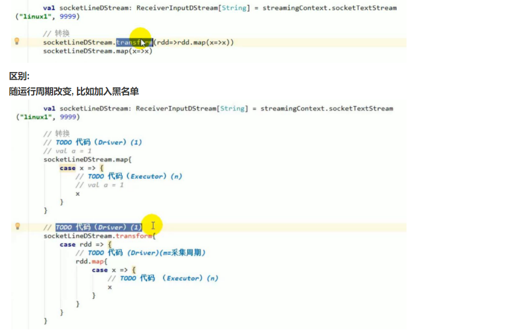

## spark-sql可调参数

---
```properties
#Job ID /Name
spark.app.name=clsfd_ad_attr_map_w_mvca_ins

#yarn 进行调度，也可以是mesos，yarn，以及standalone

#一个spark application，是一个spark应用。一个应用对应且仅对应一个sparkContext。每一个应用，运行一组独立的executor processes。一个应用，可以以多线程的方式提交多个作业job。spark可以运行在多种集群管理器上如：mesos，yarn，以及standalone，每种集群管理器都会提供跨应用的资源调度策略。
spark.master=yarn

#激活外部shuffle服务。服务维护executor写的文件，因而executor可以被安全移除。
#需要设置spark.dynamicAllocation.enabled 为true，同事指定外部shuffle服务。
#对shuffle来说，executor现将自己的map输出写入到磁盘，然后，自己作为一个server，向其他executor提供这些map输出文件的数据。而动态资源调度将executor返还给集群后，这个shuffle数据服务就没有了。因此，如果要使用动态资源策略，解决这个问题的办法就是，将保持shuffle文件作为一个外部服务，始终运行在spark集群的每个节点上，独立于应用和executor
spark.shuffle.service.enabled=true

#在默认情况下，三种集群管理器均不使用动态资源调度模式。所以要使用动态资源调度需要提前配置。
spark.dynamicAllocation.enabled=true

# 如果所有的executor都移除了，重新请求时启动的初始executor数
spark.dynamicAllocation.initialExecutors=20

# 最少保留的executor数
spark.dynamicAllocation.minExecutors=10

# 最多使用的executor数，默认为你申请的最大executor数
spark.dynamicAllocation.maxExecutors=100

# 可以是cluster也可以是Client
spark.submit.deployMode=cluster

# 指定提交到Yarn的资源池
spark.yarn.queue=hdlq-data-batch-low

# 在yarn-cluster模式下，申请Yarn App Master（包括Driver）所用的内存。
spark.driver.memory=8g
# excutor的核心数
spark.executor.cores=16
# 一个Executor对应一个JVM进程。Executor占用的内存分为两部分：ExecutorMemory和MemoryOverhead
spark.executor.memory=32g
spark.yarn.executor.memoryOverhead=2g

# shuffle分区数100，根据数据量进行调控，这儿配置了Join时shuffle的分区数和聚合数据时的分区数。
spark.sql.shuffle.partitions=100

# 如果用户没有指定并行度，下面这个参数将是RDD中的分区数，它是由join,reducebykey和parallelize 
# 这个参数只适用于未加工的RDD不适用于dataframe
# 没有join和聚合计算操作，这个参数将是无效设置
spark.default.parallelism

# 打包传入一个分区的最大字节，在读取文件的时候。
spark.sql.files.maxPartitionBytes=128MB

# 用相同时间内可以扫描的数据的大小来衡量打开一个文件的开销。当将多个文件写入同一个分区的时候该参数有用。
# 该值设置大一点有好处，有小文件的分区会比大文件分区处理速度更快（优先调度）。
spark.sql.files.openCostInBytes=4MB

# Spark 事件总线是SparkListenerEvent事件的阻塞队列大小
spark.scheduler.listenerbus.eventqueue.size=100000

# 是否启动推测机制
spark.speculation=false

# 开启spark的推测机制，开启推测机制后如果某一台机器的几个task特别慢，推测机制会将任务分配到其他机器执行，最后Spark会选取最快的作为最终结果。
# 2表示比其他task慢两倍时，启动推测机制
spark.speculation.multiplier=2

# 推测机制的检测周期
spark.speculation.interval=5000ms

# 完成task的百分比时启动推测
spark.speculation.quantile=0.6

# 最多允许失败的Executor数量。
spark.task.maxFailures=10

# spark序列化 对于优化<网络性能>极为重要，将RDD以序列化格式来保存减少内存占用.
spark.serializer=org.apache.spark.serializer.KryoSerializer

# 因为spark是基于内存的机制，所以默认是开启RDD的压缩
spark.rdd.compress=true

# Spark的安全管理
#https://github.com/apache/spark/blob/master/core/src/main/scala/org/apache/spark/SecurityManager.scala
spark.ui.view.acls=*
spark.ui.view.acls.groups=*

# 表示配置GC线程数为3
spark.executor.extraJavaOptions="-XX:ParallelGCThreads=3"

# 最大广播表的大小。设置为-1可以禁止该功能。当前统计信息仅支持Hive Metastore表。这里设置的是10MB
spark.sql.autoBroadcastJoinThreshold=104857600

# 广播等待超时，这里单位是秒
spark.sql.broadcastTimeout=300

# 心跳检测间隔
spark.yarn.scheduler.heartbeat.interval-ms=10000

spark.sql.broadcastTimeout

#缓存表问题
#spark2.+采用：
#spark.catalog.cacheTable("tableName")缓存表，spark.catalog.uncacheTable("tableName")解除缓存。
#spark 1.+采用：
#sqlContext.cacheTable("tableName")缓存，sqlContext.uncacheTable("tableName") 解除缓存
#Sparksql仅仅会缓存必要的列，并且自动调整压缩算法来减少内存和GC压力。

#假如设置为true，SparkSql会根据统计信息自动的为每个列选择压缩方式进行压缩。
spark.sql.inMemoryColumnarStorage.compressed=true

#控制列缓存的批量大小。批次大有助于改善内存使用和压缩，但是缓存数据会有OOM的风险
spark.sql.inMemoryColumnarStorage.batchSize=10000
```

## Spark数据类型

### RDD、DataFrame、DataSet创建,及相互转换

**RDD创建(RDD整体上分为Value类型和Key-Value类型)**
- 从内存(集合)创建
```java
val rdd = sc.parallelize(Array(1,2,3,4,5,6,7,8))
val rdd1 = sc.makeRDD(Array(1,2,3,4,5,6,7,8))
```
- 从磁盘创建
```java
val rdd2= sc.textFile("hdfs://hadoop102:9000/RELEASE")
```
- 从其他RDD转化

**DataFrame创建(SparkSession是创建DataFrame和执行SQL的入口)**
- 通过Spark的数据源进行创建；
```java
val df = spark.read.json("/opt/module/spark/examples/src/main/resources/people.json")
```
- 从一个存在的RDD进行转换；
- 还可以从Hive Table进行查询返回

**DataSet创建(Dataset是具有强类型的数据集合，需要提供对应的类型信息)**
- 内存创建
1）创建一个样例类
```shell script
  scala> case class Person(name: String, age: Long)
  defined class Person
```
2）创建DataSet
```shell script
  scala> val caseClassDS = Seq(Person("Andy", 32)).toDS()
  caseClassDS: org.apache.spark.sql.Dataset[Person] = [name: string, age: bigint]
```
- 通过DataFrame或RDD转化

**相互转化**


**待扩展**
三者共性和区别
用户自定义函数
Spark数据源


## Spark代码学习

---
### 第一个spark程序
```java
 import org.apache.spark.{SparkConf, SparkContext}
 
 object FirstSpark {
   def main(args: Array[String]): Unit = {
 //        println("hello spark!")
     val conf = new SparkConf().setAppName("mySpark")
     .setMaster("local") //本机的park就用local.远端的就写ip，因为我的park环境是在云端连接不方便这里我先用local
     //如果是打成jar包运行则需要去掉setMaster("local")因为在参数中会指定。
 
     //sc对象为spark运行时的上下文
     val sc = new SparkContext(conf)
     //使用list初始化1个RDD并使用map函数*3
     val rdd = sc.parallelize(List(1, 2, 3, 4, 5, 6)).map(_ * 3)
     //取出大于10的元素
     val mappedRDD = rdd.filter(_ > 10).collect()
     //对集合求和
     println(rdd.reduce(_ + _))
     //输出大于10的元素
     for (arg <- mappedRDD)
       print(arg + " ")
     println()
     println("run success")
 
     sc.stop()
   }
 }
```
### WordCount
```java
 import org.apache.spark.{SparkConf, SparkContext}
 
 object WordCount {
   def main(args: Array[String]): Unit = {
     /**
     第一步：创建spark的配置对象sparkconf,设置spark程序的运行时的配置信息，例如说通过setMaster来设置程序
       链接spark集群的master的URL，如果设置为local，则代表spark程序在本地运行，
      */
     val conf = new SparkConf()   //创建SparkConf对象
     .setAppName("WordCount")    //设置应用程序的名称,在程序运行的监控界面可以看到这个名字
     //conf.setMaster("local")//此时，程序在本地执行，不需要安装spark集群
     //"spark://192.168.1.100:7077"
     //conf.setMaster(args(0))//指定spark运行是集群模式 一般我们不在代码中指定，我们在提交的时候指定
     /**
     第二步：创建SparkContext对象，
     SparkContext是spark程序所有功能的唯一入口，无论是采用Scala，Java，Python，R等都必须有一个SparkContext
     SparkContext核心作用：初始化spark应用程序运行时候所需要的核心组件，包括DAGScheduler，TaskScheduler,SchedulerBackend
     同时还会负责Spark程序往Master注册程序等
     SparkContext是整个spark应用程序中最为至关重要的一个对象
      */
     val sc=new SparkContext(conf)   //创建SparkContext对象，通过传入SparkContext实例来定制Spark运行的具体参数和配置信息
     /**
     第3步：根据具体的数据来源 (HDFS,HBase,Local等)通过SparkContext来创建RDD
     RDD的创建有3种方式，外部的数据来源，根据scala集合，由其他的RDD操作
     数据会被RDD划分成为一系列的Partitions,分配到每个Partition的数据属于一个Task的处理范畴
      */
     val line=sc.textFile(args(0),1)  //读取本地的一个文件并且设置为1个partition
     //val line =sc.textFile("hdfs://192.168.18.140:9000/input/LICENSE.txt")   //指定HDFS的路径，这个也可以到时候在参数传入
     /**
     第4步：对初始的RDD进行Transformation级别的处理，例如Map、filter等高阶函数等的编程来进行具体的数据计算
      在对每一行的字符串拆分成单个单词
      在单词的拆分的基础上对每个单词实例计算为1，也就是word=>(word,1)
      在对每个单词实例计数为1基础上统计每个单词在文件中出现的总次数
      */
     val words=line.flatMap(_.split(" "))
     val pairs=words.map(word=>(word,1))
     val wordcounts=pairs.reduceByKey(_+_)
 
     //key value反转，按key排序，再反转回来
     val sortWords = wordcounts.map(x => (x._2,x._1)).sortByKey(false).map(x => (x._2,x._1))
     sortWords.saveAsTextFile(args(1)) //存储到文件系统
 
     //sortWords.foreach(wordNum=>println(wordNum._1+":"+wordNum._2)) //本地模式用这个打印
     sortWords.collect().foreach(wordNum=>println(wordNum._1+":"+wordNum._2))
     sc.stop()
   }
 }
```

## Spark SQL（sqlContext）

### 第一个例子

```java
package sparkSQL

import org.apache.spark.sql.{DataFrame, SparkSession}

object SparkSqlJson {
  def main(args: Array[String]): Unit = {
    //在代码中使用sparkSql,我们只需要一个SparkSession即可搞定
    //创建一个SparkSession实例
    val sparkSession: SparkSession = SparkSession.builder() //创建 SparkSession.Builder，初始化SparkSession.
      .appName("spark SQL basic example")
      .master("local[*]") //在idea里设置master为local
      .getOrCreate() //当SparkSession.GetOrCreate()被调用，SparkSession发生变化，将会返回一个线程和它的子线程。这将会确定给定的线程接受带有隔离会话的SparkSession，而不是全局的context。

    //读入数据文件,该文件是从spark example中拷贝的,具体路径spark/examples/src/main/resources/下
    val dataFrame: DataFrame = sparkSession.read.json(args(0)) //"data\\people.json"

    //显示数据集
    println("----------------1.显示数据集--------------------------")
    dataFrame.show()
    //显示数据集的模式
    println("----------------2.显示数据集的模式--------------------------")
    dataFrame.printSchema()
    //查询name列并显示
    println("----------------3.查询name列并显示--------------------------")
    dataFrame.select("name").show()


    //引入spark的隐式转换功能,我们可以使用$符号+列名的形式对列进行计算
    //这里的sparkSession不是某个包下面的东西，而是我们SparkSession.builder()对应的变量值
    import sparkSession.implicits._
    //查询姓名,并age+1后显示
    println("----------------4.查询姓名,并age+1后显示--------------------------")
    dataFrame.select($"name", $"age" + 1).show()
    //过滤年龄大于21的并显示
    println("----------------5.过滤年龄大于21的并显示--------------------------")
    dataFrame.filter($"age" > 21).show()
    //以年龄分组并计算每组的人数
    println("----------------6.以年龄分组并计算每组的人数--------------------------")
    dataFrame.groupBy("age").count().show()

    //将dataframe注册为临时表people
    dataFrame.createOrReplaceTempView("people")
    //直接使用sql语句查询people表
    val sqlDF: DataFrame = sparkSession.sql("SELECT * FROM people")
    //显示结果集
    println("----------------7.查询临时表,显示结果集--------------------------")
    sqlDF.show()

    //创建全局表
    dataFrame.createGlobalTempView("people")
    //查询全局people表
    println("----------------8.查询全局people表--------------------------")
    sparkSession.sql("SELECT * FROM global_temp.people").show()
    //全局表是可以跨session的
    println("----------------9.全局表跨session查询--------------------------")
    sparkSession.newSession().sql("SELECT * FROM global_temp.people").show()
  }
}
```

添加依赖
```java
<!--SparkSQL添加依赖-->
<dependency>
    <groupId>org.apache.parquet</groupId>
    <artifactId>parquet-jackson</artifactId>
    <version>1.10.1</version>
</dependency>
```

打jar包测试
```shell script
bin/spark-submit \
--class sparkSQL.SparkSqlJson \
--master spark://hadoop1:7077 \
--executor-memory 1G \
--total-executor-cores 1 \
./myjar/SparkSQLJson.jar \
file:///soft/spark/examples/src/main/resources/people.json
```

### SparkSQL CLI(hiveContext)

在spark下链接hadoop的core-site.xml 以及配置hive-site.xml的hive.metastore.uris并链接
```java
<configuration>
  <property>
    <name>hive.metastore.uris</name>
    <value>thrift://hadoop100:9083</value>
    <description>Thrift URI for the remote metastore. Used by metastore client to connect to remote metastore.</description>
  </property>
</configuration>

ln -s /soft/module/hadoop-2.9.2/etc/hadoop/core-site.xml /soft/module/spark/conf/core-site.xml
ln -s /soft/module/hive/conf/hive-site.xml /soft/module/spark/conf/hive-site.xml

然后启动hive的metastore服务，使用nohup命令后台启动
nohup hive --service metastore > metastore.log 2>&1 &

启动spark-sql
/soft/module/spark/bin/spark-sql
```


## Spark Streaming知识点

---
###  Dstream基础
- ssc.socketTextStream()方法 TCP套接字连接 (截图在命令行练习)
- streamingContext.fileStream(dataDirectory)方法, 可以从任何文件系统(如：HDFS、S3、NFS等）的文件中读取数据，然后创建一个DStream。
> 需要注意的是：读取的必须是具有相同的数据格式的文件；创建的文件必须在dataDirectory目录下，并通过自动移动或重命名成数据目录；文件一旦移动就不能被改变，如果文件被不断追加,新的数据将不会被阅读。
- 对于简单的文本文件，可以使用一个简单的方法streamingContext.textFileStream(dataDirectory)来读取数据

### 高级来源

Spark Streaming原生支持一些不同的数据源。一些“核心”数据源已经被打包到Spark Streaming 的 Maven 工件中，而其他的一些则可以通过 spark-streaming-kafka 等附加工件获取。

每个接收器都以 Spark 执行器程序中一个长期运行的任务的形式运行，因此会占据分配给应用的 CPU 核心。这意味着如果要运行多个接收器，就必须至少有和接收器数目相同的核心数，还要加上用来完成计算所需要的核心数。(意思是核心数 >= 接收器数n + 1)

**官方示例WordCount**
```java
package sparkstreaming

import org.apache.spark.SparkConf
import org.apache.spark.streaming.{Seconds, StreamingContext}
//import org.apache.spark.streaming.StreamingContext._

/**
 * 官方示例WordCount
 */
object SparkStreaming {
  def main(args: Array[String]): Unit = {

    //1.初始化Spark配置信息
    val conf = new SparkConf().setMaster("local[2]").setAppName("NetworkWordCount")

    //2.初始化SparkStreamingContext
    val ssc = new StreamingContext(conf, Seconds(5)) //以5s为时间窗口进行数据处理

    //3.通过监控端口创建DStream，读进来的数据为一行行
    val lines = ssc.socketTextStream("hadoop1", 9999)

    //将每一行数据做切分，形成一个个单词
    val words = lines.flatMap(_.split(" "))


    //将单词映射成元组（word,1）
    val pairs = words.map(word => (word, 1))
    //将相同的单词次数做统计
    val wordCounts = pairs.reduceByKey(_ + _)

    // Print the first ten elements of each RDD generated in this DStream to the console
    //打印
    wordCounts.print()
    ssc.start()     // Start the computation
    ssc.awaitTermination()  // Wait for the computation to terminate

  }
}
```

### 文件数据源(文件系统)
```java
package sparkstreaming

import org.apache.spark.SparkConf
import org.apache.spark.streaming.dstream.DStream
import org.apache.spark.streaming.{Seconds, StreamingContext}

/**
 * 文件数据源(文件系统)
 */
object FileSource {
  def main(args: Array[String]): Unit = {
    //1.初始化Spark配置信息

    val sparkConf: SparkConf = new SparkConf().setMaster("local[*]")
      .setAppName("Stream WordCount")

    //2.初始化Spark StreamingContext
    val ssc: StreamingContext = new StreamingContext(sparkConf, Seconds(5))

    //3.监控文件夹创建DStream
    val dirStream: DStream[String] = ssc.textFileStream("hdfs://hadoop1:9000/fileStream")

    //4.将每一行数据做切分, 形成一个个单词
    val wordStream: DStream[String] = dirStream.flatMap(_.split(" "))

    //5.将单词映射为元组
    val wordAndOneStream: DStream[(String, Int)] = wordStream.map((_, 1))

    //6.将相同的单词做次数统计
    val wordAndCountStream: DStream[(String, Int)] = wordAndOneStream.reduceByKey(_ + _)

    //7.打印
    wordAndCountStream.print()

    //8.启动StreamContext
    ssc.start()
    ssc.awaitTermination() // 调用StreamingContext的awaitTermination()方法， 来等待应用程序的终止。
  }
}
```

### mysql(队列)数据源

**添加依赖**
```java
<!--连接mysql添加依赖-->
<dependency>
    <groupId>mysql</groupId>
    <artifactId>mysql-connector-java</artifactId>
    <version>8.0.17</version>
</dependency>
```

```java
package sparkstreaming.mysqlandqueue

import java.sql.{Connection, DriverManager, ResultSet, Statement}

object DB {

  //初始化数据连接
  var connection: Connection = _
  var statement : Statement = _

  def conn {
    // 访问本地MySQL服务器，通过3306端口访问mysql数据库
    val url = "jdbc:mysql://localhost:3306/demo-3?useUnicode=true&characterEncoding=utf-8&serverTimezone=GMT%2B8&useSSL=false"
    //驱动名称
    val driver = "com.mysql.cj.jdbc.Driver"

    val username = "root"
    val password = "123456789"


    Class.forName(driver) //.newInstance()
    connection = DriverManager.getConnection(url, username, password)
    statement = connection.createStatement //(ResultSet.TYPE_FORWARD_ONLY, ResultSet.CONCUR_READ_ONLY)
  }

  //从数据库中取出每个用户的名字，是个String有序队列
  def getMessage : Seq[String] = {
    conn
    var setName = Seq("")
    try {
      // Execute Query，查询用户表 sec_user 是我的用户表，有name属性。
      val rs = statement.executeQuery("select ci_id, ci_name from city")
      // Iterate Over ResultSet
      while (rs.next) {
        // 返回行号
        // println(rs.getRow)
        val ci_name = rs.getString("ci_name")
        setName = setName :+ ci_name
      }
    } finally {
      close
    }
    return setName
  }

  def close: Unit ={
    connection.close
  }
//  def main(args: Array[String]): Unit = {
//    println(getMessage)
//  }
}
```

```java
package sparkstreaming.mysqlandqueue

import org.apache.spark.SparkConf
import org.apache.spark.rdd.RDD
import org.apache.spark.streaming.dstream.{DStream, InputDStream}
import org.apache.spark.streaming.{Seconds, StreamingContext}

import scala.collection.mutable

/**
 * RDD队列数据源 + mysql
 */
object MySparkStreaming {
  def main(args: Array[String]) {

    // 1.创建spark实例
    val sparkConf = new SparkConf().setAppName("QueueStream").setMaster("local")

    // 2.初始化sparkStreamingContext ，Seconds是多久去Rdd中取一次数据。
    val ssc = new StreamingContext(sparkConf, Seconds(3))

    // 3.创建RDD队列
    val rddQueue = new mutable.Queue[RDD[String]]()

    // 4.创建QueueInputStream, 从rdd队列中读取输入流
    val inputStream: InputDStream[String] = ssc.queueStream(rddQueue)

    // 5.处理队列中的RDD数据
    //将输入流中的每个元素（每个元素都是一个String）后面添加一个“a“字符，并返回一个新的rdd。
    val mappedStream: DStream[(String, Int)] = inputStream.map(x => (x + "*", 1))
    // reduceByKey(_ + _)对每个元素统计次数。map(x => (x._2,x._1))是将map的key和value 交换位置。
    // 后边是过滤次数超过1次的且String 相等于“testa“
    val reducedStream: DStream[(String, Int)] = mappedStream.reduceByKey(_ + _)
        .filter(x => x._1.length>4)
      //.map(x => (x._2, x._1)).filter((x) => x._1 > 1).filter((x) => x._2.equals("testa"))

    // 6.打印结果
    reducedStream.print()
    //将每次计算的结果存储在./out/resulted处。
    //reducedStream.saveAsTextFiles("data/resulted")

    // 7.启动任务
    ssc.start()

    //从数据库中查出每个用户的姓名，返回的是一个String有序队列seq，因为生成RDD的对象必须是seq。
    val seq = DB.getMessage
    //println(seq)

    // 8.创建循环并向RDD队列中放入RDD
    // 将seq生成RDD然后放入Spark的Streaming的RDD队列，作为输入流。
    for (i <- 1 to 3) {
      rddQueue.synchronized {
        rddQueue += ssc.sparkContext.makeRDD(seq, 10)
        // 打印到控制台
        //rddQueue.foreach(rdd => rdd.foreach(println(_)))
      }
      Thread.sleep(3000)
    }
    ssc.stop()
    //ssc.awaitTermination() // 调用StreamingContext的awaitTermination()方法， 来等待应用程序的终止。
  }
}
```

### 自定义数据源

```java
package sparkstreaming.udsource

import java.io.{BufferedReader, InputStreamReader}
import java.net.Socket
import java.nio.charset.StandardCharsets

import org.apache.spark.storage.StorageLevel
import org.apache.spark.streaming.receiver.Receiver

/**
 * 自定义数据源
 * 需要继承Receiver 并实现onStart onStop方法
 */
class CustomerReceiver(host:String, port:Int) extends Receiver[String](StorageLevel.MEMORY_ONLY){
  //最初启动的时候，调用该方法，作用为：读数据并将数据发送给Spark
  override def onStart(): Unit ={
    new Thread("Socket Receiver") {
      override def run() {
        receive()
      }
    }.start()
  }

  //读数据并将数据发送给Spark
  def receive(): Unit = {

    //创建一个Socket
    var socket: Socket = new Socket(host, port)

    //定义一个变量，用来接收端口传过来的数据
    var input: String = null

    //创建一个BufferedReader用于读取端口传来的数据
    val reader = new BufferedReader(new InputStreamReader(socket.getInputStream, StandardCharsets.UTF_8))

    //读取数据
    input = reader.readLine()

    //当receiver没有关闭并且输入数据不为空，则循环发送数据给Spark
    while (!isStopped() && input != null) {
      store(input)
      input = reader.readLine()
    }

    //跳出循环则关闭资源
    reader.close()
    socket.close()

    //重启任务
    restart("restart")
  }


  override def onStop(): Unit ={

  }
}
```

```java
package sparkstreaming.udsource

import org.apache.spark.SparkConf
import org.apache.spark.streaming.{Seconds, StreamingContext}

object UDSource {
  def main(args: Array[String]): Unit = {

    //1.初始化Spark配置信息
    val sparkConf = new SparkConf().setMaster("local[*]")
      .setAppName("StreamWordCount")

    //2.初始化SparkStreamingContext
    val ssc = new StreamingContext(sparkConf, Seconds(5))

    //3.创建自定义receiver的Streaming
    val lineStream = ssc.receiverStream(new CustomerReceiver("hadoop102", 9999))

    //4.将每一行数据做切分，形成一个个单词
    val wordStreams = lineStream.flatMap(_.split("\t"))

    //5.将单词映射成元组（word,1）
    val wordAndOneStreams = wordStreams.map((_, 1))

    //6.将相同的单词次数做统计
    val wordAndCountStreams = wordAndOneStreams.reduceByKey(_ + _)

    //7.打印
    wordAndCountStreams.print()

    //8.启动SparkStreamingContext
    ssc.start()
    ssc.awaitTermination()
  }
}
```

### 有状态数据统计UpdateStateByKey

```java
package com.hrbu

import org.apache.kafka.clients.consumer.ConsumerRecord
import org.apache.kafka.common.serialization.StringDeserializer
import org.apache.spark.sql.SparkSession
import org.apache.spark.streaming.dstream.{DStream, InputDStream}
import org.apache.spark.streaming.kafka010.{ConsumerStrategies, KafkaUtils, LocationStrategies}
import org.apache.spark.streaming.{Seconds, StreamingContext}
import org.apache.spark.{SparkConf, SparkContext}

/**
 * @title 有状态数据统计
 * 有状态转化操作  (UpdateStateByKey)  类似UDAF的Buffer???
 * 对之前的数据也有更新
 * 保存到文件(数据大  防止宕机)
 */
object DataStreaming_02 {
  def main(args: Array[String]): Unit = {
    val config = Map(
      "spark.cores" -> "local[*]",
      "kafka.topic" -> "datastreaming"
    )

    // 创建配置对象
    val sparkConf: SparkConf = new SparkConf().setAppName("DataStreaming").setMaster(config("spark.cores"))
    // 创建SparkSession
    val spark: SparkSession = SparkSession.builder().config(sparkConf).getOrCreate()
    // 创建sparkContext
    val sc: SparkContext = spark.sparkContext
    // 创建spark StreamingContext
    val ssc = new StreamingContext(sc, Seconds(5))

    // 保存数据状态 需要设置检查点路径
    sc.setCheckpointDir("checkpoint")

    // 创建到Kafka的连接
    val kafkaPara = Map(
      "bootstrap.servers" -> "hadoop1:9092",
      "key.deserializer" -> classOf[StringDeserializer],
      "value.deserializer" -> classOf[StringDeserializer],
      "group.id" -> "data",
      "auto.offset.reset" -> "latest"
    )

    val kafkaStream: InputDStream[ConsumerRecord[String, String]] = KafkaUtils.createDirectStream[String, String](
      ssc,
      LocationStrategies.PreferConsistent,
      ConsumerStrategies.Subscribe[String, String](Array(config("kafka.topic")), kafkaPara)
    )

    // 取到消息队列里的值
    val valueDStream: DStream[String] = kafkaStream.flatMap(t => t.value().split(" "))

    val mapDStream: DStream[(String, Int)] = valueDStream.map((_, 1))

    // 将转换结构后的数据进行聚合处理
    val stateDStream: DStream[(String, Int)] = mapDStream.updateStateByKey {
      case (seq, buffer) => {
        val sum: Int = buffer.getOrElse(0) + seq.sum
        Option(sum)
      }
    }

    stateDStream.print()

    // 对读入的DStream进行分析


    // 启动采集器
    ssc.start()
    // 等待采集器停止
    ssc.awaitTermination()
  }
}
```

### Window滑动

```java
package com.hrbu

import org.apache.kafka.clients.consumer.ConsumerRecord
import org.apache.kafka.common.serialization.StringDeserializer
import org.apache.spark.sql.SparkSession
import org.apache.spark.streaming.dstream.{DStream, InputDStream}
import org.apache.spark.streaming.kafka010.{ConsumerStrategies, KafkaUtils, LocationStrategies}
import org.apache.spark.streaming.{Seconds, StreamingContext}
import org.apache.spark.{SparkConf, SparkContext}


object DataStreaming03_Window {
  def main(args: Array[String]): Unit = {
    TestScala
  }

  def TestScala(): Unit ={
    // Scala语法
    val ints = List(1, 2, 3, 4, 5, 6)
    // 滑动窗口函数(窗口大小 步长)
    val iter: Iterator[List[Int]] = ints.sliding(3, 3)

    for( list <- iter){
      println(list.mkString(","))
    }
  }

  // 随时间改变(随时间推移  少一部分  多一部分)
  def sparkMain(){
    val config = Map(
      "spark.cores" -> "local[*]",
      "kafka.topic" -> "datastreaming"
    )

    // 创建配置对象
    val sparkConf: SparkConf = new SparkConf().setAppName("DataStreaming").setMaster(config("spark.cores"))
    // 创建SparkSession
    val spark: SparkSession = SparkSession.builder().config(sparkConf).getOrCreate()
    // 创建sparkContext
    val sc: SparkContext = spark.sparkContext
    // 创建spark StreamingContext
    val ssc = new StreamingContext(sc, Seconds(3))

    // 创建到Kafka的连接
    val kafkaPara = Map(
      "bootstrap.servers" -> "hadoop1:9092",
      "key.deserializer" -> classOf[StringDeserializer],
      "value.deserializer" -> classOf[StringDeserializer],
      "group.id" -> "data",
      "auto.offset.reset" -> "latest"
    )

    val kafkaStream: InputDStream[ConsumerRecord[String, String]] = KafkaUtils.createDirectStream[String, String](
      ssc,
      LocationStrategies.PreferConsistent,
      ConsumerStrategies.Subscribe[String, String](Array(config("kafka.topic")), kafkaPara)
    )

    // 窗口大小为采集周期的整数倍 窗口滑动步长也应该为采集周期的整数倍
    val windowDStream: DStream[ConsumerRecord[String, String]] = kafkaStream.window(Seconds(9), Seconds(3))

    // 取到消息队列里的值
    val valueDStream: DStream[String] = windowDStream.flatMap(t => t.value().split(" "))

    val mapDStream: DStream[(String, Int)] = valueDStream.map((_, 1))

    // 数据聚合处理
    val reduceDStream: DStream[(String, Int)] = mapDStream.reduceByKey(_ + _)

    reduceDStream.print()

    // 启动采集器
    ssc.start()
    // 等待采集器停止
    ssc.awaitTermination()
  }
}
```

### 转换 transfrom



### DStream.foreachRDD(DStream输出)
一个DStream包含一个或多个RDD

通用的输出操作foreachRDD()，它用来对DStream中的RDD运行任意计算。这和transform() 有些类似，都可以让我们访问任意RDD。在foreachRDD()中，可以重用我们在Spark中实现的所有行动操作。
比如，常见的用例之一是把数据写到诸如MySQL的外部数据库中。 注意：
（1）连接不能写在driver层面；
（2）如果写在foreach则每个RDD都创建，得不偿失；
（3）增加foreachPartition，在分区创建。