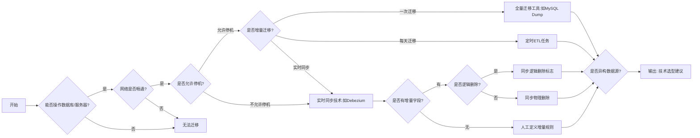

## 工具


| 维度        | Kettle | DataX     | 达梦DTS        | Sqoop    | SeaTunnel |
| --------- | ------ | --------- |--------------| -------- |-------|
| **实时性**   | 否      | 否         | 否            | 否        | ✅（流批一体） |
| **图形化界面** | ✅（强）   | ❌（JSON配置） | ✅（向导式）       | ❌（命令行）   | ❌（YAML配置） |
| **性能**    | 中等     | 高         | 中等           | 高        | ✅（超高） |
| **扩展性**   | 插件生态   | 插件架构      | 封闭生态         | Hadoop生态 | 连接器丰富 |
| **易用性**   | ✅（低门槛） | ❌（复杂）     | ✅（国产化）       | 中等       | 中等    |
| **适用场景**  | 复杂ETL  | 离线迁移      | 与DM之间数据及对象迁移 | Hadoop集成 | 实时数据管道 |


### Kettle

> ETL（Extract-Transform-Load的缩写，即数据抽取、转换、装载的过程），对于企业或行业应用来说，我们经常会遇到各种数据的处理，转换，迁移，所以了解并掌握一种ETL工具的使用，必不可少。

市面上常用的ETL工具有很多，比如Sqoop，DataX，Kettle，Talend等，作为一个大数据工程师，我们最好要掌握其中的两到三种

#### 多表数据迁移

1. 创建数据源（源和目标）
2. 点击 工具 -> 向导 -> 复制多表向导
3. 选择 源数据库和目标数据库，选择需要迁移的表
4. 执行生成的job

附：连接 Oracle 19c正常，但是读取元数据报错（不支持的字符集），在 [Oracle官网](https://www.oracle.com/database/technologies/appdev/jdbc-downloads.html) 下载`ojdbcx-full.tar.gz`，取出其中的`orai18n.jar`，放入 Kettle 的 lib 目录下。

#### 表名变量导出指定表

通过循环表名变量，导出指定表数据（导出到 excel 时速度较慢）

[原文链接](https://blog.csdn.net/nivalsoul1/article/details/125140394?spm=1001.2014.3001.5506)

### Sqoop

**导入**

```shell
# 全部导入
$ bin/sqoop import \
--connect jdbc:mysql://linux01:3306/company \
--username root \
--password 123456 \
--table staff \
--target-dir /user/company \
--delete-target-dir \
--num-mappers 1 \
--fields-terminated-by "\t"

# 导入指定列
$ bin/sqoop import \
--connect jdbc:mysql://linux01:3306/company \
--username root \
--password 123456 \
--target-dir /user/company \
--delete-target-dir \
--num-mappers 1 \
--fields-terminated-by "\t" \
--columns id,sex \
--table staff

# 查询导入
$ bin/sqoop import \
--connect jdbc:mysql://linux01:3306/company \
--username root \
--password 123456 \
--target-dir /user/company \
--delete-target-dir \
--num-mappers 1 \
--fields-terminated-by "\t" \
--query 'select name,sex from staff where id <=1 and $CONDITIONS;'

# where关键字筛选
$ bin/sqoop import \
--connect jdbc:mysql://linux01:3306/company \
--username root \
--password 123456 \
--target-dir /user/company \
--delete-target-dir \
--num-mappers 1 \
--fields-terminated-by "\t" \
--table staff \
--where "id=1"

# 导入到hive：第一步将数据导入到HDFS，第二步将导入到HDFS的数据迁移到Hive仓库
bin/sqoop import \
--connect jdbc:mysql://Faded103:3306/db_sqoop_test \
--username root \
--password 123456 \
--table staff \
--target-dir /user/db_sqoop_test \
--delete-target-dir \
--num-mappers 1 \
--fields-terminated-by "\t" \
--hive-import \
--fields-terminated-by "\t" \
--hive-overwrite \
--hive-table staff_hive
```

**导出**

```shell
# hdfs/hive到rdms
$ bin/sqoop export \
--connect jdbc:mysql://linux01:3306/company \
--username root \
--password 123456 \
--table staff \
--num-mappers 1 \
--export-dir /user/hive/warehouse/staff_hive \
--input-fields-terminated-by "\t"
```


### Datax

#### 安装

* 下载 `wget http://datax-opensource.oss-cn-hangzhou.aliyuncs.com/datax.tar.gz`
* 解压 `tar -zxvf datax.tar.gz -C /opt/module`
* 依赖
	* **安装jdk**
	* **python**
```
sudo apt install python
(一定要是python2(2.7+?)
因为后面执行datax.py的时候，里面的Python的print会执行不了，导致运行不成功，会提示你print语法要加括号，Python2中加不加都行，Python3中必须要加，否则报语法错。)
```
	* **Apache Maven 3.x**   
```
下载 wget https://mirrors.tuna.tsinghua.edu.cn/apache/maven/maven-3/3.8.5/binaries/apache-maven-3.8.5-bin.tar.gz
解压 tar -zxvf apache-maven-3.8.5-bin.tar.gz -C /opt/module/
环境变量
vim /etc/profile

MAVEN_HOME=/opt/module/apache-maven-3.8.5
PATH=${M2_HOME}/bin:${PATH}

source /etc/profile
```
* Jdk、Python、Maven都安装成功了，datax解压缩成功了，开始自检，进入bin目录，开始自检
```text
python datax.py ../job/job.json
```

#### 字段对应

[各个数据库和datax字段映射](https://blog.csdn.net/WANTAWAY314/article/details/113499474?utm_medium=distribute.pc_aggpage_search_result.none-task-blog-2~aggregatepage~first_rank_ecpm_v1~rank_v31_ecpm-2-113499474.pc_agg_new_rank&utm_term=datax+%E5%AD%97%E6%AE%B5%E7%B1%BB%E5%9E%8B&spm=1000.2123.3001.4430)

#### 使用

> 最开始时报错，然后考虑是不支持MySQL8.0的原因，下载源码修改，由于依赖不全(下载jar包 安装到本地maven库也不行)，暂时搁置。    
> 然后考虑将mysqlwriter中MySQL驱动换成8.0的驱动。   
> 还报错，是因为date日期格式的问题，需制定格式。
> （换jar包解决问题）暂未发现其他问题，待补充

::: details
Json文件示例(csv文本到mysql)

```json
{
    "job": {
        "setting": {
                "speed": {
                        "channel": 3 
                }
        },
        "content": [
            {
                "reader": {
                    "name": "txtfilereader",
                    "parameter": {
                    "path": ["/home/banana/data/xxxxx.csv"],
                    "encoding":"utf-8",
                        "column": [
                            { "index": 0, "type": "String" },
                            { "index": 1, "type": "String" },
                            { "index": 2, "type": "String" },
                            { "index": 3, "type": "String" },
                            { "index": 4, "type": "String" },
                            { "index": 5, "type": "String" },
                            { "index": 6, "type": "String" },
                            { "index": 7, "type": "String" },
                            { "index": 8, "type": "String" },
                            { "index": 9, "type": "String" },
                            { "index": 10, "type": "String" },
                            { "index": 11, "type": "String" },
                            { "index": 12, "type": "String" },
                            { "index": 13, "type": "String" },
                            { "index": 14, "type": "String" },
                            { "index": 15, "type": "String" },
                            { "index": 16, "type": "String" },
                            { "index": 17, "type": "String" },
                            { "index": 18, "type": "String" },
                            { "index": 19, "type": "String" },
                            { "index": 20, "type": "String" },
                            { "index": 21, "type": "Date", "format": "yyyy/MM/dd" },
                            { "index": 22, "type": "Date", "format": "yyyy/MM/dd" },
                            { "index": 23, "type": "String" },
                            { "index": 24, "type": "Date", "format": "yyyy/MM/dd HH:mm:ss" },
                            { "index": 25, "type": "String" },
                            { "index": 26, "type": "String" },
                            { "index": 27, "type": "String" },
                            { "index": 28, "type": "String" },
                            { "index": 29, "type": "String" },
                            { "index": 30, "type": "Date", "format": "yyyy/MM/dd HH:mm:ss" },
                            { "index": 31, "type": "Date", "format": "yyyy/MM/dd" },
                            { "index": 32, "type": "String" },
                            { "index": 33, "type": "String" },
                            { "index": 34, "type": "String" },
                            { "index": 35, "type": "String" },
                            { "index": 36, "type": "String" },
                            { "index": 37, "type": "String" },
                            { "index": 38, "type": "String" },
                            { "index": 39, "type": "String" },
                            { "index": 40, "type": "string" },
                            { "index": 41, "type": "Long" },
                            { "index": 42, "type": "Long" }
                        ],
                    "skipHeader": "true",
                      "fileDelimiter":","
                    }
                },
                "writer": {
                    "name": "mysqlwriter",
                    "parameter": {
                        "column": ["字段名","字段名","字段名","字段名","字段名","字段名","字段名","字段名","字段名","字段名","字段名","字段名","字段名","字段名","字段名","字段名","字段名","字段名","字段名","字段名","字段名","字段名","字段名","字段名","字段名","字段名","字段名","字段名","字段名","字段名","字段名","字段名","字段名","字段名","字段名","字段名","字段名","字段名","字段名","字段名","字段名","字段名","字段名"
                        ],
                        "preSql": [
                            "truncate table 表名;"
                        ],
                        "connection": [
                            {
                               "jdbcUrl": "jdbc:mysql://ip:port/book?&useSSL=false&serverTimezone=Asia/Shanghai",
                               "table": ["表名"]
                            }
                        ],
                        "password": "xxxx",
                        "username": "banana",
                        "writeMode":"insert"
                    }
                }
            }
        ]
    }
}
```
::: 

#### datax-web 安装

[官方地址](https://github.com/WeiYe-Jing/datax-web)

1. 下载官方编译 tar 包：datax-web-2.1.2.tar.gz
2. 解压：`tar -zxvf datax-web-2.1.2.tar.gz -C ../module/`
3. 进入目录：`cd ../module/datax-web-2.1.2`
4. 安装：手动安装 `./bin/install.sh`  不询问安装 `./bin/install.sh --force`
5. 第四步或输入MySQL连接相关信息，若没有输入需要手动初始化 `vim datax-web-2.1.2/modules/datax-admin/conf/bootstrap.properties` 执行 `/bin/db/datax-web.sql` 脚本
6. 配置
	* /modules/datax-admin/bin/env.properties 配置邮件服务(可跳过)
	* /modules/datax-execute/bin/env.properties 指定PYTHON_PATH的路径
7. 命令：启动 `./bin/start-all.sh` 停止 `./bin/stop-all.sh` 单模块停止 `./bin/stop.sh -m {module_name}`

### 达梦DTS工具


### SeaTunnel

* 应用集成: 数据接口形式
* 数据集成: 数据库数据同步形式

与DataX相比：DataX只能单节点，存在瓶颈限制。而SeaTunnel是将配置转换为Spark或Flink代码，能借助集群的能力，不存在瓶颈。且拥有丰富的连接器。

SeaTunnel专注于数据集成和数据同步，主要旨在解决数据集成领域的常见问题：

- 数据源多样：常用数据源有数百种，版本不兼容。 随着新技术的出现，更多的数据源不断出现。 用户很难找到一个能够全面、快速支持这些数据源的工具。
- 同步场景复杂：数据同步需要支持离线全量同步、离线增量同步、CDC、实时同步、全库同步等多种同步场景。
- 资源需求高：现有的数据集成和数据同步工具往往需要大量的计算资源或JDBC连接资源来完成海量小表的实时同步。 这增加了企业的负担。
- 缺乏质量和监控：数据集成和同步过程经常会出现数据丢失或重复的情况。 同步过程缺乏监控，无法直观了解任务过程中数据的真实情况。
- 技术栈复杂：企业使用的技术组件不同，用户需要针对不同组件开发相应的同步程序来完成数据集成。
- 管理和维护困难：受限于底层技术组件（Flink/Spark）不同，离线同步和实时同步往往需要分开开发和管理，增加了管理和维护的难度。


## 数据迁移方案（结构化数据）

#### 选型

**需要考虑的点**

1. 是否能操作数据库、服务器
2. 是否网络畅通
3. 是否允许停机
3. 是否异构数据源
4. 是否增量迁移（迁移一次、每天迁移还是实时同步）
5. 若增量，是否有时间字段等增量字段且正常维护
6. 若增量，删除数据是否是逻辑删除（该怎么迁移）

**参考图片（不大对，简单看看）**



#### 调优

**工具调优**

1. 内存配置
2. 多线程配置
3. 并行数配置
4. 分批提交
5. 其他方式（配置参数、优化网络?）

**数据库方面**

1. 目标库删除索引（非唯一索引；最好空表，数据导完之后再建索引）
2. 目标库停用触发器
3. 其他：若事务过大必要时调整redo log大小
