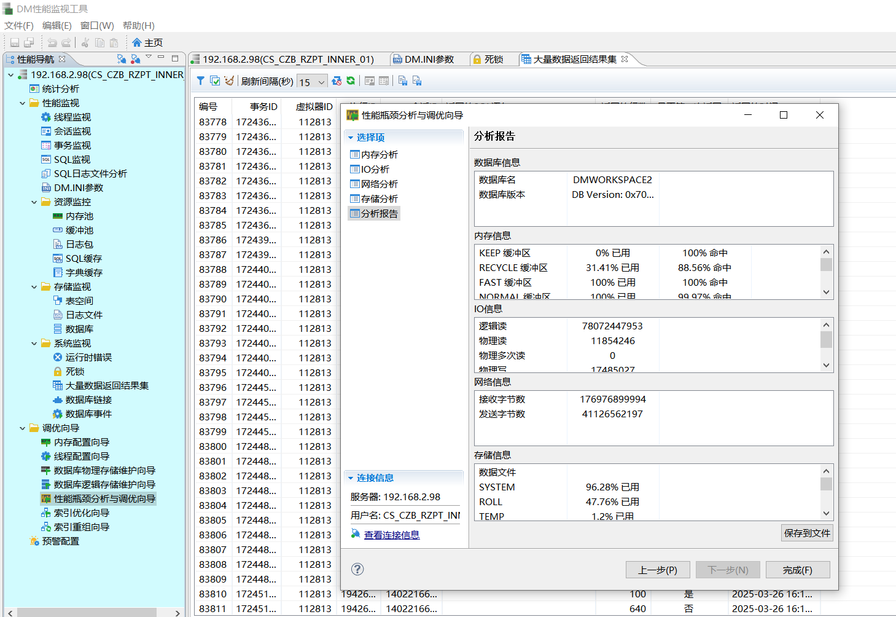

## 零、官方文档

[产品手册](https://eco.dameng.com/document/dm/zh-cn/pm/)

**达梦数据库需善用达梦提供的工具**

- DM控制台工具：查看 dm.ini 配置（中文描述配置信息）、备份还原
- DM审计分析工具 
- DM数据迁移工具：用于达梦与其他数据库间的数据迁移（包含视图、存储过程、函数、触发器等）
- DM性能监视工具：性能监控（线程、会话、SQL、资源的监控）、调优向导（内存配置、线程配置、索引优化）
- SQL交互式查询工具



## 一、数据库安装
#### 前期准备

1. 创建dmdba用户,dinstall组
    ```shell
    [root@localhost oracle]# groupadd dinstall && useradd -g dinstall dmdba && echo root|passwd --stdin dmdba
    Changing password for user dmdba.
    passwd: all authentication tokens updated successfully.
    ```
2. 关闭防火墙和selinux
3. 创建软件安装目录 `/opt/dmdbms && chown dmdba:dinstall /opt/dmdbms`
4. 创建数据目录`/opt/dmdata && chown dmdba:dinstall /opt/dmdata`
5. 修改用户资源限制  
    vi /etc/security/limits.conf 增加相应配置
    ```shell
    dmdba hard nofile 131072
    dmdba soft nofile 131072
    dmdba soft nice 0
    dmdba hard nice 0
    dmdba soft as unlimited
    dmdba hard as unlimited
    dmdba soft fsize unlimited
    dmdba hard fsize unlimited
    dmdba soft nproc 131072
    dmdba hard nproc 131072
    dmdba soft data unlimited
    dmdba hard data unlimited
    dmdba soft core unlimited
    dmdba hard core unlimited
    dmdba soft memlock unlimited
    dmdba hard memlock unlimited
    ```
6. 上传安装包，解压 `unzip dm8_20220525_x86_rh6_64.zip`
7. iso挂载到/mnt `mount -o loop dm8_20220525_x86_rh6_64.iso /mnt/`
8. 取消挂载 `umount /mnt/` （全部安装完成后执行）

#### 安装

1. 切换用户 dmdba 进行安装
2. 执行安装脚本 `/mnt/DMInstall.bin -i`
    ```shell
    [dmdba@localhost ~]$ /mnt/DMInstall.bin -i
    Please select the installer's language (E/e:English C/c:Chinese) [E/e]:c
    解压安装程序......... 
    欢迎使用达梦数据库安装程序
    
    是否输入Key文件路径? (Y/y:是 N/n:否) [Y/y]:n
    
    是否设置时区? (Y/y:是 N/n:否) [Y/y]:y
    设置时区:
    [ 1]: GTM-12=日界线西
    [ 2]: GTM-11=萨摩亚群岛
    [ 3]: GTM-10=夏威夷
    [ 4]: GTM-09=阿拉斯加
    [ 5]: GTM-08=太平洋时间（美国和加拿大）
    [ 6]: GTM-07=亚利桑那
    [ 7]: GTM-06=中部时间（美国和加拿大）
    [ 8]: GTM-05=东部部时间（美国和加拿大）
    [ 9]: GTM-04=大西洋时间（美国和加拿大）
    [10]: GTM-03=巴西利亚
    [11]: GTM-02=中大西洋
    [12]: GTM-01=亚速尔群岛
    [13]: GTM=格林威治标准时间
    [14]: GTM+01=萨拉热窝
    [15]: GTM+02=开罗
    [16]: GTM+03=莫斯科
    [17]: GTM+04=阿布扎比
    [18]: GTM+05=伊斯兰堡
    [19]: GTM+06=达卡
    [20]: GTM+07=曼谷，河内
    [21]: GTM+08=中国标准时间
    [22]: GTM+09=汉城
    [23]: GTM+10=关岛
    [24]: GTM+11=所罗门群岛
    [25]: GTM+12=斐济
    [26]: GTM+13=努库阿勒法
    [27]: GTM+14=基里巴斯
    请选择设置时区 [6]:21
    
    安装类型:
    1 典型安装
    2 服务器
    3 客户端
    4 自定义
    请选择安装类型的数字序号 [1 典型安装]:1
    所需空间: 1585M
    
    请选择安装目录 [/home/dmdba/dmdbms]:/opt/dmdbms
    目录(/opt/dmdbms)下不为空，请选择其他目录。
    请选择安装目录 [/home/dmdba/dmdbms]:/opt/dmdbms
    可用空间: 13G
    是否确认安装路径(/opt/dmdbms)? (Y/y:是 N/n:否)  [Y/y]:y
    
    安装前小结
    安装位置: /opt/dmdbms
    所需空间: 1585M
    可用空间: 13G
    版本信息: 
    有效日期: 
    安装类型: 典型安装
    是否确认安装? (Y/y:是 N/n:否):y
    2022-07-18 19:00:36 
    [INFO] 安装达梦数据库...
    2022-07-18 19:00:37 
    [INFO] 安装 基础 模块...
    2022-07-18 19:00:40 
    [INFO] 安装 服务器 模块...
    2022-07-18 19:00:40 
    [INFO] 安装 客户端 模块...
    2022-07-18 19:00:42 
    [INFO] 安装 驱动 模块...
    2022-07-18 19:00:43 
    [INFO] 安装 手册 模块...
    2022-07-18 19:00:43 
    [INFO] 安装 服务 模块...
    2022-07-18 19:00:44 
    [INFO] 移动日志文件。
    2022-07-18 19:00:44 
    [INFO] 安装达梦数据库完成。
    
    请以root系统用户执行命令:
    /opt/dmdbms/script/root/root_installer.sh
    
    安装结束
    ```

3. root执行脚本 `/opt/dmdbms/script/root/root_installer.sh`

    ```shell
    [root@localhost opt]# /opt/dmdbms/script/root/root_installer.sh
    移动 /opt/dmdbms/bin/dm_svc.conf 到/etc目录
    修改服务器权限
    创建DmAPService服务
    Created symlink from /etc/systemd/system/multi-user.target.wants/DmAPService.service to /usr/lib/systemd/system/DmAPService.service.
    创建服务(DmAPService)完成
    启动DmAPService服务
    [root@localhost opt]#
    ```

#### 初始化

1. 执行初始化脚本 `./dminit path=/opt/dmdata db_name=aihb instance_name=aihb`
    ```shell
    [dmdba@localhost bin]$ pwd
    /opt/dmdbms/bin
    [dmdba@localhost bin]$ ./dminit path=/opt/dmdata db_name=aihb instance_name=aihb
    initdb V8
    db version: 0x7000c
    file dm.key not found, use default license!
    License will expire on 2023-05-25
    Normal of FAST
    Normal of DEFAULT
    Normal of RECYCLE
    Normal of KEEP
    Normal of ROLL
    
     log file path: /opt/dmdata/aihb/aihb01.log
    
    
     log file path: /opt/dmdata/aihb/aihb02.log
    
    write to dir [/opt/dmdata/aihb].
    create dm database success. 2022-07-19 10:05:20
    [dmdba@localhost bin]$ 
    ```


#### 注册数据库服务，启动数据库

1. 调用达梦提供的脚本生成数据库服务,自动启动数据库,脚本在安装目录的/script/root子目录下,调用注册脚本需**使用root用户**
`./dm_service_installer.sh -t dmserver -dm_ini /opt/dmdata/aihb/dm.ini -p aihb`

    - 调用dm_service_installer.sh脚本来生成服务
    - -t 指定需要创建的服务类型,这里是数据库服务所以是dmserver
    - -dm_ini 指定在上一步初始化后生成的dm.ini文件
    - -p 为生成服务的后缀名,可自定义，这里给的czw，所以创建的服务名为DmServiceczw

    ```shell
    [root@localhost root]# pwd
    /opt/dmdbms/script/root
    [root@localhost root]# ll
    total 48
    -rwxr-xr-x. 1 dmdba dinstall 29111 Jul 19 10:00 dm_service_installer.sh
    -rwxr-xr-x. 1 dmdba dinstall  9618 Jul 19 10:00 dm_service_uninstaller.sh
    -rwxr-xr-x. 1 dmdba dinstall   635 Jul 19 10:00 root_installer.sh
    [root@localhost root]# ./dm_service_installer.sh -t dmserver -dm_ini /opt/dmdata/aihb/dm.ini
    请设置参数-p
    [root@localhost root]# ./dm_service_installer.sh -t dmserver -dm_ini /opt/dmdata/aihb/dm.ini -p aihb
    Created symlink from /etc/systemd/system/multi-user.target.wants/DmServiceaihb.service to /usr/lib/systemd/system/DmServiceaihb.service.
    创建服务(DmServiceaihb)完成
    [root@localhost root]# 
    ```

2. 启动数据库
`systemctl start DmServiceaihb`


## 二、创建Oracle To 达梦的DBlink（OCI方式）

[参考链接](https://blog.csdn.net/baidu_41727061/article/details/124823583)

#### 环境准备

| 键               | 值         |
| ---------------- | ---------- |
| **操作系统**     | Centos 7   |
| **Oracle数据库** | 11.2.0.4.0 |
|达梦数据库| Centos 7 x86版本|
|达梦安装目录|  /opt/dmdbms|
|Oracle OCI位置|  /opt/oracle|

#### 工具准备

**Oracle OCI：** instantclient-basic-linux.x64-11.2.0.4.0.zip（与系统和Oracle版本对应） 
[下载地址](https://www.oracle.com/database/technologies/instant-client/linux-x86-64-downloads.html)

#### Oracle OCI安装配置（达梦数据库所在服务器）

1. 进入包所在的路径并解压： 

    ```shell script
    cd /opt/oracle/ && unzip instantclient-basic-linux.x64-11.2.0.4.0.zip
    ```
   
2. （18.3 之前的版本需要这一步）进入解压后目录创建软连接：
 
    ```shell script
    cd instantclient_11_2 && ln -sfv libclntsh.so.11.1 libclntsh.so
    ```
   
3. 配置环境变量
    - 将OCI添加到/etc/ld.so.conf.d目录下（**系统用户**）
        ```shell script
        echo /opt/oracle/instantclient_11_2 > /etc/ld.so.conf.d/oracle-instantclient.conf
        ```
    - 加载动态链接库（使上一步生效）：`ldconfig`
    - 配置LD_LIBRARY_PATH环境变量（**dmdba用户**）  
    修改dmdba用户下的.bash_profile文件（`vim ~/.bash_profile`），添加以下内容 
        ```shell script
        export LD_LIBRARY_PATH="$LD_LIBRARY_PATH:/opt/oracle/instantclient_11_2"
        ```
    - 加载环境变量（使上一步生效）：`source ~/.bash_profile`
    
4. 启动（重启达梦数据库 **系统用户**） 
```shell script
systemctl restart DmServiceXXX #（**实际服务名**）
```

5. 创建DBLink（注：用户名不要加引号）
```shell script
create link LINKORA connect 'ORACLE' with username identified by "password" using 'x.x.x.x:1521/orcl';
```

## 数据库调优方面

[性能诊断与优化](https://eco.dameng.com/document/dm/zh-cn/ops/performance-optimization.html)

### 数据库统计信息

#### 自动收集

DM 数据库支持统计信息的自动收集，当全表数据量变化超过设定阈值后可自动更新统计信息。  

```sql
--打开表数据量监控开关，参数值为 1 时监控所有表，2 时仅监控配置表
SP_SET_PARA_VALUE(1,'AUTO_STAT_OBJ',2);

-- 如果 AUTO_STAT_OBJ=2，需进一步使用 DBMS_STATS.SET_TABLE_PREFS 设置 STALE_PERCENT 属性
--设置 SYSDBA.T 表数据变化率超过 15% 时触发自动更新统计信息
DBMS_STATS.SET_TABLE_PREFS('SYSDBA','T','STALE_PERCENT',15);

--配置自动收集统计信息触发时机
-- 停止时最后一个参数配置为0？   参数值需再斟酌！！！！
SP_CREATE_AUTO_STAT_TRIGGER(1, 1, 1, 1,'1:00', '2025/3/12',60,1);

/*
函数各参数介绍
SP_CREATE_AUTO_STAT_TRIGGER(
    TYPE                    INT,    --间隔类型，默认为天
    FREQ_INTERVAL         INT,    --间隔频率，默认 1
    FREQ_SUB_INTERVAL    INT,    --间隔频率，与 FREQ_INTERVAL 配合使用
    FREQ_MINUTE_INTERVAL INT,    --间隔分钟，默认为 1440
    STARTTIME              VARCHAR(128), --开始时间，默认为 22:00
    DURING_START_DATE    VARCHAR(128), --重复执行的起始时间，默认 1900/1/1
    MAX_RUN_DURATION    INT,    --允许的最长执行时间(秒)，默认不限制
    ENABLE                  INT     --0 关闭，1 启用  --默认为 1
);
*/
```


**测试**

```sql
CREATE TABLE T(A INT);
insert into t select level connect by level<=20;
commit;

-- SELECT * FROM SYSSTATTABLEIDU order by LAST_STAT_DT desc;

SELECT *
  FROM sysstats
 WHERE id IN (SELECT object_id
                FROM dba_objects
               WHERE object_type = 'TABLE'
                 AND owner = 'OWNER'
                 AND object_name = 'T');
```

**监控统计信息收集过程**

```sql
-- 创建一个用户表 AUTO_STAT_INFO，用以保存自动收集过程的相关信息
-- 最好是系统用户吧？？？SYSDBA？？？
create table AUTO_STAT_INFO
(
   task_id               INT,
   total_stat            INT,
   table_id              INT,
   sch_name              varchar(24),
   table_name            varchar(24),
   curr_gath_tab_id      INT,
   curr_gath_sch_name    varchar(24),
   curr_gath_tab_name    varchar(24),
   success_stat          INT,
   fail_stat             INT,
   task_start_time       DATETIME,
   task_end_time         DATETIME,
   gather_tbl_start_time DATETIME,
   gather_tbl_end_time   DATETIME
);


-- 创建过程 SYSDBA.GET_AUTO_STAT_INFO_FUNC，接收服务器在自动收集统计信息时的过程信息。并在模块体编写用户代码，将过程收集的统计信息写入 AUTO_STAT_INFO 中。
CREATE OR REPLACE PROCEDURE  SYSDBA.GET_AUTO_STAT_INFO_FUNC(task_id INT,total_stat INT,table_id INT, sch_name varchar(24), table_name varchar(24),curr_gath_tab_id INT, curr_gath_sch_name varchar(24), curr_gath_tab_name varchar(24),success_stat INT,fail_stat INT,task_start_time DATETIME, task_end_time DATETIME,gather_tbl_start_time DATETIME,gather_tbl_end_time DATETIME) as
BEGIN
//下面是用户自定义的代码，将SYSDBA.GET_AUTO_STAT_INFO_FUNC过程的信息插入到用户表AUTO_STAT_INFO 中
    INSERT INTO AUTO_STAT_INFO VALUES(task_id,total_stat,table_id, sch_name,table_name,curr_gath_tab_id, curr_gath_sch_name, curr_gath_tab_name,success_stat ,fail_stat,task_start_time,task_end_time,gather_tbl_start_time,gather_tbl_end_time);
commit;
EXCEPTION
    WHEN OTHERS THEN
        NULL;
END;
/

-- 最后，解读表 AUTO_STAT_INFO，介绍一次自动收集统计信息任务的相关过程信息。如果 SP_CREATE_AUTO_STAT_TRIGGER 触发一次自动收集统计信息，在任务开始时，会先记录当前任务的开始时间，当前任务的待收集表的总个数，以及接下来待收集的表的 id。之后每收集完成一个表的统计信息，就会记录该表 table 的 id 及收集该表的开始和结束时间，和截至目前收集成功失败的表个数情况，以及接下来待收集的表的 id。其中“接下来待收集的表的 id”即 current_gather_tab_id，为当前服务器正在收集的表 id。
```


#### 手动收集

**查看是否已有统计信息**  

```sql
-- 检查表上是否有统计信息
select * from sysstats
where id IN
(
  select object_id from dba_objects where
  object_type='TABLE'
  and owner = '模式名'
  and object_name='表名'
) ;


-- 用于经过 GATHER_TABLE_STATS、GATHER_INDEX_STATS 或 GATHER_SCHEMA_STATS 收集之后展示。
dbms_stats.table_stats_show('模式名','表名');
```

**收集统计信息**  

```sql
1、收集全库统计信息
DBMS_STATS.GATHER_SCHEMA_STATS('HNSIMIS', 100,FALSE,'FOR ALL COLUMNS SIZE AUTO');--HNSIMIS是模式名
-- 这种收集方式，并不是100%收集，所以有一定的弊端。

2、收集表的统计信息
dbms_stats.GATHER_TABLE_STATS('TEST','test',null,100);--收集表的统计信息，包括列和索引等 第一个参数是模式，第二个参数是表 Null是缺省，100是采样率100%，默认不是。
DBMS_STATS.GATHER_TABLE_STATS('OWNER','TABLE_NAME',null,100,TRUE,'FOR ALL COLUMNS SIZE AUTO');

3、收集列统计信息
stat 100 on fw(CREATE_USERID); --收集某一列的统计信息 fw是表名 CREATE_USERID是列名称
-- 这个在做sql调优的时候比较常用，因为比较准。

4、收集索引统计信息
sp_index_stat_init('DREAMWEB_PUDONG','IX_FW_ROWSTATE',100); --收集索引的统计信息 DREAMWEB_PUDONG是模式名称 IX_FW_ROWSTATE是索引名称
-- 这个也比较常用，建议创建完索引，立刻收集下统计信息。

-- 报错 磁盘空间不足 -523[-523]: anonymous block line 2
-- SYSTEM表空间 不足
```

**删除统计信息**  

```sql
--表
DBMS_STATS.DELETE_TABLE_STATS('模式名','表名','分区名',...);

--模式
DBMS_STATS.DELETE_SCHMA_STATS('模式名','','',...);

--索引
DBMS_STATS.DELETE_INDEX_STATS('模式名','索引名','分区表名',...);

--字段
DBMS_STATS.DELETE_COLUMN_STATS('模式名','表名','列名','分区表名',...);
```

### ET 工具

ET 工具是 DM 数据库自带的 SQL 性能分析工具，能够统计 SQL 语句执行过程中每个操作符的实际开销，为 SQL 优化提供依据以及指导。  

```sql
--查看ET是否开启
select * from v$parameter t where NAME = 'MONITOR_SQL_EXEC';
select * from v$parameter t where NAME = 'ENABLE_MONITOR';
--ENABLE_MONITOR，动态参数(系统级)
--MONITOR_SQL_EXEC，动态参数(会话级)

--开启ET
SP_SET_PARA_VALUE(1,'ENABLE_MONITOR',1);
SP_SET_PARA_VALUE(1,'MONITOR_SQL_EXEC',1);

--关闭ET
SP_SET_PARA_VALUE(1,'ENABLE_MONITOR',0);
SP_SET_PARA_VALUE(1,'MONITOR_SQL_EXEC',0);
```

### dbms_sqltune 工具

DBMS_SQLTUNE 包提供一系列实时 SQL 监控的方法。当 SQL 监控功能开启后，DBMS_SQLTUNE 包可以实时监控 SQL 执行过程中的信息，包括：执行时间、执行代价、执行用户、统计信息等情况。  
dbms_sqltune 系统包相比 ET 功能更强大，能够获取 IO 操作量，查看真实执行计划，每个操作符消耗占比和相应的花费时间，还能看出每个操作符执行的次数，非常便于了解执行计划中瓶颈位置。  
dbms_sqltune 功能远不止定位执行计划瓶颈，还拥有调优助手功能（建议性提示建某索引和收集某统计信息），具体使用 [DM8 系统包使用手册](https://eco.dameng.com/document/dm/zh-cn/pm/dbms_sqltume-package.html)。  

```sql
-- 1. 使用前提：建议会话级开启参数 MONITOR_SQL_EXEC=1，而 MONITOR_SQL_EXEC 在达梦数据库中一般默认是 1，无需调整。
ALTER SESSION SET 'MONITOR_SQL_EXEC' = 1;
-- 2. <执行待优化SQL>
-- 3. 查看执行计划
select DBMS_SQLTUNE.REPORT_SQL_MONITOR(SQL_EXEC_ID=>1213701) from dual;
```

### Hints

DM 查询优化器采用基于代价的方法。在估计代价时，主要以统计信息或者普遍的数据分布为依据。在大多数情况下，估计的代价都是准确的。但在一些比较特殊的场合，例如缺少统计信息，或统计信息陈旧，或抽样数据不能很好地反映数据分布时，优化器选择的执行计划不是“最优”的，甚至可能是很差的执行计划。  
如果 HINT 的语法没有写对或指定的值不正确，DM 并不会报错，而是直接忽略 HINT 继续执行。  

#### INI 参数提示

支持使用 HINT 的 INI 参数可通过 V$HINT_INI_INFO 动态视图查询。支持 HINT 的 INI 参数分为两类：一是 HINT_TYPE 为“OPT”，表示分析阶段使用的参数；二是 HINT_TYPE 为“EXEC”，表示运行阶段使用的参数，运行阶段使用的参数对于视图无效。  
- 例：`SELECT /*+ENABLE_HASH_JOIN(1)*/ * FROM T1,T2 WHERE C1=D1;`

#### 索引提示

```sql
-- 使用索引(如果查询中给出了表的别名那么必须使用别名)：
/*+ INDEX (表名[,] 索引名) {INDEX (表名[,] 索引名)} */

-- 不使用索引：
/*+ NO_INDEX (表名[,] 索引名) { NO_INDEX (表名[,] 索引名)} */


```

#### 连接方法提示

```sql
-- 强制两个表间使用指定顺序的哈希连接
/*+ USE_HASH(T1, T2) */

-- 强制两个表间不能使用指定顺序的哈希连接
/*+ NO_USE_HASH(T1, T2) */

-- 强制两个表间使用嵌套循环连接
/*+ USE_NL(A, B) */

-- 强制两个表间不能使用嵌套循环连接
/*+ NO_USE_NL(A, B) */

-- 当连接情况为左表 + 右表索引时，强制两个表间使用索引连接
/*+ USE_NL_WITH_INDEX(T1, IDX_T2_ID) */

-- 当连接情况为左表 + 右表索引时，强制两个表间不能使用索引连接
/*+ NO_USE_NL_WITH_INDEX(T1, IDX_T2_ID) */

-- 强制两个表间使用归并连接。归并连接所用的两个列都必须是索引列。
/*+ USE_MERGE(T1,T2) */

-- 强制两个表间不能使用归并连接
/*+ NO_USE_MERGE(T1,T2) */

-- 优先采用半连接转换为等价的内连接，仅 OPTIMIZER_MODE=1 有效。
/*+ SEMI_GEN_CROSS  OPTIMIZER_MODE(1) */

-- 不采用半连接转换为等价的内连接，仅 OPTIMIZER_MODE=1 有效。
/*+ NO_SEMI_GEN_CROSS  OPTIMIZER_MODE(1) */

-- 优先采用变量改写方式实现连接，适合驱动表数据量少而另一侧计划较复杂的场景，目前支持变量改写的连接方式有 NEST LOOP INNER JOIN2、NEST LOOP LEFT JOIN2、NEST LOOP SEMI JOIN2，仅 OPTIMIZER_MODE=1 有效。
/*+ USE_CVT_VAR OPTIMIZER_MODE(1) */

-- 不考虑变量改写方式实现连接，仅 OPTIMIZER_MODE=1 有效。
/*+ NO_USE_CVT_VAR OPTIMIZER_MODE(1) */

-- 一般情况下，归并连接需要左右孩子的数据按照连接列有序，使用此优化器提示时，优化器将考虑通过插入排序操作符的方式实现归并连接，仅 OPTIMIZER_MODE=1 有效。
/*+ENHANCED_MERGE_JOIN OPTIMIZER_MODE(1) stat(T1 1M) stat(T2 1M) */

```

#### 连接顺序提示

```sql
-- 多表连接时优化器会考虑各种可能的排列组合顺序。使用 ORDER HINT 指定连接顺序提示可以缩小优化器试探的排列空间，进而得到接近 DBA 所期望的查询计划。如果连接顺序和连接方法提示同时指定且二者间存在自相矛盾，优化器会以连接顺序提示为准。
/*+ ORDER (T1, T2 , T3, … tn ) */

/*
如果期望表的连接顺序是 T1, T2, T3，那么可以加入这样的提示：
SELECT /*+ ORDER(T1, T2, T3 )*/* FROM T1, T2 , T3, T4 WHERE …
在指定上述连接顺序后，T4,T1,T2,T3 或 T1,T2,T4,T3 会被考虑；T3,T1,T2 或 T1,T3,T2 不被考虑。
*/

-- 更特定的执行计划
-- EXPLAIN SELECT /*+ OPTIMIZER_MODE(1), ORDER(T1,T2,T3,T4) ,USE_HASH(T1,T2), USE_HASH(T2,T3), USE_HASH(T3,T4)*/* FROM T1,T2,T3,T4 WHERE T1.c1=T2.d1 AND T2.d2 = T3.e2 AND T3.e1 = T4.f1;
```

#### 统计信息提示

```sql
-- 统计信息提示只能针对基表设置，视图和派生表等对象设置无效。如果表对象存在别名则必须使用别名。行数只能使用整数，或者整数 +K（千），整数 +M（百万），整数 +G（十亿）。行数提示设置后，统计信息的其它内容也会做相应的调整。
/*+ STAT (表名, 行数) *
```

#### 其他 Hint

**MPP 本地对象提示**  

```sql
-- MPP 环境下，提供一种将用户表或动态视图作为本地对象处理的方法，通过指示符 LOCAL_OBJECT(对象名/别名) 进行处理。
-- 对于系统表当做本地对象的处理，本方法不适用，系统表只能在主站点才能做本地对象处理。
/*+ LOCAL_OBJECT(对象名/别名) */
```

**忽略重复键值提示**  

```sql
-- 当执行 INSERT 操作时，如果存在 UNIQUE 索引，那么发生了重复键值冲突。使用 HINT IGNORE_ROW_ON_DUPKEY_INDEX 则可以忽略该冲突，冲突数据既不进行插入也不会报错，其他非冲突插入正常进行。
/*+IGNORE_ROW_ON_DUPKEY_INDEX(<表名> [(<列名>{,<列名>})])*/
```

**禁用计划缓存提示**  

```sql
-- 使用 HINT PLAN_NO_CACHE 禁用计划缓存，当前语句的执行计划将不会被缓存。
/*+PLAN_NO_CACHE*/
```

**DMDPC 数据分发方式提示**  

```sql
DMDPC 环境下提供了一种专门针对指定的连接、分组、排序、去重和分析函数操作符数据分发方式进行人工干预的优化器提示。该提示被采纳的前提是指定的分发路径有效，因为代价原因没有被优化器选中。
/*+DPC(分发方式探测序号 分发方式字符串)*/
```


## DTS 迁移

#### 注意事项

1. **一定要用新版本DTS工具，旧版本一堆坑**
2. 如果允许的话，迁移表勾选已存在的先删除表再创建（绕过奇奇怪怪的报错）
3. 数据库区分大小写时，是否有字段名转大写的选项（去掉 保持对象名大小写 的勾选）
4. 表已存在且不能删表时：一定要先禁用触发器、索引等（Oracle不能禁用唯一索引，DM不知道能行不）
5. 报错：数据迁移 A 模式时报 B 模式主键冲突；原因可能是有 A 模式同步到 B 模式的触发器


## 常用SQL

#### 博客

[达梦8数据库运维常用基础sql](https://mp.weixin.qq.com/s/kQ93CD6oRivs6haQecchqg)

### 元数据获取

#### 常用系统视图

`v$dynamic_tables` 可以获取所有动态视图

```sql
user_tables  -- dba_tables
user_tab_columns
user_indexes
-- 查看系统中的作业信息
select t.job, t.schema_user, t.last_date, t.last_sec, t.next_date, t.next_sec, t."INTERVAL", t.broken, t.failures,t.what from dba_jobs t;
-- 查询数据库实例启动状态
select name, status$ from v$instance;
-- 查询license信息
select * from V$LICENSE;
-- 查询系统函数及其参数
select a.name, b.* from v$ifun a, v$ifun_arg b where a.id = b.id and a.name like 'SF_ARCHIVELOG_%';  --系统函数名
-- 查询函数/存储过程/包源码信息
select * from DBA_SOURCE t where name = 'P_TEST';  --查询对象名
```

**触发器**

```sql
select * from DBA_TRIGGERS where owner = 'xxx' and TABLE_NAME = 'xxx';

-- 禁用启用触发器
ALTER TRIGGER 触发器名称 DISABLE;
ALTER TRIGGER 触发器名称 ENABLE;
```

#### 建表语句获取

```sql
SELECT DBMS_METADATA.GET_DDL('TABLE', '表名', '模式名') FROM DUAL;

-- 未使用，理论上没问题，不知道是否有错误的地方
WITH TABLES AS
 (SELECT TABLE_NAME AS T_NAME, OWNER
    FROM DBA_TABLES
   WHERE OWNER = 'OWNER'
     AND TABLE_NAME = 'TABLE_NAME')

SELECT SUB.T_NAME,
       LISTAGG(SQL_PART, CHR(13)) WITHIN GROUP(ORDER BY SUB.FLAG) AS FULL_DDL
  FROM (
        -- 表定义
        SELECT 1 AS FLAG,
                T.T_NAME,
                DBMS_METADATA.GET_DDL('TABLE', T.T_NAME, T.OWNER) || CHR(13) AS SQL_PART
          FROM TABLES T
        UNION ALL
        -- 表注释
        SELECT 2 AS FLAG,
                T.T_NAME,
                'COMMENT ON TABLE ' || T.T_NAME || ' IS ''' || TC.COMMENTS || ''';' AS SQL_PART
          FROM TABLES T
          LEFT JOIN ALL_TAB_COMMENTS TC
            ON TC.TABLE_NAME = T.T_NAME
           AND TC.OWNER = T.OWNER
         WHERE TC.COMMENTS IS NOT NULL
        UNION ALL
        -- 字段注释
        SELECT 3 AS FLAG,
                T.T_NAME,
                'COMMENT ON COLUMN ' || T.T_NAME || '.' || CC.COLUMN_NAME || ' IS ''' || CC.COMMENTS || ''';' AS SQL_PART
          FROM TABLES T
          LEFT JOIN ALL_COL_COMMENTS CC
            ON CC.TABLE_NAME = T.T_NAME
           AND CC.OWNER = T.OWNER
         WHERE CC.COMMENTS IS NOT NULL
        UNION ALL
        -- 索引定义
        SELECT 4 AS FLAG,
                T.T_NAME,
                DBMS_METADATA.GET_DDL('INDEX', I.INDEX_NAME, T.OWNER) AS SQL_PART
          FROM TABLES T
          LEFT JOIN ALL_INDEXES I
            ON I.TABLE_NAME = T.T_NAME
           AND I.TABLE_OWNER = T.OWNER
         WHERE I.INDEX_TYPE = 'NORMAL'
           AND I.UNIQUENESS = 'NONUNIQUE') SUB
 GROUP BY SUB.T_NAME;
```


#### 查询表空间占用率

```sql
select b.file_name,
       b.tablespace_name,
       b.bytes/1024/1024 size_m,
       (b.bytes-(nvl(a.bytes,0)))/1024/1024  used_m,
       round((b.bytes-(nvl(a.bytes,0)))/(b.bytes)*100,2)  usedrate
  from dba_free_space a,dba_data_files b
 where a.file_id(+) = b.file_id
   and a.tablespace_name(+) = b.tablespace_name
 order by b.tablespace_name;
```

#### 查看单表（索引）占用空间

```sql
-- user_segments 
-- dba_segments
select  t.segment_name,
       t.segment_type,
       t.tablespace_name,
       t.owner,
       t.bytes,
       t.bytes/1024 byte_kb,
       t.bytes/1024 byte_mb
  from dba_segments t
 where t.owner = 'DMHR'   -- 用户/模式名 
   and t.SEGMENT_TYPE = 'TABLE'  -- 'INDEX'
 order by t.bytes desc;
```


#### 查看达梦数据库是否是集群

```sql
select * from v$instance;    -- MODE$为STANDBY/PRIMARY是 数据守护集群，否则普通单机或DSC集群
select * from v$dsc_ep_info;   -- 返回空  则不是dsc集群
```


#### 查看模式和用户对应关系

```sql
select a.NAME schname, a.ID schid, b.id userid, b.NAME username
  from sysobjects a, sysobjects b
where a."TYPE$"='SCH'
  and a.pid = b.id;
```


### 问题排查

#### 查询锁表 & 杀会话

```sql
-- 查询锁表
SELECT obs.OBJECT_NAME, ob.OBJECT_ID, ob.SESSION_ID, ob.USERNAME
  FROM V$LOCKED_OBJECT ob
  JOIN DBA_OBJECTS obs
    ON ob.OBJECT_ID = obs.OBJECT_ID
 WHERE obs.OBJECT_TYPE = 'TABLE';

-- 终止会话
SP_CLOSE_SESSION(SESS_ID); -- 替换为实际会话ID

-- 查询正在执行的SQL
select * from v$sessions where state = 'ACTIVE';

-- 查询阻塞
SELECT DS.SESS_ID     "被阻塞的会话ID",
       DS.SQL_TEXT    "被阻塞的SQL",
       DS.TRX_ID      "被阻塞的事务ID",
       DS.CREATE_TIME "开始阻塞时间",
       SS.SESS_ID     "占用锁的会话ID",
       SS.SQL_TEXT    "占用锁的SQL",
       SS.CLNT_IP     "占用锁的IP",
       L.wait_for_id  "占用锁的事务ID"
  FROM v$trxwait L
  LEFT JOIN V$SESSIONS DS
    ON DS.TRX_ID = L.ID
  LEFT JOIN V$SESSIONS SS
    ON SS.TRX_ID = L.wait_for_id;
```

#### 查询实例中已执行未提交的 SQL

```sql
SELECT t1.sess_id, t1.sql_text, t1.state, t1.trx_id
FROM v$sessions t1, v$trx t2
WHERE t1.trx_id = t2.id
  AND t1.state = 'IDLE'
  AND t2.status = 'ACTIVE';
```

#### 查询表上的锁

1. **无锁（LOCK_MODE=0）**  
   表示当前未对资源加锁，仅作为锁状态标识存在。
2. **共享锁（S锁，LOCK_MODE=1）**
   - 允许其他事务读取被锁资源，但禁止修改。
   - 适用于读多写少的场景，如 `SELECT ... LOCK IN SHARE MODE`。
3. **排他锁（X锁，LOCK_MODE=2）**
   - 禁止其他事务读写被锁资源，仅当前事务可修改。
   - 常用于数据更新操作（如 `UPDATE`、`DELETE`）。
4. **意向共享锁（IS锁，LOCK_MODE=3）**
   - **表级锁**，表示事务计划在表中某些行上添加共享锁（S锁）。
   - 作用：通过提前声明意向，避免其他事务对表结构进行不兼容操作（如加X锁）。
5. **意向排他锁（IX锁，LOCK_MODE=4）**
   - **表级锁**，表示事务计划在表中某些行上添加排他锁（X锁）。
   - 作用：与IS锁类似，但用于更高粒度的排他操作声明，例如批量更新前的预检测。

```sql
SELECT *
FROM V$LOCK
WHERE TABLE_ID IN (SELECT OBJECT_ID
                   FROM DBA_OBJECTS
                   WHERE OWNER = 'OWNER'
                     AND OBJECT_NAME = 'OBJECT_NAME')
```


#### 批量禁用某个用户/模式下所有外键约束

其他索引应该能以同样方式拼接禁用语句  

```sql
select 'alter table '|| t.owner||'.'||t.table_name ||' disable constraint '||t.constraint_name||';'
  from dba_constraints t
 where t.owner = 'DMHR'   -- 用户/模式名
   and t.constraint_type = 'R';
```

#### 用户锁定/解锁

```sql
-- 查询系统中锁定的用户及对应的锁定时间：
select t.username, 
       t.user_id, 
       t.account_status, 
       t.lock_date
  from dba_users t
 where t.account_status = 'LOCKED';

-- 对于被锁定的用户，可以使用SYSDBA或者具有alter user权限的用户解锁。
alter user hruser ACCOUNT UNLOCK;   --解锁用户
alter user hruser ACCOUNT LOCK;      --锁定某用户
```